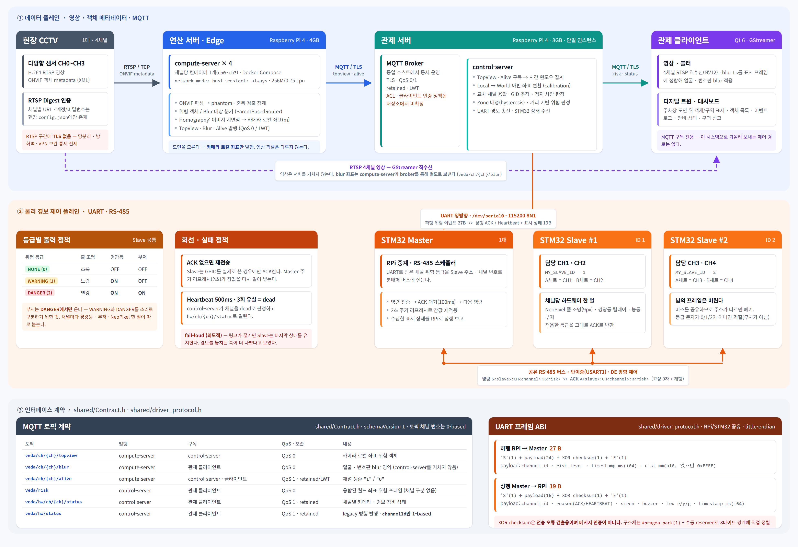
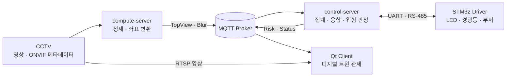

# VEDA · AI 주차장 안전 관제 시스템

<p align="center">
  
</p>

<p align="center">
  
  
  
  
  
</p>

VEDA는 CCTV의 객체 메타데이터를 엣지에서 처리하고, 여러 채널의 관측을 융합해 위험도를 판단한 뒤
관제 화면과 현장 경보 장치에 전달하는 주차장 안전 관제 시스템입니다.

## 시스템 흐름



## 구성 요소

| 디렉터리 | 역할 | 기술 |
| --- | --- | --- |
| [`compute-server/`](compute-server/) | 카메라 메타데이터 수집, 객체 정제, 로컬 좌표 산출 | C++20, RTSP/ONVIF, MQTT |
| [`control-server/`](control-server/) | 채널 집계, 월드 좌표 변환, 위험 판정, HW 이벤트 전송 | C++20, MQTT, UART |
| [`client/`](client/) | CCTV·디지털 트윈·장비 상태 통합 관제 | Qt 6, QML, GStreamer |
| [`driver/`](driver/) | RS-485 마스터/슬레이브와 현장 경보 제어 | STM32F4, FreeRTOS, HAL |
| [`shared/`](shared/) | 서버 간 데이터 계약, 로거, HW 통신 규약 | Header-only contracts |
| [`tests/`](tests/) | 서버 및 클라이언트 단위 테스트 | GoogleTest/GoogleMock |

## 서버 빠른 시작

### 요구 사항

- C++20 컴파일러, CMake 3.16 이상
- OpenSSL, pthreads, `pkg-config`, `libmosquitto`, `nlohmann_json`
- 테스트 구성 시 GoogleTest를 내려받을 수 있는 네트워크

Ubuntu 계열에서는 다음 패키지로 준비할 수 있습니다.

```bash
sudo apt install build-essential cmake pkg-config libssl-dev libmosquitto-dev nlohmann-json3-dev
```

### 빌드 및 테스트

```bash
cmake -S . -B build
cmake --build build -j
ctest --test-dir build --output-on-failure
```

compute-server만 빌드하려면 control-server를 제외할 수 있습니다.

```bash
cmake -S . -B build -DVEDA_BUILD_CONTROL_SERVER=OFF
cmake --build build --target compute-server -j
```

두 서버는 실행 디렉터리의 `config.json`을 읽습니다. 실제 카메라·MQTT·좌표 보정·시리얼 값을 배치한 뒤
각 서버 문서의 실행 방법을 따르세요. Qt 클라이언트와 STM32 펌웨어는 별도 툴체인으로 빌드합니다.

## 저장소 구조

```text
Main_Project/
├─ client/             Qt 관제 클라이언트
├─ compute-server/     채널별 엣지 연산 서버
├─ control-server/     중앙 위험 판단 서버
├─ driver/             STM32 펌웨어
├─ shared/             공통 프로토콜과 유틸리티
├─ tests/              단위 테스트
├─ deploy/             현장 배포 자료
├─ manual/             설계·보안·운영 문서
└─ performance/        벤치마크와 성능 분석
```

## 더 읽기

- [시스템 아키텍처](manual/system/system_architecture.md)
- [위험 감지 시퀀스](manual/system/hazard_detection_sequence.md)
- [요구사항 명세](manual/system/requirements_specification.md)
- [코딩 컨벤션](manual/coding_convention.md)
- [Git Flow](manual/git-flow.md)
- [성능 자료](performance/)

## 개발 규칙

기능 변경에는 가장 작은 회귀 테스트를 추가하고, C/C++ 파일은 저장소의 `.clang-format`과 `.clang-tidy`를
따릅니다. 브랜치와 커밋 규칙은 [Git Flow 문서](manual/git-flow.md)를 기준으로 합니다.
