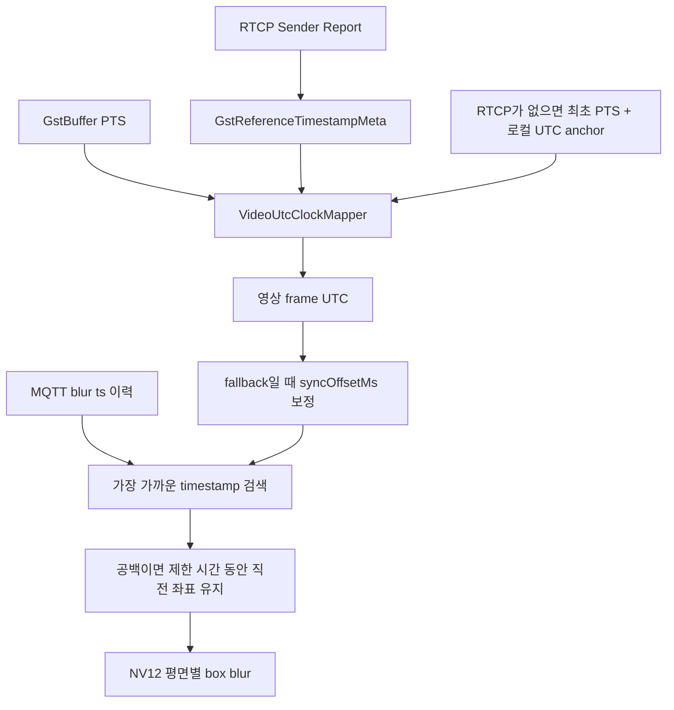

# 영상 수신 및 처리 설정 가이드

이 문서는 처음 프로젝트를 접한 개발자가 CCTV 영상이 어디에서 수신되고, 각 설정값이 어떤 지연과
안정성에 영향을 주며, 영상 전처리와 MQTT 블러가 어떤 순서로 적용되는지 이해할 수 있도록 정리한
운영·유지보수 가이드이다.

## 1. 기준 파일과 적용 우선순위

영상 설정의 기준은 다음 파일이다.

- 실제 실행 설정: `config/app_config.json`
- 배포용 예제: `config/app_config.example.json`
- JSON 검증 및 환경 변수 반영: `src/config/ApplicationConfig.cpp`
- GStreamer 파이프라인 구성: `src/video/GstRtspReceiver.cpp`
- 런타임 설정 모델: `include/video/VideoRuntimeConfig.h`
- 영상 전처리 UI: `src/ui/dialogs/MapSettingsDialog.cpp`
- 블러 동기화 및 적용: `src/video/BlurProcessor.cpp`
- 블러 GStreamer 요소(`qtblur`): `src/video/BlurVideoFilter.cpp`
- 영상 PTS와 UTC 변환: `src/video/VideoUtcClockMapper.cpp`
- 표시 채널 판정과 valve 게이팅: `src/ui/mainwindow.cpp`

설정 파일은 아래 순서로 선택된다.

1. `VEDA_CONFIG_FILE` 환경 변수가 가리키는 파일
2. 실행 파일 옆의 `config/app_config.json`
3. 현재 작업 디렉터리의 `config/app_config.json`

JSON을 읽은 뒤 일부 값은 환경 변수로 다시 덮어쓴다.

| 환경 변수 | 덮어쓰는 값 |
| --- | --- |
| `QTCCTV_DECODER_MODE` | `video.receiver.decoderMode` |
| `QTCCTV_BLUR_SYNC_OFFSET_MS` | `video.receiver.blur.syncOffsetMs` |
| `VEDA_RTSP_URL_1` ~ `VEDA_RTSP_URL_4` | 채널별 RTSP URL |

> RTSP 계정과 비밀번호가 포함된 `app_config.json`은 저장소에 커밋하지 않는다. 공개 가능한 값은
> `app_config.example.json`에만 기록하고, 실제 URL은 환경 변수 또는 별도 보안 설정 파일로 주입한다.

## 2. 전체 처리 구조

현재 애플리케이션은 채널마다 독립된 `GstRtspReceiver`와 GStreamer 파이프라인을 사용한다. Qt UI
스레드는 영상 디코딩이나 블러 연산을 직접 수행하지 않는다.

```mermaid
flowchart LR
    Camera["CCTV / NVR\nH.264 RTP over RTSP"]
    Source["rtspsrc\nRTSP 세션 + RTP jitterbuffer"]
    Depay["rtph264depay\nRTP에서 H.264 추출"]
    Parse["h264parse\nH.264 정규화"]
    DecodeQueue["decodequeue\n디코딩 전 스레드 경계"]
    Valve["presentationvalve\n숨긴 채널 차단"]
    Decoder["avdec_h264 또는\nd3d11h264dec + d3d11scale + d3d11download"]
    Watch["identity framewatch\n프레임 감시"]
    Convert["videoconvert\nNV12 유지 (d3d11 경로는 passthrough)"]
    RenderQueue["renderqueue\n완충 겸 유일한 드롭 지점\n(지연 + 여유분을 담는다)"]
    Balance["videobalance\n밝기·대비"]
    Gamma["gamma\n감마 보정"]
    Blur["qtblur\nMQTT 블러 적용"]
    Sink["d3d11videosink\nsync=true + ts-offset\nQt 위젯 출력"]

    Camera --> Source --> Depay --> Parse --> DecodeQueue --> Valve --> Decoder --> Watch --> Convert
    Convert --> RenderQueue --> Balance --> Gamma --> Blur --> Sink
```



`presentationvalve`는 **디코더 앞**에 있다. 화면에 없는 채널은 이 valve에서 차단되므로 디코딩, 다운로드,
블러, GPU 업로드를 통째로 건너뛰고 RTSP/RTP 수신과 depay/parse만 유지한다. 구역 전환으로 숨겨진
채널과 영상 확대 중 가려진 채널이 모두 대상이며, 판정은 `MainWindow::isChannelVisible()` 하나가 하고
`MainWindow::syncStreamPresentation()`이 상태를 맞춘다. 켜기를 먼저 돌리고 끄기를 나중에 돌려 전환
중에 아무 채널도 표시되지 않는 구간이 생기지 않게 한다.

`rtspsrc`는 내부적으로 RTP session manager와 jitterbuffer를 생성해 패킷 재정렬, 지터 흡수, RTCP
처리를 수행한다. 애플리케이션은 `select-stream`과 `pad-added`에서 H.264 영상 스트림만 선택하므로
ONVIF metadata 등 다른 RTSP 트랙은 이 영상 chain에 연결하지 않는다.

GStreamer `queue`는 자체 src thread를 만들어 앞뒤 처리 단계를 분리한다. 따라서 네트워크 수신,
디코딩, 렌더링이 하나의 호출 스택에서 직렬로 막히는 것을 줄인다.

## 3. 현재 활성 영상 설정

아래 값은 현재 `config/app_config.json` 기준이다. 예제 파일과 다른 값은 별도로 표시한다.

### 3.1 채널 시작

| 설정 | 현재값 | 의미와 선택 이유 |
| --- | ---: | --- |
| `initialStartDelayMs` | 1000 ms | 창과 native video handle이 준비된 뒤 첫 채널을 시작한다. |
| `receiverStartSpacingMs` | 3000 ms | 네 채널의 RTSP SETUP/PLAY와 디코더 초기화가 동시에 몰리지 않게 분산한다. |

네 채널을 동시에 시작하면 NVR 세션 처리, 네트워크 burst, 디코더 생성이 한순간에 겹칠 수 있다.
3초 간격은 전체 시작 시간보다 첫 연결 성공률과 부하 분산을 우선한 값이다.

### 3.2 RTSP 수신과 복구

| 설정 | 현재값 | 정의 | 현재 설정 이유 |
| --- | ---: | --- | --- |
| `latencyMs` | 350 ms | `rtspsrc` 내부 jitterbuffer가 네트워크 변동을 흡수할 목표 시간 | 공식 기본값 2000 ms보다 훨씬 작다. 유선 환경에서 실시간성을 우선한 값이며, 지터가 이 값을 넘으면 패킷이 버려진다(아래 12장 참고). |
| `dropOnLatency` | `true` | jitterbuffer가 `latencyMs`보다 계속 커지지 않도록 오래된 데이터를 버림 | 지연 누적보다 최신 화면 유지를 우선한다. |
| `udpBufferSizeBytes` | 4,194,304 B | OS UDP 수신 버퍼 요청 크기 | 네 채널 burst와 순간 처리 지연에서 커널 패킷 손실 여유를 확보한다. |
| `udpTimeoutUs` | 5,000,000 us | UDP RTP가 오지 않을 때 TCP transport 재시도까지의 시간 | GStreamer 기본값과 같은 5초이며, 장시간 무응답 대기를 막는다. |
| `tcpTimeoutUs` | 20,000,000 us | TCP 연결 동작의 실패 제한 시간 | 공식 기본값과 같은 20초로 불필요한 무한 대기를 막는다. |
| `probationPackets` | 2 | RTP source를 승인하기 위한 연속 sequence packet 수 | GStreamer 기본값이며 잘못된 source를 즉시 승인하지 않는다. |
| `rtspKeepAlive` | `true` | RTSP 세션 keep-alive 사용 | 장시간 관제 중 서버가 idle session을 닫는 것을 예방한다. |
| `udpReconnect` | `true` | UDP 사용 중 RTSP 연결이 닫히면 재연결 | 장시간 운용 복구를 위해 유지한다. |
| `addReferenceTimestampMeta` | `true` | RTCP sender report 기반 절대시각 metadata 추가 시도 | 영상 PTS와 MQTT UTC 블러 좌표를 맞추는 우선 기준이다. |

`protocols`는 코드에서 강제하지 않는다. 따라서 GStreamer 기본 협상 순서인 UDP unicast, UDP
multicast, TCP를 사용한다. `udpTimeoutUs`는 일반적인 “RTSP 접속 timeout”이 아니라 UDP로 RTP가
들어오지 않을 때 TCP transport로 재시도하기까지의 시간이다.

### 3.3 디코딩과 큐

| 설정 | 현재값 | 정의 | 현재 설정 이유 |
| --- | ---: | --- | --- |
| `decoderMode` | `d3d11` | 디코더 선택 모드 | 축소가 `d3d11scale` 전용이라 고정해 둔다. 아래 구현 주의사항 참고. |
| `processingWidth` / `processingHeight` | 1280 x 720 | 시스템 메모리로 내려받기 전에 GPU에서 줄일 해상도 | 블러가 CPU 접근을 요구해 생기는 왕복 전송량과 CPU 픽셀 수를 함께 줄인다. 둘 다 `0`이면 원본 유지. **`d3d11` 디코더 경로에서만 적용된다.** |
| `decodeQueueMaximumTimeMs` | 800 ms | 디코딩 전 queue의 최대 시간 | 압축 H.264라 깊어도 싸다(4 Mbps 기준 1초 ≈ 500 KB). 여기서 막히면 backpressure가 지터버퍼까지 올라간다. 아래 참고. |
| `alignmentDelayMs` | 300 ms | 영상과 늦게 도착하는 AI/MQTT metadata를 맞추기 위한 의도적 영상 대기 | sink의 `ts-offset`으로 적용한다. `sinkSync=true`가 전제다. |
| `renderQueueMaximumTimeMs` | 200 ms | 렌더 전 queue가 지연 **위에 추가로** 담는 여유분 | 실제 queue 상한은 `renderQueueMaximumTimeMs + alignmentDelayMs`(현재 500 ms)다. |

GStreamer queue는 `max-size-buffers`, `max-size-bytes`, `max-size-time` 중 **먼저 도달한 제한**을
사용한다. 이 프로젝트는 **시간 제한만** 쓴다. buffer 개수 상한은 같은 시간이라도 fps에 따라 값이
달라져서, 30 fps에서 `alignmentDelayMs`보다 먼저 걸리면 아래의 지연 관계가 조용히 무너진다.
(예전 `renderQueueMaximumBuffers=8`은 15 fps에서 533 ms지만 30 fps에서는 266 ms다.)

- `decodequeue`는 non-leaky queue다. **leaky로 바꾸지 마라** — 디코더 앞에서 압축 frame을 버리면
  화면이 깨진다.
- `renderqueue`는 `leaky=downstream`이며 **frame을 버리는 유일한 지점**이다. 렌더가 계속 밀리면
  오래된 frame을 버리고 최신 frame을 유지한다.

#### 지연은 queue가 아니라 sink가 만든다 (세 값이 한 몸이다)

`alignmentDelayMs`, `sinkSync`, `renderQueueMaximumTimeMs`는 **따로 만지면 안 된다.**

| 값 | 역할 |
| --- | --- |
| `sinkSync=true` | `ts-offset`은 clock 동기화 경로에서만 쓰인다. `false`면 지연이 통째로 사라지고 블러만 앞서 나간다. 설정 로더가 이 조합을 **오류로 막는다.** |
| sink `ts-offset` | `alignmentDelayMs`가 그대로 들어간다. 블러가 없는 GPU 경로에는 정렬할 대상이 없어 0이다. |
| `renderqueue` 상한 | `ts-offset`만큼을 담아야 한다. 못 담으면 `leaky=downstream`이 상시 frame을 버려서 지연이 서지 않는다. |

**예전 구조(`alignmentqueue` + `min-threshold-time`)를 되살리지 마라.** `min-threshold-time`은 공식
문서상 "Min. amount of data in the queue to allow reading"이라, 임계값 아래로 내려가면 출력이 다시
멈춘다. 쌓아 둔 분량을 언더런 흡수에 **쓸 수 없어** 순수한 지연 비용이었고, 짧은 언더런도 임계값을
다시 채울 때까지 늘어났다. `alignmentDelayMs`를 100→300으로 올렸을 때 회복 비용이 그대로 3배가 된
것이 그 구조 때문이다. sink가 클럭에 맞춰 꺼내가면 **같은 지연이 renderqueue의 진짜 여유분**이 된다.

**`max-lateness`는 `-1`로 끈다.** 요소 기본값이 5 ms라 `sync=true`로 켜는 순간 조금만 늦은 frame도
sink가 버린다. 드롭 지점은 `renderqueue` 하나로 유지하는 편이 원인을 읽기 쉽다.

#### `decodequeue`가 얕으면 로컬 부하가 망 손실로 번진다

`decodequeue`는 non-leaky다. 가득 차면 upstream을 block하는데, 그 backpressure가 여기서 멈추지 않는다.

```
디코더가 잠깐 밀림 → decodequeue 가득 참 → h264parse/depay push 블록
  → rtpjitterbuffer push 스레드 블록
  → drop-on-latency=true + latency=350 ms 이므로 초과분 폐기
  → 조각난 frame → depay의 wait-for-keyframe=true
  → 다음 IDR까지 화면 정지 (GOV 15 / 15 FPS 기준 약 1초)
```

즉 12장 2번의 "수 초 정지"는 **네트워크 지터 없이 로컬 GPU 경합만으로도 도달한다.** 그래서 상한을
100 ms에서 800 ms로 올렸다. 여기 흐르는 것은 압축 H.264라 깊어도 싸고, 드롭이 필요하면
`renderqueue`가 "디코딩 끝난 frame 하나 스킵"으로 깨끗하게 처리한다.

#### `decoderMode: auto`의 실제 동작

현재 구현에서 `auto`는 하드웨어 우선이 아니다.

1. `d3d11`을 명시했고 `d3d11h264dec`와 `d3d11download`가 있으면 D3D11 사용
2. `auto` 또는 `software`이고 `avdec_h264`가 있으면 `avdec_h264 max-threads=2` 사용
3. 소프트웨어 디코더가 없고 D3D11 요소가 있으면 D3D11 사용
4. 마지막 fallback은 `avdec_h264`

즉 `auto`는 일반적인 설치에서 소프트웨어 디코딩을 선택한다. 디코더를 비교 시험하려면
`QTCCTV_DECODER_MODE=d3d11` 또는 `software`를 명시하고, 한 번에 다른 설정은 바꾸지 않는다.

**이 선택이 `processingWidth`/`processingHeight`에 그대로 영향을 준다.** 축소는 `d3d11scale`로 하므로
소프트웨어 경로에서는 값이 있어도 **적용되지 않는다.** 설정을 켰는데 부하가 그대로면 로그의
`[GstRtspReceiver] ... processing=1280x720` 줄과 실제 디코더를 함께 확인한다.

**그래서 두 설정 파일은 `decoderMode`를 `d3d11`로 고정한다.** `auto`로 두면 `processingWidth/Height`
1280x720이 조용히 무시되어, 4채널 전부가 카메라 원본 해상도로 CPU 디코딩 → `videoconvert`
I420→NV12(`n-threads` 기본 1) → CPU 블러 → sink 업로드를 돈다. `d3d11`을 명시하면 축소가
**다운로드 전에** GPU에서 걸려 그 뒤 구간의 픽셀 수가 함께 줄어든다. `d3d11h264dec`/`d3d11download`가
없는 환경에서는 `decoderChain()`이 알아서 `avdec_h264`로 되돌아가므로 명시해 두어도 안전하다.

### 3.4 H.264 복구 설정

파이프라인은 다음 값을 코드에서 고정해 사용한다.

| 요소 | 설정 | 기능 |
| --- | --- | --- |
| `rtph264depay` | `request-keyframe=true` | packet loss 감지 시 새 keyframe을 요청한다. |
| `rtph264depay` | `wait-for-keyframe=true` | 손실 뒤 다음 keyframe까지 기다려 깨진 화면 전파를 줄인다. |
| `h264parse` | `config-interval=-1` | 매 IDR frame에 SPS/PPS를 삽입한다. 재연결·손실 후 decoder 복구를 돕는다. |
| `avdec_h264` | `max-threads=2` | 채널당 software decoder worker 수를 제한해 4채널 CPU 경쟁을 제어한다. |
| `d3d11h264dec` | `discard-corrupted-frames=true` | 손상 frame을 출력하지 않는다. |
| `d3d11h264dec` | `automatic-request-sync-points=true` | 손상 시 동기 지점 요청을 허용한다. |

카메라 GOV가 15이고 FPS가 15라면 IDR 간격은 약 1초다. 패킷 손실 뒤 keyframe을 기다리는 최악의
복구 시간도 대체로 이 간격의 영향을 받는다.

### 3.5 sink와 화면 출력

| 설정 | 현재값 | 의미와 선택 이유 |
| --- | ---: | --- |
| `sinkSync` | `true` | pipeline clock에 맞춰 frame을 표시 | 표시 간격을 도착 간격에서 떼어 내고, `ts-offset` 지연을 성립시킨다. 요소 기본값도 `true`다. |
| `ts-offset` | `alignmentDelayMs` | 렌더 시각을 그만큼 뒤로 민다 | 블러 정렬 지연을 만드는 수단. GPU 경로에서는 0. |
| `max-lateness` | `-1` | 늦은 frame을 sink가 버리지 않음 | 요소 기본값 5 ms. 드롭 지점을 `renderqueue` 하나로 유지한다. |
| `sinkQos` | `false` | sink가 upstream으로 QoS event를 보내지 않음 | 디코더에 QoS 개입을 시키지 않는다. 요소 기본값은 `true`. |
| `sinkAsync` | `false` | sink가 ASYNC 상태 전환을 기다리지 않음 | sparse/비동기 live stream의 시작 상태 지연을 줄인다. |
| `enable-last-sample` | `false` | sink가 마지막 sample을 별도로 보관하지 않음 | frame reference를 빨리 반환하고 불필요한 보관 비용을 줄인다. |
| `enable-navigation-events` | `false` | 마우스/키보드 navigation event를 상류로 올리지 않음 | 요소 기본값은 `true`. 앱은 `GstNavigation`을 쓰지 않는데(더블클릭은 `ClickableVideoWidget`이 Qt에서 처리), 켜 두면 영상 위에서 마우스가 움직일 때마다 sink → qtblur → … → rtspsrc로 event가 올라간다. |
| `force-aspect-ratio` | `true` | 원본 종횡비 유지 | 영상 찌그러짐을 막는다. |

GStreamer 공식 문서상 `sync=false`이면 sink clock 동기화가 비활성화되고 `ts-offset`/`render-delay`도
효력을 잃는다. 예전에는 그 상태였고, 그래서 **표시 간격이 곧 도착 간격**이었다(12장 1번). 지금은
sink가 클럭에 맞춰 표시하고, 최신 frame 정책은 그대로 앞의 leaky `renderqueue`가 담당한다.

### 3.6 시작·stall·재연결

| 설정 | 현재값 | 기능 |
| --- | ---: | --- |
| `busPollIntervalMs` | 200 ms | ERROR, WARNING, EOS, LATENCY, CLOCK_LOST 등 bus message 확인 주기 |
| `initialPacketTimeoutMs` | 10,000 ms | 최초 RTP/H.264 packet이 없을 때 pipeline 재시작 |
| `initialFrameTimeoutMs` | 10,000 ms | packet은 있지만 decoded frame이 없을 때 재시작 |
| `stallTimeoutMs` | 8,000 ms | 정상 재생 후 frame이 멈춘 상태의 재시작 기준 |
| `maximumReconnectDelayMs` | 5,000 ms | 일반 오류 재연결 backoff 상한 |
| `authenticationFailureReconnectDelayMs` | 120,000 ms | 잘못된 인증으로 NVR을 반복 압박하지 않도록 긴 대기 |
| `reconnectSpreadMs` | 3,000 ms | 여러 채널의 재연결이 동시에 몰리지 않게 분산 |
| `minimumLoadingMs` | 700 ms | 첫 frame이 빨리 와도 loading 연출을 최소 시간 유지 |

이 값들은 정상 재생 지연을 직접 만들지 않는다. 오류를 언제 감지하고 다시 연결할지 결정한다.
`minimumLoadingMs`도 영상 pipeline 지연이 아니라 UI loading 표시 시간이다.

## 4. 영상 전처리 설정

전처리는 `videobalance`와 `gamma`를 이용하며, 채널별로 적용할 수 있다.

| 항목 | UI/JSON 범위 | GStreamer 적용값 | 중립값 |
| --- | ---: | ---: | ---: |
| 밝기 | -20 ~ +20 | `brightness / 100.0` | 0 |
| 대비 | 0.80 ~ 1.20 | 입력값 그대로 | 1.00 |
| 감마 | 0.80 ~ 1.40 | 입력값 그대로 | 1.00 |

GStreamer 기준으로 `videobalance brightness=0`, `contrast=1`, `gamma gamma=1`이 원본과 같은 중립
상태다. 현재 JSON은 전처리 `enabled=true`이지만 세 값이 모두 중립값이므로 요소가 passthrough로
전환되어 실제 보정 연산을 생략한다.

### 프리셋

| 프리셋 | 밝기 | 대비 | 감마 | 목적 |
| --- | ---: | ---: | ---: | --- |
| 사용자 설정/기본 | 0 | 1.00 | 1.00 | 원본 유지 또는 직접 조정 |
| 주간 | +3 | 1.08 | 1.00 | 밝은 환경에서 약한 대비 보강 |
| 야간 | +10 | 1.05 | 1.20 | 암부 가시성 보강 |

프리셋 이름 자체가 GStreamer 동작을 바꾸는 것은 아니다. UI가 위 숫자를 채운 뒤 동일한
`videobalance`와 `gamma` property에 적용한다. 사용 체크를 해제하면 즉시 중립값으로 돌아가고 두
요소를 passthrough로 전환한다.

전처리는 NV12 raw frame 전체를 순회할 수 있으므로 해상도와 채널 수에 비례해 CPU/GPU memory
bandwidth를 사용한다. 지연이 중요하면 먼저 중립값 또는 전처리 OFF 상태와 비교한다.

**중립값에서는 두 요소가 스스로 passthrough로 빠진다(실측).** 공식 문서에는 없는 동작이라
`GST_DEBUG=basetransform:5`로 직접 확인했다.

| 값 | 로그 |
| --- | --- |
| 중립 (0 / 1.0 / 1.0) | `<balance> element is in passthrough`, `passthrough: reusing input buffer` (`gammafilter`도 동일) |
| 변경 (0.2 / 1.2) | `<balance> set passthrough 0` |

따라서 "전처리를 안 쓰는데 파이프라인에 요소가 남아 있어 손해"라는 걱정은 하지 않아도 된다.
중립값이면 buffer를 그대로 통과시키므로 요소를 빼는 최적화는 필요 없다.

## 5. MQTT 블러와 영상 시간 동기화

블러는 단순히 “가장 최근 MQTT 좌표”를 현재 영상에 덮지 않는다. 영상 frame의 시각과 MQTT metadata
시각을 맞춘 뒤 가장 가까운 좌표를 선택한다.



### 블러 설정

| 설정 | 현재값 | 기능과 상호작용 |
| --- | ---: | --- |
| `syncOffsetMs` | 100 ms | RTCP sender clock을 얻지 못한 PTS-anchor fallback에서만 영상 UTC에서 빼는 보정값 |
| `historyMs` | 10,000 ms | timestamp 검색에 보존할 metadata 시간 범위 |
| `maximumHistorySize` | 300 | 시간 범위와 별개인 metadata 개수 상한 |
| `matchToleranceMs` | 250 ms | 영상 시각과 metadata 시각을 직접 일치로 인정할 최대 차이 |
| `holdLastMetadataMs` | 1,000 ms | metadata 공백에서 직전 box를 유지할 최대 시간 |
| `sourceRestartGapMs` | 5,000 ms | 정상 metadata 공백 뒤 timestamp 기준을 재동기화할 기준 |
| (참고) `mqtt.dispatcher.blurTimestampRestartThresholdMs` | 2,000 ms | dispatcher에서 source timestamp 재시작을 판단하는 역행 기준. **`blur` 아래가 아니라 `mqtt.dispatcher` 아래에 있다.** 예전에 `blur.sourceTimestampRestartThresholdMs`라는 이름으로 JSON에 적혀 있었지만 읽는 코드가 없어 삭제했다 |
| `paddingRatio` | 0.18 | 검출 box의 각 방향을 box 크기의 18%만큼 확대 |
| `radiusDivisor` | 3 | blur radius 계산의 분모. 작을수록 blur가 강해짐 |
| `minimumRadius` / `maximumRadius` | 4 / 28 px | 해상도·box 크기에 따른 radius 하한/상한 |
블러 영역은 전달된 bounding box와 padding 전체를 감싸는 원형 마스크를 적용한다.

`addReferenceTimestampMeta=true`로 RTCP sender clock을 얻은 frame에는 `syncOffsetMs`를 적용하지
않는다. RTCP reference가 없을 때만 최초 PTS와 로컬 UTC로 anchor를 만들고, 이 fallback 경로에서
100 ms를 보정한다. 따라서 `syncOffsetMs`는 네트워크 jitterbuffer 값이나 `alignmentDelayMs`의
대체값이 아니다.

`alignmentDelayMs=300`은 metadata가 도착할 시간을 확보하기 위해 **영상 자체를 기다리는 값**이고,
`matchToleranceMs=250`은 이미 저장된 metadata 중 어떤 것을 **같은 시각으로 인정할지** 정하는 값이다.
두 값을 무조건 같게 유지해야 하는 것은 아니지만, alignment delay를 줄이면 미래 쪽 metadata가 아직
도착하지 않아 보간 대신 이전 box hold가 더 자주 사용될 수 있다.

### 블러를 끄면 요소가 passthrough로 내려간다

얼굴·번호판 블러가 모두 꺼져 있으면 `GstRtspReceiver::applyBlurPassthrough()`가 `qtblur`를
passthrough로 전환한다. `videobalance`/`gamma`를 중립값에서 passthrough로 내리는 것과 같은 처리다.

passthrough가 아니면 `GstBaseTransform`이 매 frame 버퍼를 쓰기 가능 상태로 만들어 `transform_ip`을
호출한다. 이 요소는 `gst_base_transform_set_in_place(TRUE)`를 쓰므로, 공식 문서 기준 **쓰기 불가능한
버퍼는 전달 전에 복사된다**(`always_in_place`). 블러를 쓰지 않는 채널에서는 이 비용이 전부 낭비이므로
반드시 passthrough로 내려야 한다.

이 전환은 블러 대상 설정이 바뀔 때와 pipeline을 새로 만들 때 적용된다. metadata가 일시적으로 없는
구간까지 frame 단위로 전환하지는 않는다. passthrough 변경은 pipeline 협상을 건드리므로 frame마다
토글하면 안 된다.

`BlurProcessor::apply()`도 두 대상이 모두 꺼져 있으면 **맨 앞에서 반환한다.** passthrough 전환이
적용되기 전 몇 frame과, 다른 경로로 `apply()`가 불리는 경우까지 덮기 위한 두 번째 방어선이다.
이 조기 반환 덕에 시각 변환과 이력 조회(뮤텍스)까지 가지 않는다.

## 6. 설정값이 함께 만드는 지연

전체 지연은 단순한 고정 합계가 아니며 다음 요소가 함께 결정한다.

```text
카메라 노출/인코딩
+ GOV에서 다음 decodable frame을 기다리는 시간
+ 네트워크 전송 및 rtspsrc jitterbuffer
+ decodequeue 대기와 디코딩
+ 시스템 메모리 다운로드 (d3d11 경로)
+ sink ts-offset의 의도적 대기(=alignmentDelayMs)
+ 전처리와 블러 연산
+ renderqueue 및 화면 출력
```

현재 설정에서 의도적으로 명확한 두 축은 다음과 같다.

- 네트워크 지터 흡수: `latencyMs=350`
- AI/MQTT 정렬용 영상 대기: `alignmentDelayMs=300`(sink `ts-offset`)

따라서 정상 상태에서도 이 두 설정만으로 약 650 ms 규모의 buffering 의도가 있다. 하지만 실제
end-to-end 지연은 카메라 인코딩, 패킷 도착 패턴, queue underrun, frame period, 디코딩 시간에 따라
달라지므로 350 ms로 단정하면 안 된다. queue의 maximum 값도 항상 소비되는 지연이 아니라 용량
상한이다.

15 FPS에서는 frame 하나가 약 66.7 ms다. 따라서 20~30 ms 단위의 미세 조정은 실제 화면에서 한
frame 경계 때문에 계단식으로 보일 수 있다.

### 대표적인 상호작용

| 변경 | 장점 | 부작용/함께 볼 값 |
| --- | --- | --- |
| `latencyMs` 감소 | RTSP 지연 감소 | packet reorder 여유 감소. `dropOnLatency=true`에서 frame 손실·깨짐 가능성 증가 |
| `latencyMs` 증가 | 불안정한 네트워크 흡수 | 정상 지연 증가 |
| `alignmentDelayMs` 감소 | 화면이 빨라짐 | MQTT blur가 영상 뒤를 따라가거나 이전 box hold가 늘 수 있음 |
| `alignmentDelayMs` 증가 | blur 좌표 도착 여유 증가 | 모든 영상이 의도적으로 늦어짐 |
| decode queue 감소 | backlog 상한 감소 | upstream block이 지터버퍼까지 번져 packet 폐기 → IDR 대기 정지가 된다(3.3장) |
| render queue 증가 | 순간 render 흔들림 흡수 | 상한은 `ts-offset` + 여유분이다. 여유분만 늘리면 정상 지연은 그대로다 |
| `sinkSync=false`로 되돌림 | (롤백 스위치) | `ts-offset` 지연이 사라져 블러만 앞서 나간다. 설정 로더가 `alignmentDelayMs>0`과의 조합을 막는다 |
| 전처리 활성값 적용 | 가시성 향상 | raw frame 전체 연산으로 4채널 처리 비용 증가 |
| blur radius/padding 증가 | 개인정보 마스킹 강화 | box당 처리 pixel 수와 CPU 비용 증가 |

## 7. 카메라/NVR 인코딩 기준

카메라 설정은 이 저장소에서 강제하지 않는다. 최근 운용 기준은 아래와 같으며, 실제 배포 전 NVR의
profile4 설정에서 다시 확인해야 한다.

| 항목 | 운용 기준 | 설명 |
| --- | ---: | --- |
| 코덱 | H.264 | 현재 depay/parser/decoder chain의 전제 |
| 해상도 | 1280 x 720 | 4채널 관제에서 화질과 decode/후처리 비용의 균형 |
| FPS | 15 | frame 간격 약 66.7 ms |
| GOV/GOP | 15 | 약 1초마다 IDR, 손실·재연결 복구 시간과 압축률의 균형 |
| 프로파일 | Main | 호환성과 압축 효율의 균형 |
| 최대 bitrate | 4096 kbps/채널 | 720p 세부 화질 확보. 4채널 payload 합계 약 16.4 Mbps |

4096 kbps는 “항상 사용하는 대역폭”이 아니라 encoder rate-control 방식과 장면 복잡도에 따른 상한일
수 있다. 네 채널 합산 payload 외에 RTP/UDP/IP 또는 TCP/RTSP overhead도 있으므로 네트워크 여유를
별도로 둔다. 현재처럼 유선망을 사용하면 Wi-Fi보다 packet loss와 jitter가 작아 `latencyMs=100`의
저지연 설정을 유지하기 쉽다.

## 8. 공식 문서 기준과 프로젝트 선택

이 프로젝트는 GStreamer의 공식 element 역할을 그대로 사용하고, 제품 요구에 맞춰 낮은 latency와
최신 frame 우선 정책을 조합한다.

- [`rtspsrc`](https://gstreamer.freedesktop.org/documentation/rtsp/rtspsrc.html): RTSP 연결, 기본 transport
  협상, 내부 RTP session manager/jitterbuffer, `latency`, `drop-on-latency`, timeout, UDP buffer 정의
- [`queue`](https://gstreamer.freedesktop.org/documentation/coreelements/queue.html): 별도 streaming thread,
  buffer/time/bytes 제한, `leaky`, `min-threshold-time` 정의
- [`rtph264depay`](https://gstreamer.freedesktop.org/documentation/rtp/rtph264depay.html): H.264 RTP 추출,
  packet loss 시 keyframe 요청·대기
- [`h264parse`](https://gstreamer.freedesktop.org/documentation/videoparsersbad/h264parse.html): H.264 parsing,
  `config-interval=-1`의 IDR별 SPS/PPS 삽입
- [`avdec_h264`](https://gstreamer.freedesktop.org/documentation/libav/avdec_h264.html): software H.264 decoder와
  `max-threads`
- [`videobalance`](https://gstreamer.freedesktop.org/documentation/videofilter/videobalance.html): 밝기·대비
  등 color balance
- [`gamma`](https://gstreamer.freedesktop.org/documentation/videofilter/gamma.html): gamma correction
- [`identity`](https://gstreamer.freedesktop.org/documentation/coreelements/identity.html): buffer를 변경하지
  않는 진단 요소. `signal-handoffs=false`는 불필요한 frame별 signal 비용을 없앤다.
- [`GstBaseSink`](https://gstreamer.freedesktop.org/documentation/base/gstbasesink.html): `sync`, `qos`, `async`,
  `ts-offset`, `max-lateness`, `enable-last-sample`과 late frame 처리 원리
- [`GstBaseTransform`](https://gstreamer.freedesktop.org/documentation/base/gstbasetransform.html): `transform_ip`,
  `always_in_place`의 비쓰기 버퍼 복사 규칙, passthrough 전환. `qtblur`와 전처리 요소의 근거
- [`valve`](https://gstreamer.freedesktop.org/documentation/coreelements/valve.html): `drop`,
  `drop-mode`. 숨긴 채널의 디코딩 차단에 `drop`만 사용한다(`drop-mode`는 기본값 `drop-all`)
- [GStreamer latency 설계](https://gstreamer.freedesktop.org/documentation/additional/design/latency.html): live
  pipeline에서 요소별 latency query와 buffering 원리

공식 기본값과 다른 핵심 선택은 다음과 같다.

| 항목 | 공식 기본 | 프로젝트 | 이유 |
| --- | ---: | ---: | --- |
| `rtspsrc latency` | 2000 ms | 250 ms | 유선 관제망의 실시간성 우선 |
| `drop-on-latency` | `false` | `true` | 지연 누적 방지 |
| `udp-buffer-size` | 524,288 B | 4,194,304 B | 4채널 burst 여유 |
| sink `sync` | 일반적으로 `true` | `false` | 도착 frame 즉시 출력 |
| sink `enable-last-sample` | `true` 계열 | `false` | 불필요한 frame 보관 제거 |

이 차이는 공식 권장사항을 무시한 것이 아니라, “모든 frame 보존”보다 “현재 상황을 가능한 빨리
표시”하는 관제 제품의 정책을 선택한 것이다.

## 9. 안전한 튜닝 순서

영상 설정은 한 번에 하나만 바꿔야 원인을 구분할 수 있다.

1. 카메라 FPS, GOV, bitrate를 고정한다.
2. 전처리를 중립값, 블러를 OFF로 두고 RTSP 자체 끊김을 확인한다.
3. `latencyMs`만 20~50 ms 단위로 조정한다.
4. RTSP가 안정되면 `alignmentDelayMs`를 블러 위치에 맞춘다.
5. `alignmentDelayMs`를 바꿨으면 sink `ts-offset`과 `renderqueue` 상한이 함께 움직였는지 로그로 확인한다
   (`[GstRtspReceiver] video path=... tsOffset=...ms renderQueue=...ms`).
6. 블러를 켜고 `syncOffsetMs`, `matchToleranceMs`, `holdLastMetadataMs` 순서로 조정한다.
7. 마지막에 전처리 값을 적용하고 CPU 사용률과 frame stall을 비교한다.

### 증상별 첫 확인값

| 증상 | 먼저 확인할 항목 |
| --- | --- |
| 화면이 계속 늦어짐 | `latencyMs`, `alignmentDelayMs`, render queue가 최신 frame을 leak하는지 |
| 짧게 끊기거나 깨짐 | packet loss, `latencyMs`, `udpBufferSizeBytes`, NVR bitrate/GOV |
| 블러가 사람 뒤를 따라감 | RTCP reference 사용 여부, `alignmentDelayMs`, `syncOffsetMs`, MQTT timestamp |
| 블러가 순간 사라짐 | `matchToleranceMs`, `holdLastMetadataMs`, metadata 누락 |
| 전처리 ON에서 지연 증가 | brightness/contrast/gamma가 중립인지, raw frame 처리 CPU |
| 재연결이 너무 늦음 | packet/frame/stall timeout을 구분하고 transport timeout과 혼동하지 않기 |
| CPU가 높음 | `decoderMode`, software decoder thread 수, `processingWidth/Height`, blur 영역 크기 |

## 10. 변경 시 체크리스트

- 활성 설정 파일이 실제로 어느 경로에서 로드됐는지 확인한다.
- 환경 변수가 JSON 값을 덮어쓰고 있지 않은지 확인한다.
- `app_config.json`과 `app_config.example.json`의 의도적 차이를 문서화한다.
- `alignmentDelayMs > 0`이면 `sinkSync=true`를 유지한다(설정 로더가 막지만, 의도를 먼저 확인할 것).
- frame drop은 `renderqueue` 한 곳에서만 일어난다. sink `max-lateness`로 버리게 만들지 않는다.
- 블러 성능 측정 시 RTCP clock 사용과 PTS-anchor fallback을 구분한다.
- 15 FPS에서는 한 frame이 약 66.7 ms임을 고려한다.
- 네 채널 총 bitrate와 network overhead를 합산한다.
- 변경 전후를 같은 장면, 같은 유선망, 같은 decoder mode로 비교한다.
- 실제 RTSP 인증 정보는 로그, 문서, Git diff에 남기지 않는다.

## 11. 현재 설정에서 특히 주의할 점

1. `app_config.json`과 `app_config.example.json`의 영상 수신 값은 현재 동일하다(`latencyMs=350`,
   `alignmentDelayMs=300`, `sinkSync=true`, `decodeQueueMaximumTimeMs=800`,
   `renderQueueMaximumTimeMs=200`, `processingWidth/Height=1280x720`). 한쪽만 바꾸면 새 환경이 다른
   지연 특성으로 시작하므로 항상 같이 고친다. **실제로 한 번 갈라진 적이 있다** — 예제만
   `latencyMs` 250→350, `alignmentDelayMs` 100→300으로 바뀌고 로컬 파일과 이 문서는 그대로였다.
2. `decoderMode`는 `d3d11`로 **고정**돼 있다. `auto`로 되돌리면 software decoder가 선택되고
   **그 경로에서는 `processingWidth/Height` 축소가 적용되지 않는다**(`d3d11scale` 전용).
3. `preprocessing.enabled=true`이지만 값이 중립이면 passthrough이므로 실제 보정 비용은 생략된다.
4. `alignmentDelayMs`는 의도적으로 설정한 영상-MQTT 정렬 지연이므로 RTSP latency를 조정할 때 함께
   없애거나 같은 값으로 취급하면 안 된다.
5. `dropOnLatency=true`와 leaky queue는 frame 완전 보존보다 실시간성을 선택한다. 녹화 용도의
   pipeline에는 같은 설정을 그대로 사용하면 안 된다.

## 12. 끊김에 영향을 주는 확정 요인

아래는 **공식 문서와 요소 기본값으로 메커니즘이 확정되는 것**만 정리했다. 기본값은 배포 환경의
GStreamer 1.28.4에서 `gst-inspect-1.0`으로 실측한 값이다. "이 요인이 특정 현장의 끊김 원인이다"까지는
실 스트림 계측 없이 단정할 수 없으므로, 현상이 생기면 아래 순서로 좁힌다.

| # | 요인 | 근거 | 현재 상태 |
| ---: | --- | --- | --- |
| 1 | sink 클럭 동기화 없음 (`sinkSync=false`) | GstBaseSink 문서: "When `sync` is false, incoming samples will be played as fast as possible." 요소 기본값은 `true` | **수정됨** (`sync=true` + `ts-offset`) |
| 2 | 지터버퍼가 기본값보다 작고 초과분을 버림 | `rtspsrc` 기본값 `latency=2000`, `drop-on-latency=false` → 현재 `350`/`true` | 저지연 우선으로 **유지**. 단 10번도 함께 볼 것 |
| 3 | 렌더 queue 흡수량 0 | queue 문서의 `leaky`/`max-size-*` 의미. 이전 `max-size-buffers=1` | **수정됨** (시간 상한 = `ts-offset` + 여유분) |
| 4 | 정렬 queue가 흡수에 기여하지 않음 | queue 문서의 `min-threshold-time` 의미 | **수정됨** (`alignmentqueue` 삭제, sink `ts-offset`으로 대체) |
| 5 | 매 frame GPU→CPU→GPU 왕복 | `d3d11download` + sink 재업로드 | **완화됨** (NV12 유지 + 다운로드 전 축소). 블러가 CPU 접근을 요구해 왕복 자체는 유지 |
| 6 | 블러 미사용 시에도 frame 매핑 | GstBaseTransform 문서의 `always_in_place` 복사 규칙 | **수정됨** (passthrough 적용) |
| 7 | `decoderMode=auto`가 software를 골라 `processingWidth/Height`가 무시됨 | `decoderChain()` 분기 순서. 축소는 `d3d11scale` 전용 | **수정됨** (`d3d11` 고정) |
| 8 | 객체가 잡히면 QML 지도가 GUI 스레드와 GPU를 상시 점유 | QQuickWidget 문서(렌더 루프·추가 render pass), Shape 문서(속성 변경 시 재삼각분할) | **완화됨** (궤적 `CurveRenderer` 제거, 무한 맥동 제거, `renderIntervalMs` 50) |
| 9 | 위험 테두리 애니메이션이 네이티브 영상 HWND의 부모를 60 Hz 재도색 | `VideoRiskBorderFrame`의 `QVariantAnimation` + `update()` | **수정됨** (QSS 상태 전환으로 대체, 클래스 삭제) |
| 10 | 얕은 `decodequeue`의 backpressure가 지터버퍼까지 올라가 2번을 로컬에서 유발 | queue 문서(non-leaky는 upstream block) + `drop-on-latency` 의미 | **수정됨** (100 → 800 ms) |
| 11 | 숨긴 채널의 valve가 frame마다 GAP 이벤트를 만들어 디코더를 drain | `GstVideoDecoder`가 GAP을 forward하기 전에 drain한다 | **수정됨** (`drop-mode=transform-to-gap` 제거, 기본 `drop-all`) |
| 12 | 마우스 이동마다 sink가 navigation 이벤트를 상류 전체로 전파 | `d3d11videosink` 기본값 `enable-navigation-events=true`. 앱은 `GstNavigation` 미사용 | **수정됨** (`false`로 명시) |
| 13 | 두 설정 파일의 지연 값이 갈라져 환경마다 다른 특성으로 동작 | `latencyMs`/`alignmentDelayMs`/`syncOffsetMs`가 예제에서만 바뀜 | **수정됨** (두 파일 통일, 11장 1번) |

### 1번을 어떻게 고쳤나

`sync=false`는 버퍼 타임스탬프를 무시하고 도착 즉시 렌더한다. 따라서 **표시 간격이 곧 도착 간격**이었다.
frame을 하나도 잃지 않아도 디코딩 시간 편차, 단일 스레드 색변환 편차, 블러 영역 수에 따른 편차가 그대로
화면 떨림이 됐고, 그 편차를 흡수할 주체가 pipeline에 없었다.

지금은 `sync=true`이고 정렬 지연이 sink `ts-offset`으로 들어간다. 표시 시각이 클럭 기준이 되므로
위 편차가 화면 간격에 그대로 나타나지 않고, 4번에서 "흡수에 쓸 수 없다"던 지연분이 `renderqueue`의
실제 여유가 된다. 대신 `max-lateness`를 `-1`로 두지 않으면 요소 기본값 5 ms 때문에 sink가 늦은 frame을
버리므로, 두 값은 항상 같이 본다(3.3장).

**롤백은 `sinkSync=false` 한 줄**이지만, 그러면 `ts-offset`이 무시되어 블러 정렬이 깨진다. 설정 로더가
`alignmentDelayMs > 0`과의 조합을 오류로 막으므로, 되돌릴 때는 `alignmentDelayMs=0`도 같이 둔다.

### 2번이 "짧은 떨림"이 아니라 "몇 초 정지"로 나타나는 경로

지터가 `latencyMs`를 넘으면 jitterbuffer가 패킷을 버린다. 그 뒤 디코더가
`discard-corrupted-frames=true`로 손상 frame을 버리고 `automatic-request-sync-points=true`로 새
동기 지점을 요청하므로, **다음 IDR이 도착할 때까지 화면이 정지한다.** GOV 15 / 15 FPS 기준 약 1초이며,
GOV가 큰 카메라에서는 더 길어진다.

즉 증상이 "미세한 떨림"이면 1·3·5번을, "수 초 정지"면 2번과 10번을 먼저 본다. 10번 때문에 "수 초
정지"가 반드시 망 문제라는 뜻은 아니다. 첫 packet 로그의 `RTSP transport=UDP|TCP(interleaved)`로
어느 transport인지 먼저 가른다.

### 5번의 규모

채널마다 매 frame GPU에서 내려받아 CPU 박스 블러를 적용한 뒤 sink가 다시 GPU로 올린다. 이 왕복은
CPU 블러가 raw frame 접근을 요구하기 때문에 생기므로 **블러를 꺼도 사라지지 않는다.** 다만 왕복하는
양은 두 가지로 줄여 두었다.

- **포맷**: pipeline caps가 `NV12`다. 디코더 출력 그대로라 `videoconvert`가 d3d11 경로에서
  passthrough로 빠진다(`basetransform` 로그의 "element is in passthrough"로 확인). 이전 `BGRA`
  고정은 픽셀당 4바이트 풀프레임 변환과 2.7배 큰 전송을 매 frame 강제했다.
- **해상도**: `processingWidth`/`processingHeight`가 설정돼 있으면 `d3d11scale`이 **다운로드 전에**
  GPU에서 줄인다.

frame당 전송량은 1080p 기준 BGRA 8.29 MB → NV12 3.11 MB → NV12 720p 1.38 MB로 바뀐다.
`videobalance`/`gamma`/블러가 훑는 바이트도 같은 비율로 줄어든다.

### QML은 frame을 막지는 않지만, 부하는 나눠 쓴다 (정정됨)

UI를 Qt Quick으로 옮기면서 영상이 영향을 받는지 검토했고, **데이터 경로는** 다음 두 가지로
분리돼 있음을 확인했다. 같은 의심이 반복되지 않도록 근거를 남긴다.

- **표면 분리**: 영상은 `ClickableVideoWidget`이 `WA_NativeWindow`로 만든 네이티브 HWND에
  `d3d11videosink`가 직접 그린다. QML은 최상위 창의 합성 표면에 그려진다. 서로 다른 HWND다.
- **스레드 분리**: 디코딩·블러·present가 모두 채널별 `QThread`와 GStreamer 스트리밍 스레드에서 돈다.
  `BlurProcessor`는 채널마다 별도 인스턴스이고, mutex는 좌표 조회 구간만 잡으며 실제 블러 연산
  (`applyNv12Blur`)은 락 밖에서 실행된다. GUI 스레드가 막혀도 frame은 계속 흐른다.

**세 번째로 적어 두었던 "상시 부하 없음"은 틀렸다.** 지도를 QML로 옮긴 뒤(`DigitalTwinMap.qml` +
`ParkingPlan.js`) 확인된 사실은 이렇다.

- 객체가 잡히면 `DigitalTwinMapWidget`의 `liveFrameRenderTimer_`(`digitalTwin.renderIntervalMs`)가
  돌기 시작해 `publishObjects()`가 궤적 좌표까지 포함한 목록을 매 tick QML로 다시 넘긴다.
  Shape 문서는 "Changing the set of path elements, changing the properties of these elements ...
  all lead to retriangulation of the affected paths on every change"라고 못 박는다.
- `QQuickWidget`은 그 장면을 offscreen 텍스처에 한 번 더 그린 뒤 사각형으로 합성하고
  ("at least one additional render pass ... increased load especially for the fragment processing
  of the GPU"), 그 렌더 루프는 GUI 스레드에 묶인다("Using QQuickWidget disables the threaded
  render loop on all platforms"). 현재 `QQuickWidget`은 6개 이상이다.
- 같은 iGPU가 `d3d11videosink` 스왑체인 4개를 동시에 present한다.

즉 **frame이 막히지는 않지만 GPU와 GUI 스레드는 공유 자원이다.** 예전에는 `sinkSync=false`라 그 편차가
그대로 표시 간격이 됐다. `sync=true`로 바꾼 뒤에는 편차가 `renderqueue`의 여유분 안에서 흡수되지만,
여유분을 넘기면 이번에는 leak(드롭)으로 나타난다. **부하 자체가 사라지는 것은 아니다.**
"객체가 잡히는 순간 네 채널이 함께 끊긴다"가 이 경로의 증상이다.
그래서 궤적 Shape에서 `CurveRenderer`를 뺐고(폴리라인이라 곡선 셰이더로 얻을 것이 없다),
위험 테두리의 무한 맥동을 한 번짜리 페이드로 바꿨으며(장면이 다시 idle로 돌아갈 수 있게),
`renderIntervalMs`를 50으로 두었다(`positionTransitionMs`가 그 사이를 보간한다).

**영상 타일 테두리도 같은 이유로 위젯 애니메이션을 걷어냈다.** 예전 `VideoRiskBorderFrame`은
`QVariantAnimation`으로 400~530 ms 동안 색을 보간하며 프레임마다 `update()`를 불렀는데, 그
`QFrame`은 `d3d11videosink`가 그리는 네이티브 자식 HWND의 **부모**라 재도색이 영상 표면의
재합성을 함께 끌고 갔다. 지금은 `riskLevel` 속성 + `app.qss` 상태 선택자로만 바뀐다.
**이 `QFrame`에 다시 애니메이션을 붙이지 마라.** (2026-08-20에 `VideoRiskBorderFrame`이라는 이름으로
한 번 되돌아왔다가 다시 걷어냈다. 페이드가 필요해 보이면 `app.qss`의 상태 선택자를 먼저 보라.)

다만 z-order는 주의해야 한다. 네이티브 자식 HWND는 Qt가 합성하는 모든 내용 위에 그려지므로
**영상 타일 위에 QML 오버레이를 올리면 보이지 않는다.** `WA_AlwaysStackOnTop`으로도 이길 수 없다.
채널 라벨을 네이티브 위젯으로 만들고 `SetWindowPos(HWND_TOP)`으로 올리는 것이 그 우회다.

### 검토했지만 하지 않은 최적화 (다시 열지 않기 위한 기록)

블러 부하를 줄이는 과정에서 후보로 올렸다가 **크기를 재보고 접은 것들**이다. 다시 제안되면 아래
숫자부터 반박해야 한다.

| 후보 | 접은 이유 |
| --- | --- |
| `videobalance`/`gamma`를 중립일 때 파이프라인에서 제거 | 두 요소가 이미 스스로 passthrough로 빠진다(4장 실측 표). 얻을 것이 없다. |
| `BlurProcessor`의 뮤텍스를 불변 스냅샷으로 교체 | 실제 블로킹이 sub-µs다. 쓰기는 대부분 벡터 끝 append(O(1))이고, 최악인 중간 삽입도 32 B x 최대 300개 = 약 10 KB memmove다. 읽기는 이진 탐색(비교 8회) + 작은 벡터 하나. 반면 copy-on-write로 바꾸면 metadata 메시지마다 이력 전체를 복사해야 해서 **없애려는 비용보다 새로 드는 비용이 크다.** |
| 블러 metadata 전달에서 GUI 스레드 홉 제거 | 블러는 도착 순서가 아니라 timestamp로 매칭한다. 영상은 jitterbuffer 250 ms + `alignmentDelayMs` 100 ms 뒤에 나오므로 metadata에 **약 350 ms 여유**가 있는데, GUI 홉 지연은 통상 한 렌더 주기(33 ms)다. GUI가 350 ms 이상 멈추는 상황에서만 의미가 있고, 그 정도면 블러가 아니라 다른 것이 먼저 문제다. |

### 확실하지 않아 제외한 것

- Qt Quick RHI(D3D11)와 `d3d11videosink`의 GPU 경합: 장치를 각자 쓰고 백엔드 강제 설정도 없다. 부하
  공유는 있으나 "충돌"이라 부를 근거는 없다.
- `rtspsrc protocols` 기본 협상(UDP 우선): **이제 로그로 확인할 수 있다.** 첫 packet에서
  `[GstRtspReceiver] RTSP transport=UDP|TCP(interleaved) firstPacket=... ms`를 남긴다(rtspsrc 내부에
  `udpsrc`가 있는지로 판별). UDP 손실이 의심되면 그 로그를 먼저 보고, `protocols=tcp`와 비교한다.
  transport가 원인인지 자체는 여전히 실 계측이 필요하다.
- `sinkQos=false`: `sync=true`가 된 뒤에도 QoS는 켜지 않았다. 디코더에 개입시킬 이유가 없고, 드롭
  지점을 `renderqueue` 하나로 유지하려는 것과 같은 이유다.
