# 영상 수신 및 처리 설정 가이드

이 문서는 처음 프로젝트를 접한 개발자가 CCTV 영상이 어디에서 수신되고, 각 설정값이 어떤 지연과
안정성에 영향을 주며, 영상 전처리와 MQTT 블러가 어떤 순서로 적용되는지 이해할 수 있도록 정리한
운영·유지보수 가이드이다.

## 1. 기준 파일과 적용 우선순위

영상 설정의 기준은 다음 파일이다.

- 실제 실행 설정: `config/app_config.json`
- 배포용 예제: `config/app_config.example.json`
- JSON 검증 및 환경 변수 반영: `src/config/ApplicationConfig.cpp`
- GStreamer 파이프라인 구성: `src/video/GstRtspReceiver.cpp`
- 런타임 설정 모델: `include/video/VideoRuntimeConfig.h`
- 영상 전처리 UI: `src/ui/dialogs/MapSettingsDialog.cpp`
- 블러 동기화 및 적용: `src/video/BlurProcessor.cpp`
- 영상 PTS와 UTC 변환: `src/video/VideoUtcClockMapper.cpp`

설정 파일은 아래 순서로 선택된다.

1. `VEDA_CONFIG_FILE` 환경 변수가 가리키는 파일
2. 실행 파일 옆의 `config/app_config.json`
3. 현재 작업 디렉터리의 `config/app_config.json`

JSON을 읽은 뒤 일부 값은 환경 변수로 다시 덮어쓴다.

| 환경 변수 | 덮어쓰는 값 |
| --- | --- |
| `QTCCTV_DECODER_MODE` | `video.receiver.decoderMode` |
| `QTCCTV_BLUR_SYNC_OFFSET_MS` | `video.receiver.blur.syncOffsetMs` |
| `VEDA_RTSP_URL_1` ~ `VEDA_RTSP_URL_4` | 채널별 RTSP URL |

> RTSP 계정과 비밀번호가 포함된 `app_config.json`은 저장소에 커밋하지 않는다. 공개 가능한 값은
> `app_config.example.json`에만 기록하고, 실제 URL은 환경 변수 또는 별도 보안 설정 파일로 주입한다.

## 2. 전체 처리 구조

현재 애플리케이션은 채널마다 독립된 `GstRtspReceiver`와 GStreamer 파이프라인을 사용한다. Qt UI
스레드는 영상 디코딩이나 블러 연산을 직접 수행하지 않는다.

```mermaid
flowchart LR
    Camera["CCTV / NVR\nH.264 RTP over RTSP"]
    Source["rtspsrc\nRTSP 세션 + RTP jitterbuffer"]
    Depay["rtph264depay\nRTP에서 H.264 추출"]
    Parse["h264parse\nH.264 정규화"]
    DecodeQueue["decodequeue\n디코딩 전 스레드 경계"]
    Decoder["avdec_h264 또는\nd3d11h264dec"]
    Convert["videoconvert\nBGRA 변환"]
    Align["alignmentqueue\n영상 표시 지연"]
    RenderQueue["renderqueue\n최신 프레임 우선"]
    Balance["videobalance\n밝기·대비"]
    Gamma["gamma\n감마 보정"]
    Blur["qtblur\nMQTT 블러 적용"]
    Watch["identity\n프레임 감시"]
    Sink["d3d11videosink\nQt 위젯 출력"]

    Camera --> Source --> Depay --> Parse --> DecodeQueue --> Decoder --> Convert --> Align --> RenderQueue
    RenderQueue --> Balance --> Gamma --> Blur --> Watch --> Sink
```



`rtspsrc`는 내부적으로 RTP session manager와 jitterbuffer를 생성해 패킷 재정렬, 지터 흡수, RTCP
처리를 수행한다. 애플리케이션은 `select-stream`과 `pad-added`에서 H.264 영상 스트림만 선택하므로
ONVIF metadata 등 다른 RTSP 트랙은 이 영상 chain에 연결하지 않는다.

GStreamer `queue`는 자체 src thread를 만들어 앞뒤 처리 단계를 분리한다. 따라서 네트워크 수신,
디코딩, 렌더링이 하나의 호출 스택에서 직렬로 막히는 것을 줄인다.

## 3. 현재 활성 영상 설정

아래 값은 현재 `config/app_config.json` 기준이다. 예제 파일과 다른 값은 별도로 표시한다.

### 3.1 채널 시작

| 설정 | 현재값 | 의미와 선택 이유 |
| --- | ---: | --- |
| `initialStartDelayMs` | 1000 ms | 창과 native video handle이 준비된 뒤 첫 채널을 시작한다. |
| `receiverStartSpacingMs` | 3000 ms | 네 채널의 RTSP SETUP/PLAY와 디코더 초기화가 동시에 몰리지 않게 분산한다. |

네 채널을 동시에 시작하면 NVR 세션 처리, 네트워크 burst, 디코더 생성이 한순간에 겹칠 수 있다.
3초 간격은 전체 시작 시간보다 첫 연결 성공률과 부하 분산을 우선한 값이다.

### 3.2 RTSP 수신과 복구

| 설정 | 현재값 | 정의 | 현재 설정 이유 |
| --- | ---: | --- | --- |
| `latencyMs` | 100 ms | `rtspsrc` 내부 jitterbuffer가 네트워크 변동을 흡수할 목표 시간 | 유선 환경에서 실시간성을 우선하면서 작은 지터를 흡수한다. |
| `dropOnLatency` | `true` | jitterbuffer가 `latencyMs`보다 계속 커지지 않도록 오래된 데이터를 버림 | 지연 누적보다 최신 화면 유지를 우선한다. |
| `udpBufferSizeBytes` | 4,194,304 B | OS UDP 수신 버퍼 요청 크기 | 네 채널 burst와 순간 처리 지연에서 커널 패킷 손실 여유를 확보한다. |
| `udpTimeoutUs` | 5,000,000 us | UDP RTP가 오지 않을 때 TCP transport 재시도까지의 시간 | GStreamer 기본값과 같은 5초이며, 장시간 무응답 대기를 막는다. |
| `tcpTimeoutUs` | 20,000,000 us | TCP 연결 동작의 실패 제한 시간 | 공식 기본값과 같은 20초로 불필요한 무한 대기를 막는다. |
| `probationPackets` | 2 | RTP source를 승인하기 위한 연속 sequence packet 수 | GStreamer 기본값이며 잘못된 source를 즉시 승인하지 않는다. |
| `rtspKeepAlive` | `true` | RTSP 세션 keep-alive 사용 | 장시간 관제 중 서버가 idle session을 닫는 것을 예방한다. |
| `udpReconnect` | `true` | UDP 사용 중 RTSP 연결이 닫히면 재연결 | 장시간 운용 복구를 위해 유지한다. |
| `addReferenceTimestampMeta` | `true` | RTCP sender report 기반 절대시각 metadata 추가 시도 | 영상 PTS와 MQTT UTC 블러 좌표를 맞추는 우선 기준이다. |

`protocols`는 코드에서 강제하지 않는다. 따라서 GStreamer 기본 협상 순서인 UDP unicast, UDP
multicast, TCP를 사용한다. `udpTimeoutUs`는 일반적인 “RTSP 접속 timeout”이 아니라 UDP로 RTP가
들어오지 않을 때 TCP transport로 재시도하기까지의 시간이다.

### 3.3 디코딩과 큐

| 설정 | 현재값 | 정의 | 현재 설정 이유 |
| --- | ---: | --- | --- |
| `decoderMode` | `auto` | 디코더 선택 모드 | 설치 환경에서 사용 가능한 디코더로 동작하게 한다. 아래 구현 주의사항 참고. |
| `decodeQueueMaximumBuffers` | 8 | 디코딩 전 queue의 최대 buffer 수 | 순간 디코딩 흔들림을 흡수하되 무제한 누적을 막는다. |
| `decodeQueueMaximumTimeMs` | 100 ms | 디코딩 전 queue의 최대 시간 | buffer 8개보다 먼저 도달할 수 있는 실질 지연 상한이다. |
| `alignmentDelayMs` | 250 ms | 영상과 늦게 도착하는 AI/MQTT metadata를 맞추기 위한 의도적 영상 대기 | 블러 위치가 영상보다 뒤처지는 현상을 줄이기 위한 현장 보정값이다. |
| `alignmentQueueMaximumTimeMs` | 450 ms | alignment queue가 보유할 수 있는 최대 영상 시간 | 250 ms 대기를 만들 여유와 일시 변동 200 ms를 확보한다. |
| `renderQueueMaximumBuffers` | 1 | 렌더 전 queue의 최대 frame 수 | 항상 최신 frame 하나만 남겨 backlog를 방지한다. |
| `renderQueueMaximumTimeMs` | 200 ms | 렌더 전 queue의 시간 한도 | buffer 1개 제한이 보통 먼저 적용되며 안전 상한 역할을 한다. |

GStreamer queue는 `max-size-buffers`, `max-size-bytes`, `max-size-time` 중 **먼저 도달한 제한**을
사용한다. 이 프로젝트는 bytes 제한을 끄고 buffer/time 제한만 사용한다.

- `decodequeue`는 기본 non-leaky queue이다. 가득 차면 upstream을 잠시 block하여 decode chain의
  순서를 보존한다.
- `alignmentqueue`는 `min-threshold-time=250 ms`로 최소 대기량을 만들고,
  `max-size-time=450 ms`, `leaky=downstream`으로 오래된 frame부터 버린다.
- `renderqueue`는 `max-size-buffers=1`, `leaky=downstream`이므로 렌더가 밀리면 오래된 frame을
  버리고 최신 frame을 유지한다.

`alignmentQueueMaximumTimeMs`는 항상 `alignmentDelayMs` 이상이어야 하며, 설정 로더가 이 관계를
검증한다. 반대로 최대값을 최소값과 너무 가깝게 두면 작은 처리 흔들림에도 queue가 빈번하게 leak될
수 있다.

#### `decoderMode: auto`의 실제 동작

현재 구현에서 `auto`는 하드웨어 우선이 아니다.

1. `d3d11`을 명시했고 `d3d11h264dec`와 `d3d11download`가 있으면 D3D11 사용
2. `auto` 또는 `software`이고 `avdec_h264`가 있으면 `avdec_h264 max-threads=2` 사용
3. 소프트웨어 디코더가 없고 D3D11 요소가 있으면 D3D11 사용
4. 마지막 fallback은 `avdec_h264`

즉 현재 일반적인 설치에서는 `auto`가 소프트웨어 디코딩을 선택한다. 디코더를 비교 시험하려면
`QTCCTV_DECODER_MODE=d3d11` 또는 `software`를 명시하고, 한 번에 다른 설정은 바꾸지 않는다.

### 3.4 H.264 복구 설정

파이프라인은 다음 값을 코드에서 고정해 사용한다.

| 요소 | 설정 | 기능 |
| --- | --- | --- |
| `rtph264depay` | `request-keyframe=true` | packet loss 감지 시 새 keyframe을 요청한다. |
| `rtph264depay` | `wait-for-keyframe=true` | 손실 뒤 다음 keyframe까지 기다려 깨진 화면 전파를 줄인다. |
| `h264parse` | `config-interval=-1` | 매 IDR frame에 SPS/PPS를 삽입한다. 재연결·손실 후 decoder 복구를 돕는다. |
| `avdec_h264` | `max-threads=2` | 채널당 software decoder worker 수를 제한해 4채널 CPU 경쟁을 제어한다. |
| `d3d11h264dec` | `discard-corrupted-frames=true` | 손상 frame을 출력하지 않는다. |
| `d3d11h264dec` | `automatic-request-sync-points=true` | 손상 시 동기 지점 요청을 허용한다. |

카메라 GOV가 15이고 FPS가 15라면 IDR 간격은 약 1초다. 패킷 손실 뒤 keyframe을 기다리는 최악의
복구 시간도 대체로 이 간격의 영향을 받는다.

### 3.5 sink와 화면 출력

| 설정 | 현재값 | 의미와 선택 이유 |
| --- | ---: | --- |
| `sinkSync` | `false` | pipeline clock에 맞춰 frame을 기다리지 않고 도착 즉시 렌더 | 관제 화면의 실시간성을 우선한다. |
| `sinkQos` | `false` | sink가 upstream으로 QoS event를 보내지 않음 | `sync=false` 구성에서 불필요한 QoS 개입을 피한다. |
| `sinkAsync` | `false` | sink가 ASYNC 상태 전환을 기다리지 않음 | sparse/비동기 live stream의 시작 상태 지연을 줄인다. |
| `enable-last-sample` | `false` | sink가 마지막 sample을 별도로 보관하지 않음 | frame reference를 빨리 반환하고 불필요한 보관 비용을 줄인다. |
| `force-aspect-ratio` | `true` | 원본 종횡비 유지 | 영상 찌그러짐을 막는다. |

GStreamer 공식 문서상 `sync=false`이면 sink clock 동기화가 비활성화된다. 이 경우 `max-lateness`로
late frame을 버리는 방식도 효력이 제한되므로, 현재 프로젝트는 sink보다 앞의 leaky queue에서 최신
frame 정책을 구현한다.

### 3.6 시작·stall·재연결

| 설정 | 현재값 | 기능 |
| --- | ---: | --- |
| `busPollIntervalMs` | 200 ms | ERROR, WARNING, EOS, LATENCY, CLOCK_LOST 등 bus message 확인 주기 |
| `initialPacketTimeoutMs` | 10,000 ms | 최초 RTP/H.264 packet이 없을 때 pipeline 재시작 |
| `initialFrameTimeoutMs` | 10,000 ms | packet은 있지만 decoded frame이 없을 때 재시작 |
| `stallTimeoutMs` | 8,000 ms | 정상 재생 후 frame이 멈춘 상태의 재시작 기준 |
| `maximumReconnectDelayMs` | 5,000 ms | 일반 오류 재연결 backoff 상한 |
| `authenticationFailureReconnectDelayMs` | 120,000 ms | 잘못된 인증으로 NVR을 반복 압박하지 않도록 긴 대기 |
| `reconnectSpreadMs` | 3,000 ms | 여러 채널의 재연결이 동시에 몰리지 않게 분산 |
| `minimumLoadingMs` | 700 ms | 첫 frame이 빨리 와도 loading 연출을 최소 시간 유지 |

이 값들은 정상 재생 지연을 직접 만들지 않는다. 오류를 언제 감지하고 다시 연결할지 결정한다.
`minimumLoadingMs`도 영상 pipeline 지연이 아니라 UI loading 표시 시간이다.

## 4. 영상 전처리 설정

전처리는 `videobalance`와 `gamma`를 이용하며, 채널별로 적용할 수 있다.

| 항목 | UI/JSON 범위 | GStreamer 적용값 | 중립값 |
| --- | ---: | ---: | ---: |
| 밝기 | -20 ~ +20 | `brightness / 100.0` | 0 |
| 대비 | 0.80 ~ 1.20 | 입력값 그대로 | 1.00 |
| 감마 | 0.80 ~ 1.40 | 입력값 그대로 | 1.00 |

GStreamer 기준으로 `videobalance brightness=0`, `contrast=1`, `gamma gamma=1`이 원본과 같은 중립
상태다. 현재 JSON은 전처리 `enabled=true`이지만 세 값이 모두 중립값이므로 요소가 passthrough로
전환되어 실제 보정 연산을 생략한다.

### 프리셋

| 프리셋 | 밝기 | 대비 | 감마 | 목적 |
| --- | ---: | ---: | ---: | --- |
| 사용자 설정/기본 | 0 | 1.00 | 1.00 | 원본 유지 또는 직접 조정 |
| 주간 | +3 | 1.08 | 1.00 | 밝은 환경에서 약한 대비 보강 |
| 야간 | +10 | 1.05 | 1.20 | 암부 가시성 보강 |

프리셋 이름 자체가 GStreamer 동작을 바꾸는 것은 아니다. UI가 위 숫자를 채운 뒤 동일한
`videobalance`와 `gamma` property에 적용한다. 사용 체크를 해제하면 즉시 중립값으로 돌아가고 두
요소를 passthrough로 전환한다.

전처리는 BGRA raw frame 전체를 순회할 수 있으므로 해상도와 채널 수에 비례해 CPU/GPU memory
bandwidth를 사용한다. 지연이 중요하면 먼저 중립값 또는 전처리 OFF 상태와 비교한다.

## 5. MQTT 블러와 영상 시간 동기화

블러는 단순히 “가장 최근 MQTT 좌표”를 현재 영상에 덮지 않는다. 영상 frame의 시각과 MQTT metadata
시각을 맞춘 뒤 가장 가까운 좌표를 선택한다.


### 블러 설정

| 설정 | 현재값 | 기능과 상호작용 |
| --- | ---: | --- |
| `syncOffsetMs` | 300 ms | RTCP sender clock을 얻지 못한 PTS-anchor fallback에서만 영상 UTC에서 빼는 보정값 |
| `historyMs` | 10,000 ms | timestamp 검색에 보존할 metadata 시간 범위 |
| `maximumHistorySize` | 300 | 시간 범위와 별개인 metadata 개수 상한 |
| `matchToleranceMs` | 250 ms | 영상 시각과 metadata 시각을 직접 일치로 인정할 최대 차이 |
| `holdLastMetadataMs` | 1,000 ms | metadata 공백에서 직전 box를 유지할 최대 시간 |
| `sourceRestartGapMs` | 5,000 ms | 정상 metadata 공백 뒤 timestamp 기준을 재동기화할 기준 |
| `sourceTimestampRestartThresholdMs` | 2,000 ms | dispatcher에서 source timestamp 재시작을 판단하는 역행 기준 |
| `paddingRatio` | 0.18 | 검출 box의 각 방향을 box 크기의 18%만큼 확대 |
| `radiusDivisor` | 3 | blur radius 계산의 분모. 작을수록 blur가 강해짐 |
| `minimumRadius` / `maximumRadius` | 4 / 28 px | 해상도·box 크기에 따른 radius 하한/상한 |
블러 영역은 전달된 bounding box와 padding 전체를 감싸는 원형 마스크를 적용한다.

`addReferenceTimestampMeta=true`로 RTCP sender clock을 얻은 frame에는 `syncOffsetMs`를 적용하지
않는다. RTCP reference가 없을 때만 최초 PTS와 로컬 UTC로 anchor를 만들고, 이 fallback 경로에서
300 ms를 보정한다. 따라서 `syncOffsetMs`는 네트워크 jitterbuffer 값이나 `alignmentDelayMs`의
대체값이 아니다.

`alignmentDelayMs=250`은 metadata가 도착할 시간을 확보하기 위해 **영상 자체를 기다리는 값**이고,
`matchToleranceMs=250`은 이미 저장된 metadata 중 어떤 것을 **같은 시각으로 인정할지** 정하는 값이다.
두 값을 무조건 같게 유지해야 하는 것은 아니지만, alignment delay를 줄이면 미래 쪽 metadata가 아직
도착하지 않아 보간 대신 이전 box hold가 더 자주 사용될 수 있다.

## 6. 설정값이 함께 만드는 지연

전체 지연은 단순한 고정 합계가 아니며 다음 요소가 함께 결정한다.

```text
카메라 노출/인코딩
+ GOV에서 다음 decodable frame을 기다리는 시간
+ 네트워크 전송 및 rtspsrc jitterbuffer
+ decodequeue 대기와 디코딩
+ BGRA 변환
+ alignmentqueue의 의도적 대기
+ 전처리와 블러 연산
+ renderqueue 및 화면 출력
```

현재 설정에서 의도적으로 명확한 두 축은 다음과 같다.

- 네트워크 지터 흡수: `latencyMs=100`
- AI/MQTT 정렬용 영상 대기: `alignmentDelayMs=250`

따라서 정상 상태에서도 이 두 설정만으로 약 350 ms 규모의 buffering 의도가 있다. 하지만 실제
end-to-end 지연은 카메라 인코딩, 패킷 도착 패턴, queue underrun, frame period, 디코딩 시간에 따라
달라지므로 350 ms로 단정하면 안 된다. queue의 maximum 값도 항상 소비되는 지연이 아니라 용량
상한이다.

15 FPS에서는 frame 하나가 약 66.7 ms다. 따라서 20~30 ms 단위의 미세 조정은 실제 화면에서 한
frame 경계 때문에 계단식으로 보일 수 있다.

### 대표적인 상호작용

| 변경 | 장점 | 부작용/함께 볼 값 |
| --- | --- | --- |
| `latencyMs` 감소 | RTSP 지연 감소 | packet reorder 여유 감소. `dropOnLatency=true`에서 frame 손실·깨짐 가능성 증가 |
| `latencyMs` 증가 | 불안정한 네트워크 흡수 | 정상 지연 증가 |
| `alignmentDelayMs` 감소 | 화면이 빨라짐 | MQTT blur가 영상 뒤를 따라가거나 이전 box hold가 늘 수 있음 |
| `alignmentDelayMs` 증가 | blur 좌표 도착 여유 증가 | 모든 영상이 의도적으로 늦어짐 |
| `alignmentQueueMaximumTimeMs` 감소 | 오래된 frame 누적 억제 | `alignmentDelayMs`와 너무 가까우면 잦은 drop/underrun |
| decode queue 감소 | backlog 상한 감소 | 순간 decode 지연을 흡수하지 못해 upstream block 증가 |
| render queue 증가 | 순간 render 흔들림 흡수 | 오래된 화면이 남아 실시간성 저하 |
| `sinkSync=true` | pipeline clock 기준 출력 | 현재의 명시적 alignment 구조와 지연 정책이 달라지며 재검증 필요 |
| 전처리 활성값 적용 | 가시성 향상 | raw frame 전체 연산으로 4채널 처리 비용 증가 |
| blur radius/padding 증가 | 개인정보 마스킹 강화 | box당 처리 pixel 수와 CPU 비용 증가 |

## 7. 카메라/NVR 인코딩 기준

카메라 설정은 이 저장소에서 강제하지 않는다. 최근 운용 기준은 아래와 같으며, 실제 배포 전 NVR의
profile4 설정에서 다시 확인해야 한다.

| 항목 | 운용 기준 | 설명 |
| --- | ---: | --- |
| 코덱 | H.264 | 현재 depay/parser/decoder chain의 전제 |
| 해상도 | 1280 x 720 | 4채널 관제에서 화질과 decode/후처리 비용의 균형 |
| FPS | 15 | frame 간격 약 66.7 ms |
| GOV/GOP | 15 | 약 1초마다 IDR, 손실·재연결 복구 시간과 압축률의 균형 |
| 프로파일 | Main | 호환성과 압축 효율의 균형 |
| 최대 bitrate | 4096 kbps/채널 | 720p 세부 화질 확보. 4채널 payload 합계 약 16.4 Mbps |

4096 kbps는 “항상 사용하는 대역폭”이 아니라 encoder rate-control 방식과 장면 복잡도에 따른 상한일
수 있다. 네 채널 합산 payload 외에 RTP/UDP/IP 또는 TCP/RTSP overhead도 있으므로 네트워크 여유를
별도로 둔다. 현재처럼 유선망을 사용하면 Wi-Fi보다 packet loss와 jitter가 작아 `latencyMs=100`의
저지연 설정을 유지하기 쉽다.

## 8. 공식 문서 기준과 프로젝트 선택

이 프로젝트는 GStreamer의 공식 element 역할을 그대로 사용하고, 제품 요구에 맞춰 낮은 latency와
최신 frame 우선 정책을 조합한다.

- [`rtspsrc`](https://gstreamer.freedesktop.org/documentation/rtsp/rtspsrc.html): RTSP 연결, 기본 transport
  협상, 내부 RTP session manager/jitterbuffer, `latency`, `drop-on-latency`, timeout, UDP buffer 정의
- [`queue`](https://gstreamer.freedesktop.org/documentation/coreelements/queue.html): 별도 streaming thread,
  buffer/time/bytes 제한, `leaky`, `min-threshold-time` 정의
- [`rtph264depay`](https://gstreamer.freedesktop.org/documentation/rtp/rtph264depay.html): H.264 RTP 추출,
  packet loss 시 keyframe 요청·대기
- [`h264parse`](https://gstreamer.freedesktop.org/documentation/videoparsersbad/h264parse.html): H.264 parsing,
  `config-interval=-1`의 IDR별 SPS/PPS 삽입
- [`avdec_h264`](https://gstreamer.freedesktop.org/documentation/libav/avdec_h264.html): software H.264 decoder와
  `max-threads`
- [`videobalance`](https://gstreamer.freedesktop.org/documentation/videofilter/videobalance.html): 밝기·대비
  등 color balance
- [`gamma`](https://gstreamer.freedesktop.org/documentation/videofilter/gamma.html): gamma correction
- [`identity`](https://gstreamer.freedesktop.org/documentation/coreelements/identity.html): buffer를 변경하지
  않는 진단 요소. `signal-handoffs=false`는 불필요한 frame별 signal 비용을 없앤다.
- [`GstBaseSink`](https://gstreamer.freedesktop.org/documentation/base/gstbasesink.html): `sync`, `qos`, `async`,
  `enable-last-sample`과 late frame 처리 원리
- [GStreamer latency 설계](https://gstreamer.freedesktop.org/documentation/additional/design/latency.html): live
  pipeline에서 요소별 latency query와 buffering 원리

공식 기본값과 다른 핵심 선택은 다음과 같다.

| 항목 | 공식 기본 | 프로젝트 | 이유 |
| --- | ---: | ---: | --- |
| `rtspsrc latency` | 2000 ms | 100 ms | 유선 관제망의 실시간성 우선 |
| `drop-on-latency` | `false` | `true` | 지연 누적 방지 |
| `udp-buffer-size` | 524,288 B | 4,194,304 B | 4채널 burst 여유 |
| sink `sync` | 일반적으로 `true` | `false` | 도착 frame 즉시 출력 |
| sink `enable-last-sample` | `true` 계열 | `false` | 불필요한 frame 보관 제거 |

이 차이는 공식 권장사항을 무시한 것이 아니라, “모든 frame 보존”보다 “현재 상황을 가능한 빨리
표시”하는 관제 제품의 정책을 선택한 것이다.

## 9. 안전한 튜닝 순서

영상 설정은 한 번에 하나만 바꿔야 원인을 구분할 수 있다.

1. 카메라 FPS, GOV, bitrate를 고정한다.
2. 전처리를 중립값, 블러를 OFF로 두고 RTSP 자체 끊김을 확인한다.
3. `latencyMs`만 20~50 ms 단위로 조정한다.
4. RTSP가 안정되면 `alignmentDelayMs`를 블러 위치에 맞춘다.
5. `alignmentQueueMaximumTimeMs >= alignmentDelayMs`를 유지한다.
6. 블러를 켜고 `syncOffsetMs`, `matchToleranceMs`, `holdLastMetadataMs` 순서로 조정한다.
7. 마지막에 전처리 값을 적용하고 CPU 사용률과 frame stall을 비교한다.

### 증상별 첫 확인값

| 증상 | 먼저 확인할 항목 |
| --- | --- |
| 화면이 계속 늦어짐 | `latencyMs`, `alignmentDelayMs`, render queue가 최신 frame을 leak하는지 |
| 짧게 끊기거나 깨짐 | packet loss, `latencyMs`, `udpBufferSizeBytes`, NVR bitrate/GOV |
| 블러가 사람 뒤를 따라감 | RTCP reference 사용 여부, `alignmentDelayMs`, `syncOffsetMs`, MQTT timestamp |
| 블러가 순간 사라짐 | `matchToleranceMs`, `holdLastMetadataMs`, metadata 누락 |
| 전처리 ON에서 지연 증가 | brightness/contrast/gamma가 중립인지, BGRA frame 처리 CPU |
| 재연결이 너무 늦음 | packet/frame/stall timeout을 구분하고 transport timeout과 혼동하지 않기 |
| CPU가 높음 | `decoderMode`, software decoder thread 수, BGRA 변환, blur 영역 크기 |

## 10. 변경 시 체크리스트

- 활성 설정 파일이 실제로 어느 경로에서 로드됐는지 확인한다.
- 환경 변수가 JSON 값을 덮어쓰고 있지 않은지 확인한다.
- `app_config.json`과 `app_config.example.json`의 의도적 차이를 문서화한다.
- `alignmentQueueMaximumTimeMs >= alignmentDelayMs`를 유지한다.
- `sync=false` 상태에서는 sink `max-lateness`만으로 frame drop을 기대하지 않는다.
- 블러 성능 측정 시 RTCP clock 사용과 PTS-anchor fallback을 구분한다.
- 15 FPS에서는 한 frame이 약 66.7 ms임을 고려한다.
- 네 채널 총 bitrate와 network overhead를 합산한다.
- 변경 전후를 같은 장면, 같은 유선망, 같은 decoder mode로 비교한다.
- 실제 RTSP 인증 정보는 로그, 문서, Git diff에 남기지 않는다.

## 11. 현재 설정에서 특히 주의할 점

1. 활성 `app_config.json`은 `latencyMs=100`, `alignmentDelayMs=250`이지만 예제 파일은 각각
   `200`, `150`이다. 새 환경은 예제 파일을 복사하므로 실제 제품과 지연 특성이 달라질 수 있다.
2. `decoderMode=auto`는 현재 구현에서 software decoder 우선이다.
3. `preprocessing.enabled=true`이지만 값이 중립이면 passthrough이므로 실제 보정 비용은 생략된다.
4. `alignmentDelayMs`는 의도적으로 설정한 영상-MQTT 정렬 지연이므로 RTSP latency를 조정할 때 함께
   없애거나 같은 값으로 취급하면 안 된다.
5. `dropOnLatency=true`와 leaky queue는 frame 완전 보존보다 실시간성을 선택한다. 녹화 용도의
   pipeline에는 같은 설정을 그대로 사용하면 안 된다.
