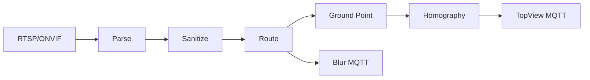

# compute-server

<p>
  
  
  
  
</p>

채널 하나의 CCTV ONVIF 메타데이터를 받아 객체를 정제하고, 카메라 로컬 좌표와 블러 영역을 MQTT로
발행하는 엣지 서버입니다. 배포 단위는 **채널당 프로세스(또는 컨테이너) 하나**입니다.

[← 프로젝트 홈](../README.md) · [배포 가이드](../deploy/compute-server/compute_server_deployment.md) ·
[성능 분석](../performance/compute-server.md)

## 처리 파이프라인



| 단계 | 구현 |
| --- | --- |
| 수집 | `RtspClientV2`, `RtspOnvifSourceV2` |
| 파싱·정제 | `OnvifParser`, `ContainmentSanitizer`, `ParentBasedRouter` |
| 좌표 처리 | `BottomCenterExtractor`, `AffineImageCoordinateMapper`, `HomographyTransform` |
| 출력 | `MqttTopViewSink`, `MqttBlurSink` |

## 디렉터리

```text
compute-server/
├─ include/             공개 계약과 도메인 타입
├─ src/core/            설정 조립과 파이프라인
├─ src/network/         RTSP 연결
├─ src/{parser,sanitize,route}/
├─ src/{ground,mapper,transform}/
├─ src/{mqtt,sink}/     비동기 MQTT 발행
├─ Dockerfile
└─ docker-compose.yml
```

## 빌드

프로젝트 루트에서 실행합니다.

```bash
cmake -S . -B build -DVEDA_BUILD_CONTROL_SERVER=OFF
cmake --build build --target compute-server -j
```

필요 패키지는 OpenSSL, pthreads, `pkg-config`, `libmosquitto`, `nlohmann_json`입니다.

## 실행

서버는 **현재 작업 디렉터리**의 `config.json`을 읽습니다. 채널마다 고유한 `channelId`, RTSP 주소,
homography, MQTT 호스트와 TLS CA를 설정한 뒤 실행하세요.

```bash
cd /path/to/channel-config
/path/to/Main_Project/build/compute-server/compute-server
```

`SIGINT`와 `SIGTERM`은 정상 종료를 수행하고, `SIGHUP`은 logrotate를 위해 로그 파일을 다시 엽니다.

## Docker

빌드 컨텍스트는 프로젝트 루트입니다.

```bash
docker build -f compute-server/Dockerfile -t veda/compute-server:1.0.0 .
```

현장에서는 채널별 `config.json`과 CA 인증서를 읽기 전용으로 마운트합니다. CCTV 1대(4채널) 배포 절차는
[초기 설정 및 신규 CCTV 배포 매뉴얼](../deploy/compute-server/compute_server_deployment.md)을 따르세요.

## 테스트와 문서

```bash
ctest --test-dir build --output-on-failure
```

- [컴포넌트 레퍼런스](../manual/compute-server/)
- [보안 검토](../manual/compute-server/security/)
- [캘리브레이션 가이드](../deploy/compute-server/calibration/calibration_manual.md)
- [Sink 벤치마크](../performance/sink-compute-server.md)
