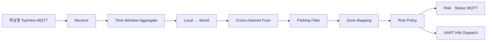

# control-server

<p>
  
  
  
  
</p>

여러 compute-server의 관측을 시간 창으로 모아 공통 월드 좌표로 변환하고, 중복 객체를 융합해 위험도를
판정하는 중앙 관제 서버입니다. 결과는 MQTT 관제 클라이언트와 UART 경보 장치로 동시에 전달합니다.

[← 프로젝트 홈](../README.md) · [컴포넌트 문서](../manual/control-server/) ·
[성능 분석](../performance/control-server.md)

## 처리 파이프라인



| 단계 | 구현 |
| --- | --- |
| 수신·집계 | `MqttChannelReceiver`, `TimeWindowAggregatorV2` |
| 좌표·융합 | `AffineLocalToWorldTransform`, `GridFuser` |
| 정책 | `StationaryParkingPolicy`, `SpatialZoneMapper`, `ThresholdRiskPolicy` |
| 출력 | `MqttTransport`, `SerialHwEventDispatcher` |

## 디렉터리

```text
control-server/
├─ include/             공개 계약과 도메인 타입
├─ src/core/            의존성 조립과 제어 루프
├─ src/{receive,aggregate,fuse}/
├─ src/{transform,parking,zone,risk}/
├─ src/dispatch/        UART 경보·상태 통신
└─ src/sink/            MQTT 결과 발행
```

## 빌드

프로젝트 루트에서 실행합니다.

```bash
cmake -S . -B build
cmake --build build --target control-server -j
```

필요 패키지는 OpenSSL, pthreads, `pkg-config`, `libmosquitto`, `nlohmann_json`입니다.

## 실행

서버는 **현재 작업 디렉터리**의 `config.json`을 읽습니다. 운영 전 다음 항목을 현장 값으로 채워야 합니다.

- MQTT broker URL, TLS CA, client ID
- 채널 수와 채널별 카메라 설치 좌표·방향
- 채널 수와 일치하는 zone 정의
- warning/danger 거리와 집계 시간 창
- STM32 시리얼 장치 경로

```bash
cd /path/to/control-config
/path/to/Main_Project/build/control-server/control-server
```

zone 또는 카메라 보정이 채널 구성과 맞지 않으면 시작 단계에서 실패합니다. `SIGINT`와 `SIGTERM`은 정상
종료를 수행하고, `SIGHUP`은 로그 파일을 다시 엽니다.

## MQTT와 하드웨어 계약

compute-server, client와 공유하는 토픽·JSON 계약은 [`shared/Contract.h`](../shared/Contract.h)에 있습니다.
STM32 UART 프레임과 checksum 계약은 [`shared/driver_protocol.h`](../shared/driver_protocol.h)를 양쪽에서
공유하므로 별도 구현으로 복제하지 않습니다.

## 테스트와 문서

```bash
ctest --test-dir build --output-on-failure
```

- [위험 감지 시퀀스](../manual/system/hazard_detection_sequence.md)
- [Aggregator 레퍼런스](../manual/control-server/components/aggregator_reference.md)
- [Risk 레퍼런스](../manual/control-server/components/risk_reference.md)
- [보안 문서](../manual/control-server/security/)
- [Control 서버 벤치마크](../performance/control-server.md)
