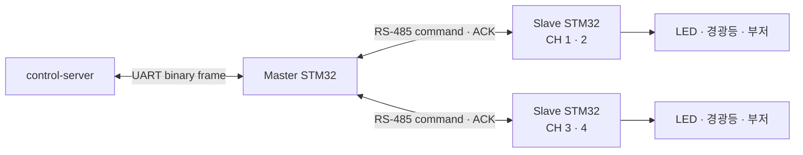

# VEDA STM32 Driver

<p>
  
  
  
  
</p>

control-server의 위험 이벤트를 받아 현장 LED·경광등·부저를 제어하고, ACK와 heartbeat로 실제 장치 상태를
돌려주는 STM32F401RE 펌웨어 모음입니다.

[← 프로젝트 홈](../README.md) · [공유 통신 규약](../shared/driver_protocol.h) ·
[위험 감지 시퀀스](../manual/system/hazard_detection_sequence.md)

## 하드웨어 흐름



## 프로젝트

| 디렉터리 | 역할 |
| --- | --- |
| `Rs485_send_demo/` | 4개 채널을 스케줄링하고 slave와 통신하는 master 펌웨어 |
| `Rs485_receive_demo/` | 채널 1·2를 제어하는 slave 펌웨어 |
| `rs485_receive_2/` | 채널 3·4를 제어하는 slave 펌웨어 |

각 프로젝트는 STM32CubeMX의 `.ioc`, STM32CubeIDE 메타데이터, HAL/CMSIS, FreeRTOS 코드를 함께 포함합니다.

## 빌드와 플래시

1. STM32CubeIDE에서 대상 디렉터리의 `.project` 또는 `.ioc`를 엽니다.
2. 보드별 채널 설정과 RS-485 DE 핀 구성을 확인합니다.
3. 프로젝트를 빌드한 뒤 ST-LINK로 해당 STM32F401RE에 플래시합니다.
4. master, 두 slave, control-server 순서로 연결 상태와 heartbeat를 확인합니다.

CubeMX에서 코드를 다시 생성할 때는 `USER CODE BEGIN/END` 밖의 수동 변경이 덮어써질 수 있으므로 diff를
반드시 확인하세요.

## 통신 계약

서버와 펌웨어는 [`shared/driver_protocol.h`](../shared/driver_protocol.h)의 프레임 구조와
`veda_checksum()`을 공통으로 사용합니다.

- control-server → master: 위험도와 거리 정보를 담은 하행 프레임
- master → control-server: ACK 또는 heartbeat 상태 프레임
- master ↔ slave: 채널 명령, ACK, 주기적 상태 갱신
- 내부 채널 인덱스는 0-based, 현장 RS-485 채널 표기는 1-based

프레임 구조를 변경할 때는 `shared/driver_protocol.h`를 먼저 수정하고 C++ 서버 테스트와 C 펌웨어 테스트를
함께 실행해야 합니다.

## 로컬 검사 도구

master 프로젝트의 `tools/`에는 프로토콜과 스케줄러의 작은 독립 검사가 있습니다.

```bash
python3 Rs485_send_demo/tools/mutation_check.py
```

세부 사용법은 [`Rs485_send_demo/tools/TESTING.md`](Rs485_send_demo/tools/TESTING.md)를 참고하세요.

## 주요 설정 위치

| 항목 | 위치 |
| --- | --- |
| master 채널 수·재시도·heartbeat | `Rs485_send_demo/Core/Inc/veda_config.h` |
| slave 채널 수·ACK·DE 핀 | 각 slave의 `Core/Inc/veda_config.h` |
| 핀맵과 UART 핸들 | 각 프로젝트의 `Core/Inc/main.h` |
| 서버/펌웨어 공통 프레임 | `shared/driver_protocol.h` 및 각 프로젝트의 동기화된 사본 |
