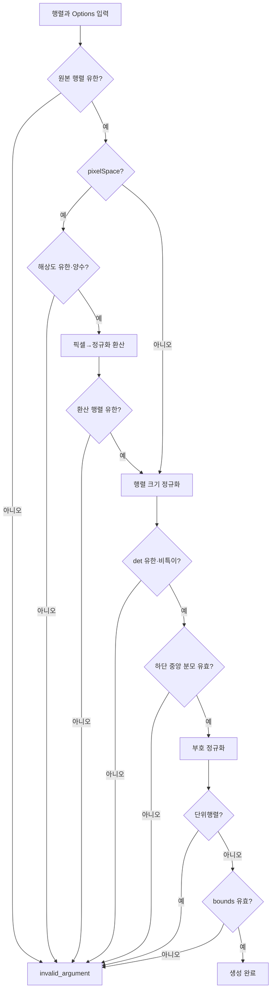

# Transform 모듈 레퍼런스 (Risk 경로 기하 변환)

> **대상 파일**
> - 인터페이스: `include/interfaces/ICoordinateTransform.h`
> - 구현체: `src/transform/HomographyTransform.h`, `.cpp`
> - 격리 단위 테스트: `HomographyTransformTest/HomographyTransformTest.cpp`
> - 디버그 더미: `src/transform/NullTransform.h`, `.cpp`

---

| Date | Version | Writer | Summary |
| :--- | :--- | :--- | :--- |
| 2026-07-28 | 1.0.0 | Jeong-dap | ICoordinateTransform 인터페이스 및 Homography 기하 변환 연산 명세 |
| 2026-07-28 | 1.0.1 | Jeong-dap | 행렬 크기 정규화, fail-closed 지평선·단위행렬 정책, 입력 계약 및 보안 회귀 테스트 반영 |

---

Router가 분리한 **risk 경로에서 이미지 위 지면점을 카메라 로컬 지면 좌표(m)로 변환하는 계층**이다.

compute-server가 발행하는 거리 좌표의 최종 산출 지점이며, 파이프라인에서 입력에 의존하는 원근 나눗셈을 수행한다.

| 구분 | **Transform** | Mapper |
|------|---------------|--------|
| 경로 | risk 전용 | blur 전용 |
| 입력 | `ImagePoint` — 정규화 `[0,1]` | bbox |
| 출력 | `veda::LocalPoint` — 카메라 로컬 미터 좌표 | 앱 표시용 이미지 좌표 |
| 수학 | 3×3 호모그래피 + 원근 나눗셈 | 아핀 변환 |
| 실패 표현 | `std::optional`의 `nullopt` | 원소 제거 |
| 호출 빈도 | risk 객체당 1회 | 프레임당 1회 |

---

## 1. 인터페이스 명세

```cpp
class ICoordinateTransform {
public:
    virtual ~ICoordinateTransform() = default;

    virtual std::optional<veda::LocalPoint> toLocal(
        const domain::ImagePoint& p) = 0;
};
```

| 요소 | 계약 |
|------|------|
| 입력 `p` | 유한한 `[0,1]` 정규화 이미지 좌표, 좌상단 원점 |
| 반환 | 카메라 로컬 지면 좌표(m) |
| 실패 | `std::nullopt` |
| 호출 전제 | 단일 Pipeline 스레드 |

### 1.1 월드 좌표가 아니다

`toLocal()`의 결과는 공통 도면 좌표가 아니다.

- 원점: 해당 카메라
- `+y`: 카메라 전방
- 단위: 미터

공통 월드 좌표로의 회전·평행이동은 control-server의 `ILocalToWorldTransform` 책임이다.

compute-server에서 호모그래피를 도면 월드 좌표에 맞추면 control-server가 변환을 다시 적용해 그럴듯하지만 잘못된 좌표가 만들어진다.

### 1.2 `std::optional`을 사용하는 이유

지평선 위·너머, 범위 밖, 비유한 입력처럼 사상할 수 없는 점에 가짜 좌표를 부여하지 않는다.

```text
확신할 수 있는 좌표 → LocalPoint
확신할 수 없는 좌표 → nullopt
```

잘못된 위치를 정상 좌표로 발행하는 것보다 해당 객체를 폐기하고 실패를 관측 가능하게 기록하는 편이 안전하다.

---

## 2. 수식과 불변성

3×3 row-major 행렬을 다음과 같이 정의한다.

```text
H = [h0 h1 h2
     h3 h4 h5
     h6 h7 h8]
```

정규화 이미지 좌표 `(u,v)`의 변환:

```text
denominator = h6·u + h7·v + h8

x = (h0·u + h1·v + h2) / denominator
y = (h3·u + h4·v + h5) / denominator
```

### 2.1 호모그래피 스칼라배 불변성

0이 아닌 상수 `c`에 대해 `H`와 `cH`는 동일한 사상이다.

```text
(c·numerator) / (c·denominator)
= numerator / denominator
```

1.0.1 구현은 생성 시 `max(|h_i|)=1`이 되도록 행렬을 정규화한다. 따라서 determinant와 분모 임계값이 입력 행렬의 임의 크기에 좌우되지 않는다.

검증된 스케일:

```text
H
1e-300H
1e300H
-1e300H
```

네 행렬은 동일한 점을 허용하고 동일한 좌표를 반환한다.

---

## 3. 생성자 — 조립 시점 fail-fast

```cpp
HomographyTransform(
    std::array<double, 9> matrix,
    const Options& options);
```

구조적으로 잘못된 설정은 런타임까지 전달하지 않고 생성자에서 `std::invalid_argument`로 거부한다.

### 3.1 검증 순서



### 3.2 `Options`

```cpp
struct Options {
    bool pixelSpace = false;
    double imageWidth = 0.0;
    double imageHeight = 0.0;

    bool boundsEnabled = false;
    double minX = 0.0;
    double maxX = 0.0;
    double minY = 0.0;
    double maxY = 0.0;
};
```

| 옵션 | 의미 |
|------|------|
| `pixelSpace` | 입력 행렬이 픽셀 좌표계 기준인지 |
| `imageWidth/Height` | 픽셀 캘리브레이션에 사용한 해상도 |
| `boundsEnabled` | 카메라 로컬 물리 범위 검사 |
| `min/max` | 허용할 로컬 좌표 범위(m) |

### 3.3 원본 행렬 유한성

행렬 9개 원소에 NaN 또는 Inf가 있으면 즉시 실패한다.

```cpp
for (double value : matrix_) {
    if (!std::isfinite(value)) {
        throw std::invalid_argument(...);
    }
}
```

### 3.4 픽셀 → 정규화 좌표계 환산

OpenCV 등에서 픽셀 좌표로 구한 행렬은 다음과 같이 정규화 입력용 행렬로 변환한다.

```text
H_normalized = H_pixel · diag(W, H, 1)
```

구현:

```cpp
for (std::size_t row = 0; row < 3; ++row) {
    matrix_[row * 3 + 0] *= options_.imageWidth;
    matrix_[row * 3 + 1] *= options_.imageHeight;
}
```

1.0.1에서는 해상도가 유한한 양수인지 검사하고, 곱셈 직후 행렬 9개 원소를 다시 검사한다.

유한한 원본 행렬과 유한한 해상도의 곱도 overflow로 Inf가 될 수 있기 때문에 환산 후 재검사가 필요하다.

### 3.5 행렬 크기 정규화

```cpp
double maxAbsValue = 0.0;
for (double value : matrix_) {
    maxAbsValue = std::max(maxAbsValue, std::abs(value));
}
for (double& value : matrix_) {
    value /= maxAbsValue;
}
```

정규화 이후:

```text
max(|h0|, ..., |h8|) = 1
```

전부 0인 행렬은 `maxAbsValue == 0`이므로 거부한다.

### 3.6 특이행렬 검사

정규화된 행렬에서 determinant를 계산한다.

```cpp
if (!std::isfinite(normalizedDeterminant) ||
    std::abs(normalizedDeterminant) <
        kMinNormalizedDeterminant) {
    throw std::invalid_argument(...);
}
```

```text
kMinNormalizedDeterminant = 1e-12
```

행렬 크기를 먼저 정규화하므로 기존의 scale-dependent 오판을 피한다.

### 3.7 지평선 기준점과 부호 정규화

기준점은 화면 하단 중앙 `(0.5, 1.0)`이다.

```cpp
anchorDenominator =
    h6·0.5 + h7·1.0 + h8
```

기준점의 분모가 유한하지 않거나 `1e-9` 이하면 생성자가 실패한다.

```cpp
if (!std::isfinite(anchorDenominator) ||
    std::abs(anchorDenominator) <= kMinDenominator) {
    throw std::invalid_argument(...);
}
```

V1의 “지평선 검사를 비활성화하고 계속 실행”하는 폴백은 제거됐다. 기준점으로 정상 지면 방향을 확정할 수 없다면 변환기를 만들지 않는다.

기준점 분모가 음수이면 행렬 전체 부호를 반전한다.

```cpp
if (anchorDenominator < 0.0) {
    for (double& value : matrix_) {
        value = -value;
    }
}
```

### 3.8 단위행렬 거부

단위행렬은 정규화 이미지 좌표를 그대로 미터 좌표라고 주장하는 상태다.

1.0.1에서는 경고만 남기지 않고 생성자에서 실패한다.

```cpp
if (isIdentityLike(matrix_)) {
    throw std::invalid_argument(...);
}
```

설정 파일이 누락되어 기본 단위행렬이 사용돼도 잘못된 좌표를 발행하기 전에 조립이 중단된다.

### 3.9 bounds 검증

`boundsEnabled == true`이면:

- 네 값이 모두 유한해야 한다.
- `minX < maxX`
- `minY < maxY`

조건을 만족하지 않으면 생성자가 실패한다.

---

## 4. 런타임 `toLocal()` — 4단계 방어

### 4.1 입력 계약

원근 계산 전에 `ImagePoint` 자체를 검사한다.

```cpp
if (!std::isfinite(p.u) ||
    !std::isfinite(p.v) ||
    p.u < 0.0 || p.u > 1.0 ||
    p.v < 0.0 || p.v > 1.0) {
    return std::nullopt;
}
```

`(0,0)`과 `(1,1)`은 허용되며 범위 밖 유한값과 NaN/Inf는 거부된다.

### 4.2 분모 선차단

```cpp
if (!std::isfinite(denominator) ||
    denominator <= kMinDenominator) {
    return std::nullopt;
}
```

나눗셈 전에 다음을 차단한다.

- NaN/Inf 분모
- 0 분모
- 지평선에 너무 가까운 양수 분모
- 지평선 위·너머의 음수 분모

```text
kMinDenominator = 1e-9
```

### 4.3 결과 유한성

```cpp
const veda::LocalPoint local{
    numeratorX / denominator,
    numeratorY / denominator,
};

if (!std::isfinite(local.x) ||
    !std::isfinite(local.y)) {
    return std::nullopt;
}
```

행렬과 입력을 앞에서 검증하더라도 결과 유한성 방어는 두 번째 안전망으로 유지한다.

### 4.4 로컬 bounds

```cpp
if (options_.boundsEnabled &&
    (local.x < options_.minX ||
     local.x > options_.maxX ||
     local.y < options_.minY ||
     local.y > options_.maxY)) {
    return std::nullopt;
}
```

bounds 경계는 포함한다.

> **운영 주의**: `localBoundsEnabled` 기본값은 `false`다. 현장에서는 실측 가능한 물리 범위로 활성화해야 유한하지만 불가능한 발산 좌표를 차단할 수 있다.

---

## 5. 실패 로그 rate-limit

연속 실패는 첫 건과 100건마다만 기록한다.

```cpp
bool HomographyTransform::shouldLogFailure() noexcept {
    ++failureCount_;
    if (!isLogEnabled(LogLevel::Error)) {
        return false;
    }
    return failureCount_ == 1 ||
           failureCount_ % 100 == 0;
}
```

문자열은 판정을 통과한 뒤 조립한다.

```cpp
if (shouldLogFailure()) {
    logFailure("u=" + std::to_string(p.u) + ...);
}
```

이 순서를 바꾸면 억제되는 99%의 실패에서도 긴 문자열이 만들어져 힙 할당이 발생한다.

검증:

```text
첫 실패로 rate-limit 상태 준비
이후 억제 실패 90회
operator new 호출 = 0
```

---

## 6. 설정 및 Pipeline 통합

### 6.1 `config.json`

| 키 | 기본값 | 의미 |
|----|--------|------|
| `homography` | 단위행렬 | 3×3 row-major 행렬 |
| `homographySpace` | `"normalized"` | `"normalized"` 또는 `"pixel"` |
| `imageWidth/Height` | `0` | 픽셀 공간일 때 사용 |
| `localBoundsEnabled` | `false` | 로컬 좌표 범위 검사 |
| `localMin/MaxX/Y` | `0` | 로컬 좌표 범위(m) |

1.0.1에서 단위행렬은 생성자 오류이므로 실제 배포에는 유효한 캘리브레이션 행렬이 반드시 필요하다.

> `AppConfig`는 잘못된 bounds에서 현재 검사를 꺼버린다. `HomographyTransform` 자체는 잘못된 bounds를 거부하지만, 운영 설정 전체를 fail-closed로 만들려면 AppConfig 정책도 함께 검토해야 한다.

### 6.2 Pipeline

```cpp
const domain::ImagePoint groundPoint =
    ground_->extract(object.box);

const auto localPoint =
    transform_->toLocal(groundPoint);

if (!localPoint.has_value()) {
    ++transformFailCount_;
    continue;
}

out.pos = *localPoint;
```

실패한 객체는 risk 출력에서 제거된다.

---

## 7. 성능·메모리·스레드 제약

### 7.1 시간 복잡도

`toLocal()`은 고정된 산술과 분기로 구성돼 객체당 O(1), 프레임당 O(N)이다.

행렬 환산·정규화·determinant·설정 검증은 생성자에서 한 번만 수행된다.

### 7.2 메모리

- 고정 `std::array<double,9>`
- 고정 `Options`
- `std::uint64_t` 실패 카운터
- 입력 비례 저장소 없음

정상 변환과 억제 실패 경로는 힙 할당 없이 동작한다.

### 7.3 스택

재귀와 입력 비례 지역 배열이 없어 구조적인 stack overflow 경로가 없다.

### 7.4 스레드 안전성

`toLocal()`은 실패 시 `failureCount_`를 변경한다. 동일 인스턴스를 여러 스레드에서 동시에 호출하면 데이터 경합이므로 스레드 안전하지 않다.

현재 Pipeline 단일 스레드 호출 전제에서는 문제가 없다. 다중 스레드로 확장할 때 카운터 구조를 재설계해야 한다.

---

## 8. 검증

### 8.1 격리 GTest

`HomographyTransformTest.cpp`는 실제 `HomographyTransform.cpp`를 링크하며 테스트에 불필요한 Contract/JSON/비동기 Logger만 최소 스텁으로 치환한다.

```text
25 tests / 25 PASS
```

검증 범위:

- NaN/Inf/0/특이/단위행렬
- 픽셀 환산 overflow
- 유한·양수 이미지 해상도
- bounds 유한성·순서
- 극단 스칼라배 동일성
- 픽셀·정규화 공간 동등성
- 지평선 기준점·위·너머·아래
- `[0,1]` 경계와 범위 밖 입력
- 정상·실패 경로 동적 할당

### 8.2 코드 품질

```text
-Wall -Wextra -Wpedantic -Werror: PASS
git diff --check: PASS
K&R/Attach 중괄호 및 단문 제어문 braces: 적용
```

---

## 9. `NullTransform`

`NullTransform`은 입력 `(u,v)`를 그대로 `LocalPoint`로 복사하는 디버그 더미다.

- 단위가 미터가 아님
- 지평선 검사 없음
- 입력 유한성·범위 검사 없음
- bounds 없음

운영 DI에 연결하면 거리 기반 위험 판정이 무의미해진다. 운영에서는 `HomographyTransform`만 사용해야 한다.

---

## 10. 1.0.1 운영 체크리스트

- [ ] 채널별 실측 대응점으로 행렬을 계산했다.
- [ ] `homographySpace`가 행렬 생성 좌표계와 일치한다.
- [ ] 픽셀 공간이면 캘리브레이션 해상도를 정확히 설정했다.
- [ ] 단위행렬이 아니다.
- [ ] 화면 하단 중앙이 지평선과 겹치지 않는다.
- [ ] `localBoundsEnabled`를 켜고 현장 물리 범위를 설정했다.
- [ ] compute 출력이 로컬 좌표이고 월드 변환은 control-server 책임임을 확인했다.
- [ ] 격리 GTest 25개와 좌표 회귀 12개를 실행했다.

---
