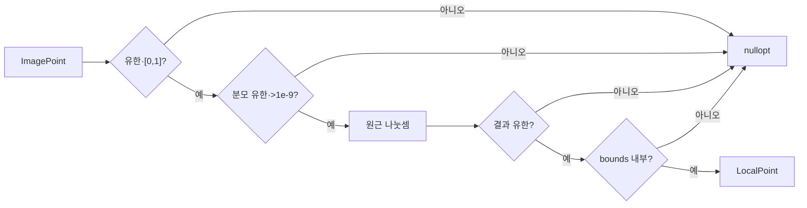

# Transform 계층 보안·성능 권고 (Security & Performance Advisory)

> **대상 모듈**
> - 인터페이스: `include/interfaces/ICoordinateTransform.h`
> - 구현체: `src/transform/HomographyTransform.h`, `.cpp`
> - 격리 단위 테스트: `HomographyTransformTest/HomographyTransformTest.cpp`

---

| Date | Version | Writer | Summary |
| :--- | :--- | :--- | :--- |
| 2026-07-28 | 1.0.0 | Jeong-dap | Transform 계층(Homography) 기하학적 예외(0 나누기, NaN) 방어 및 메모리/성능 감사 명세 |
| 2026-07-28 | 1.0.1 | Jeong-dap | Transform 수치 안전성 fail-closed 패치, 무할당 로그 및 단위·좌표 회귀 검증 |

---

## 1. 위협 모델 (Threat Model) — 수치 오답 & 안전 판단 오염

`HomographyTransform`은 외부 I/O를 직접 수행하지 않지만 신뢰할 수 없는 카메라에서 유래한 좌표와 운영 설정 행렬을 받아 원근 나눗셈을 수행한다.

| 출처 | 통제 주체 | 위협 |
|------|-----------|------|
| `ImagePoint` | 카메라(신뢰 불가) | NaN/Inf, 범위 밖 값, 지평선 위·너머 입력 |
| 호모그래피 행렬 | 운영자 설정 | 특이·단위·비유한 행렬, 잘못된 스케일 |
| 이미지 해상도 | 운영자 설정 | 0/음수/Inf, 픽셀 환산 overflow |
| 로컬 bounds | 운영자 설정 | NaN/Inf, min/max 역전, 검사 비활성화 |

| 위협 범주 | 시나리오 | 1.0.1 상태 |
|-----------|----------|---------|
| 0 나눗셈 | 지평선 위 점으로 분모 0 유도 | ✅ 나눗셈 전 차단 |
| 반사 팬텀 좌표 | 지평선 너머 음수 분모 | ✅ 부호 정규화 + 단일 비교 |
| 환산 overflow | 유한 행렬 × 큰 해상도 | ✅ 환산 직후 재검사 |
| 스칼라배 불일치 | `H`와 `cH`가 다른 판정 | ✅ 크기 정규화 |
| 특이행렬 | determinant 0 또는 NaN | ✅ 생성자 fail-fast |
| 단위행렬 | `[0,1]`을 미터로 발행 | ✅ 생성자 fail-fast |
| 입력 계약 위반 | 범위 밖 유한 좌표 | ✅ 원근 계산 전 거부 |
| 반복 로그 할당 | 억제 로그도 문자열 생성 | ✅ M1 패치·실측 완료 |

### 실패 방향

- 구조적으로 잘못된 설정: 프로세스 조립 실패
- 런타임 사상 불가: 해당 객체 `nullopt`
- 정상 입력: 유한한 `LocalPoint`

경고만 남기고 잘못된 좌표를 계속 발행하는 fail-open 경로를 제거하는 것이 1.0.1의 핵심이다.

---

## 2. 수치 안전성 패치

### 2.1 ✅ W1 — 픽셀 환산 overflow — 패치 완료

#### 패치 이전

원본 행렬만 유한성 검사한 뒤 해상도를 곱하고 결과를 재검사하지 않았다.

```cpp
matrix_[row * 3 + 0] *= imageWidth;
matrix_[row * 3 + 1] *= imageHeight;
```

유한한 값의 곱도 double 범위를 넘으면 Inf가 된다.

재현:

```text
H_pixel =
[1e-308  0  1
 0       1  0
 2       0  1]

imageWidth = 1e308
→ m6 = Inf
→ det = NaN
```

NaN 비교는 false이므로 기존 특이성 검사를 우회할 수 있었다.

#### 1.0.1 패치

- 해상도 유한·양수 검사
- 픽셀 환산 직후 행렬 9개 유한성 검사
- determinant 자체의 유한성 검사

```cpp
for (double value : matrix_) {
    if (!std::isfinite(value)) {
        throw std::invalid_argument(...);
    }
}
```

검증:

```text
PASS: 픽셀 환산 overflow 거부
PASS: 무한대 이미지 해상도 거부
PASS: 0 이미지 해상도 거부
```

### 2.2 ✅ W2 — 절대 임계값의 스칼라배 불변성 위반 — 패치 완료

#### 문제

호모그래피는 `H`와 `cH`가 같지만 기존 determinant·분모 검사는 행렬의 절대 크기에 의존했다.

```text
det(cH) = c³det(H)
```

정상 가역 행렬도 작은 상수배를 하면 특이행렬로 오판할 수 있었다.

#### 1.0.1 패치

```text
max(|h_i|) = 1
```

이 되도록 행렬을 정규화한 뒤 determinant와 분모를 검사한다.

검증:

```text
H
1e-300H
1e300H
-1e300H
```

결과:

```text
PASS: 네 행렬 모두 생성
PASS: 네 행렬의 좌표 결과 동일
```

### 2.3 ✅ W3 — 지평선 기준점 fail-open — 패치 완료

#### 패치 이전

화면 하단 중앙의 분모가 0 근처이면:

```cpp
horizonCheckEnabled_ = false;
```

로 설정하고 음수 분모의 부호 검사를 생략했다.

다음 비특이 행렬에서 반사 좌표가 통과할 수 있었다.

```text
H =
[1 0  0
 0 1  0
 0 1 -1]

det(H) = -1
anchor denominator = 0
```

#### 1.0.1 패치

기준점이 유효하지 않으면 생성자가 실패한다.

```cpp
if (!std::isfinite(anchorDenominator) ||
    std::abs(anchorDenominator) <=
        kMinDenominator) {
    throw std::invalid_argument(...);
}
```

`horizonCheckEnabled_` 멤버와 비활성화 분기를 제거했다.

검증:

```text
PASS: 하단 중앙 지평선 생성 거부
PASS: 지평선 너머 음수 분모 거부
PASS: 지평선 위 0 분모 거부
PASS: 지평선 아래 양수 분모 허용
```

### 2.4 ✅ W4 — 단위행렬 warning-only — 패치 완료

단위행렬은 `[0,1]` 이미지 좌표를 같은 숫자의 미터 좌표로 발행한다.

현재는 로그만 남기지 않고 생성자를 실패시킨다.

```cpp
if (isIdentityLike(matrix_)) {
    throw std::invalid_argument(...);
}
```

양수·음수 스칼라배 단위행렬도 크기·부호 정규화 후 동일하게 거부한다.

### 2.5 ✅ W5 — 입력 사후 검사 의존 — 패치 완료

입력 NaN을 원근 연산에 넣은 뒤 결과 유한성 검사에서 차단하는 과정이었지만 입력 관문에서 직접 거부하는 방향으로 변경하였다.

```cpp
if (!std::isfinite(p.u) ||
    !std::isfinite(p.v) ||
    p.u < 0.0 || p.u > 1.0 ||
    p.v < 0.0 || p.v > 1.0) {
    return std::nullopt;
}
```

검증:

```text
PASS: (0,0), (1,1) 허용
PASS: u<0, u>1, v<0, v>1 거부
PASS: NaN/Inf 입력 거부
```

### 2.6 ✅ bounds 생성자 검증

`boundsEnabled == true`일 때:

- 네 값 모두 유한
- `minX < maxX`
- `minY < maxY`

조건을 강제한다.

검증:

```text
PASS: 비유한 bounds 거부
PASS: 같은 min/max 거부
PASS: 역전 bounds 거부
PASS: 유효 bounds 허용
```

> **잔여 통합 사항**: `AppConfig`가 잘못된 bounds에서 검사를 꺼버리는 정책은 별도 검토 대상이다.

---

## 3. 런타임 4중 방어



| 관문 | 차단 대상 |
|------|-----------|
| 입력 유한성·범위 | NaN/Inf, 유한한 범위 밖 입력 |
| 분모 선차단 | 0, 0 근처, 음수, NaN/Inf |
| 결과 유한성 | 향후 계산 변경에 대한 두 번째 방어선 |
| 로컬 bounds | 유한하지만 물리적으로 불가능한 좌표 |

`localBoundsEnabled` 기본값은 `false`이므로 실제 배포에서는 현장 실측 범위를 설정해야 한다.

---

## 4. 메모리·스택·성능·I/O

### 4.1 ✅ OOM — 대상 컴포넌트 고정 저장소

| 저장소 | 형태 |
|--------|------|
| 행렬 | `std::array<double,9>` |
| 옵션 | 고정 크기 스칼라 구조체 |
| 실패 카운터 | `std::uint64_t` |
| 함수 지역 | 고정 개수 `double`, `LocalPoint` |

입력 크기에 따라 증가하는 자료구조가 없다.

### 4.2 ✅ Stack overflow — 구조적 경로 없음

- 재귀 없음
- 대형 지역 배열 없음
- 입력 비례 지역 저장소 없음
- 반복 횟수 최대 9

### 4.3 ✅ M1 — 억제 실패 로그 무할당 — 패치 완료

#### 문제

```cpp
logFailure("u=" + std::to_string(p.u) + ...);
```

함수 인자는 진입 전에 평가되므로 rate-limit에 의해 실제 로그가 억제돼도 문자열이 이미 조립됐다.

#### 패치

```cpp
if (shouldLogFailure()) {
    logFailure("u=" + std::to_string(p.u) + ...);
}
```

검증:

```text
정상 toLocal 1000회: 힙 할당 0
억제 실패 90회: 힙 할당 0
```

실제 기록 차례에는 의도적으로 문자열과 로그 큐 항목이 생성될 수 있다.

### 4.4 ✅ CPU

`toLocal()`은 반복문 없는 고정 산술로 객체당 O(1)이다.

행렬 정규화·determinant·설정 검증은 생성자에서 한 번만 수행된다.

### 4.5 ✅ 분기 예측

`horizonCheckEnabled_` 런타임 분기를 제거했다.

정상 입력에서 오류 분기는 대부분 false이며 별도 `[[likely]]` 힌트는 적용하지 않았다.

### 4.6 ✅ I/O

대상 컴포넌트는 직접 파일·소켓 I/O를 수행하지 않는다.

실패 로그는 비동기 Logger로 전달하며 첫 건과 100건마다 기록한다.

---

## 5. 격리 단위 테스트

### 5.1 구조

`HomographyTransformTest.cpp`는 실제 프로덕션 `HomographyTransform.cpp`를 링크한다.

테스트용 최소 스텁으로 제거한 의존성:

- `Contract.h`
- `nlohmann/json.hpp`
- `IGroundPointExtractor`
- 실제 비동기 Logger
- OpenSSL
- mosquitto

GTest는 테스트 프레임워크로 유지한다.

### 5.2 결과

```text
25 tests from HomographyTransformTest
25 PASSED
```

주요 테스트:

| 영역 | 결과 |
|------|------|
| 행렬·해상도·bounds fail-fast | ✅ PASS |
| 극단 스칼라배 불변성 | ✅ PASS |
| 픽셀·정규화 행렬 동등성 | ✅ PASS |
| 지평선 위·너머·아래 | ✅ PASS |
| `[0,1]`, NaN, Inf 입력 | ✅ PASS |
| bounds 내부·외부 | ✅ PASS |
| 정상·억제 실패 무할당 | ✅ PASS |

### 5.3 코드 품질

```text
-Wall -Wextra -Wpedantic -Werror: PASS
git diff --check: PASS
K&R/Attach braces: 적용
```

---

## 6. 감사 요약

| 영역 | 판정 | 근거 |
|------|------|------|
| 0 나눗셈·지평선 | ✅ **All Clear** | fail-open 제거, 분모 선차단 |
| NaN/Inf·overflow | ✅ **All Clear** | 환산 전후·입력·분모·결과 유한성 |
| 특이·단위행렬 | ✅ **All Clear** | 생성자 fail-fast |
| 스칼라배 불변성 | ✅ **검증 완료** | `1e-300H`부터 `1e300H`까지 동일 |
| 입력 계약 | ✅ **All Clear** | 유한성 및 `[0,1]` 강제 |
| bounds | ✅ **컴포넌트 방어 완료** | 유한성·순서·런타임 범위 |
| OOM·동적 할당 | ✅ **All Clear** | 고정 저장소, 무할당 경로 실측 |
| 스택 | ✅ **All Clear** | 재귀·입력 비례 스택 없음 |
| 성능·I/O | ✅ **All Clear** | O(1), 직접 I/O 없음 |
| 단위 테스트 | ✅ **25/25 PASS** | 실제 프로덕션 구현 링크 |
| 좌표 회귀 | ✅ **12/12 PASS** | 최대 오차 `5.687e-15 m` |

### 지적 사항 목록

| # | 항목 | 등급 | 상태 |
|---|------|------|------|
| W1 | 픽셀 환산 overflow 미검사 | Warning | ✅ 패치·검증 완료 |
| W2 | 스칼라배에 따라 다른 판정 | Warning | ✅ 패치·검증 완료 |
| W3 | 지평선 기준점 실패 시 검사 비활성화 | Warning | ✅ 패치·검증 완료 |
| W4 | 단위행렬 경고-only | Warning | ✅ 패치·검증 완료 |
| W5 | 입력 유한성·범위 미검사 | Warning | ✅ 패치·검증 완료 |
| M1 | rate-limit 이전 문자열 조립 | Warning | ✅ 패치·할당 실측 완료 |
| I1 | `localBoundsEnabled` 기본값 false | Info | ⬜ 운영에서 활성화 필요 |
| I2 | AppConfig가 잘못된 bounds에서 검사를 끔 | Info | ⬜ 별도 정책 검토 |
| I3 | 동일 인스턴스 다중 스레드 호출 | Info | ⬜ 단일 Pipeline 스레드 전제 |
| I4 | `NullTransform` 운영 배선 위험 | Info | ⬜ 운영 사용 금지 |

**총평**: 1.0.1에서는 기존 감사가 놓친 픽셀 환산 overflow, 행렬 스칼라배 불일치, 지평선 fail-open, 단위행렬 경고-only, 입력 계약 미강제 문제를 모두 fail-closed 구조로 수정했다.

실제 프로덕션 구현을 링크한 격리 GTest **25/25**와 기존 좌표 회귀 **12/12**가 통과했으며 정상·억제 실패 경로의 무할당과 극단 스칼라배 동일성도 실측했다.

따라서 `HomographyTransform` 대상 범위의 1.0.1 보안 패치는 검증 완료로 판정한다. 운영에서는 현장 bounds 활성화와 `NullTransform` 비사용을 별도로 확인해야 한다.

---
