# 컴포넌트 명세

## 1. 컴포넌트 의존성과 데이터 흐름

```mermaid
flowchart LR
    subgraph Compute["compute-server"]
        Source["RtspOnvifSourceV2"]
        Network["RtspClientV2"]
        Parser["OnvifParser"]
        Sanitizer["ContainmentSanitizer"]
        Router["ParentBasedRouter"]
        Ground["BottomCenterExtractor"]
        Local["HomographyTransform"]
        Mapper["AffineImageCoordinateMapper"]
        TopSink["MqttTopViewSink"]
        BlurSink["MqttBlurSink"]
        CTransport["compute MqttTransport"]

        Source --> Network
        Source --> Parser --> Sanitizer --> Router
        Router --> Ground --> Local --> TopSink
        Router --> Mapper --> BlurSink
        TopSink --> CTransport
        BlurSink --> CTransport
    end

    Shared["shared/Contract.h<br/>JSON DTO · topics · QoS"]
    Broker[("MQTT Broker")]

    subgraph Control["control-server"]
        Receiver["MqttChannelReceiver"]
        Aggregator["TimeWindowAggregatorV2"]
        Transform["AffineLocalToWorldTransform"]
        Fuser["GridFuser"]
        Zone["SpatialZoneMapper"]
        Risk["ThresholdRiskPolicy"]
        Dispatcher["SerialHwEventDispatcher"]
        Sink["control MqttTransport"]

        Receiver --> Aggregator --> Transform --> Fuser --> Zone --> Risk
        Risk --> Dispatcher
        Risk --> Sink
    end

    Driver["shared/driver_protocol.h<br/>UART ABI"]
    STM["STM32"]
    Qt["Qt client"]

    CTransport --> Broker --> Receiver
    Sink --> Broker --> Qt
    CTransport --> Broker --> Qt
    Shared -.-> TopSink
    Shared -.-> BlurSink
    Shared -.-> Receiver
    Shared -.-> Sink
    Dispatcher --> Driver --> STM
    STM --> Driver --> Dispatcher
```

## 2. compute-server 컴포넌트

| 컴포넌트 | 책임 | 입력 → 출력 | 동시성/실패 정책 |
| --- | --- | --- | --- |
| `RtspClientV2` | 단일 RTSP 세션, Digest, interleaved RTP metadata 재조립 | socket bytes → payload callback | timeout, cancel/shutdown, frame/header 상한 |
| `RtspOnvifSourceV2` | push→pull adapter, 재접속, bounded ring | payload → `RawPacket` | worker 1개, CV, full 시 drop-oldest |
| `OnvifParser` | XML metadata와 좌표/class 정규화 | `RawPacket` → `ChannelFrame` | malformed/비유한/과대 입력 drop |
| `ContainmentSanitizer` | phantom·중복 검출 제거 | `ChannelFrame` → 정제 frame | 입력 상한 내 객체 비교 |
| `ParentBasedRouter` | risk와 blur 분리 | 객체 목록 → `RouteResult` | 재사용 버퍼, unknown drop |
| `BottomCenterExtractor` | 위험 객체 지면 접촉점 추출 | bbox → image point | O(1) |
| `HomographyTransform` | 이미지 지면점→카메라 로컬 m | image point → optional local point | 특이/범위/유한성 fail-closed |
| `AffineImageCoordinateMapper` | Qt overlay bbox 보정·확대 | blur objects → mapped objects | 화면 밖/퇴화 bbox drop |
| `MqttTopViewSink` | TopView 검증·비동기 발행 | `TopViewFrame` → JSON MQTT | queue 상한, QoS 0 |
| `MqttBlurSink` | Blur target 검증·비동기 발행 | `BlurFrame` → JSON MQTT | invalid target 부분 drop, QoS 0 |
| compute `MqttTransport` | TLS MQTT, LWT, 재접속, publish serialization | JSON → broker | shared client, listener, graceful dead publish |

## 3. control-server 컴포넌트

| 컴포넌트 | 책임 | 입력 → 출력 | 동시성/실패 정책 |
| --- | --- | --- | --- |
| `MqttChannelReceiver` | TopView/alive 구독, 검증, callback 분리 | MQTT bytes → `TopViewFrame`/alive | network thread와 pipeline worker 분리, bytes/count 상한 |
| `TimeWindowAggregatorV2` | 채널 프레임 시간 윈도우 집계 | frames → aggregated frames | mutex 밖 callback, buffer pool |
| `AffineLocalToWorldTransform` | 채널 로컬→공통 월드 | TopView frames → observation frames | 미보정/범위 밖 객체 drop |
| `GridFuser` | 교차 채널 dedup, tracking, jitter 안정화 | observations → `WorldFrame` | 소규모 pair scan, 대규모 spatial grid |
| `SpatialZoneMapper` | 월드 객체 zone 배정 | `WorldFrame` → zoneId 포함 frame | 최근접 CCTV, 방향 점수, GID별 hysteresis 이력 5개 누락 윈도우 유지 |
| `ThresholdRiskPolicy` | 차량 중심 최근접 거리 위험 판정 | `WorldFrame` → `RiskEvaluation` + frame level | 비유한 제외, threshold fail-fast |
| `SerialHwEventDispatcher` | zone 위험 UART 송신, resend, heartbeat | `RiskEvaluation` ↔ STM32 | reader/health thread; 현재 helper 누락으로 빌드 불가 |
| control `MqttTransport` | 구독 연결 공유, Risk/Status 발행 | world/status → MQTT JSON | QoS 1, status retained, legacy 병행 |

## 4. 외부 계약

| 방향 | 토픽/채널 | Payload | QoS/보존 |
| --- | --- | --- | --- |
| compute → control | `veda/ch/{ch}/topview` | `TopViewFrame` JSON v1 | QoS 0, non-retained |
| compute → Qt | `veda/ch/{ch}/blur` | `BlurFrame` JSON v1 | QoS 0, non-retained |
| compute → control | `veda/ch/{ch}/alive` | ASCII `"1"`/`"0"` | QoS 1, retained/LWT |
| control → Qt | `veda/risk` | `RiskFrame` JSON v1 | QoS 1, non-retained |
| control → Qt | `veda/hw/ch/{ch}/status` | `ChannelStatus` JSON | QoS 1, retained |
| control → legacy Qt | `veda/hw/status` | legacy nested JSON, channelId 1-based | QoS 1, retained |
| control ↔ STM32 | UART start/payload/checksum/end | downlink 27 bytes, uplink 19 bytes | XOR checksum, little-endian |

주의: `Contract.h`의 BlurFrame 통신 설명은 실제 MQTT 구현과 불일치하므로 ICD 확정 시 소스와 주석을 함께 정리해야 한다.

## 5. 공통 기술 의존성

| 의존성 | 사용 목적 |
| --- | --- |
| C++20 / pthreads | 프로세스, thread, signal, mutex/CV |
| nlohmann/json | config와 wire JSON decode, 일부 encode |
| libmosquitto | MQTT v3.1.1, TLS, QoS, retained/LWT |
| OpenSSL | RTSP Digest MD5 및 MQTT TLS의 하위 의존 |
| CMake / GoogleTest | 빌드와 단위 테스트 |

## 6. 확인된 구조적 결함

- `Controller.cpp`는 `IRiskPolicy::evaluate(WorldFrame&, RiskEvaluation&)` 계약을 따르지 않아 전체 빌드가 실패한다.
- `SerialHwEventDispatcher.cpp`/`DriverProtocolTest.cpp`가 요구하는 endian/payload helper와 ABI assertion이
  `shared/driver_protocol.h`에 없어 후속 컴파일도 실패한다.
- Qt와 control-server 배포가 저장소에 없어 종단 통합을 재현할 수 없다.
- 단일 `kSchemaVersion=1`로 TopView/Blur/Risk/ChannelStatus를 함께 관리하면서 ChannelStatus 필드만 “v2”로
  설명해 호환 정책이 모호하다.
- legacy status dual-publish의 종료 조건과 소비자 전환 현황이 없다.
