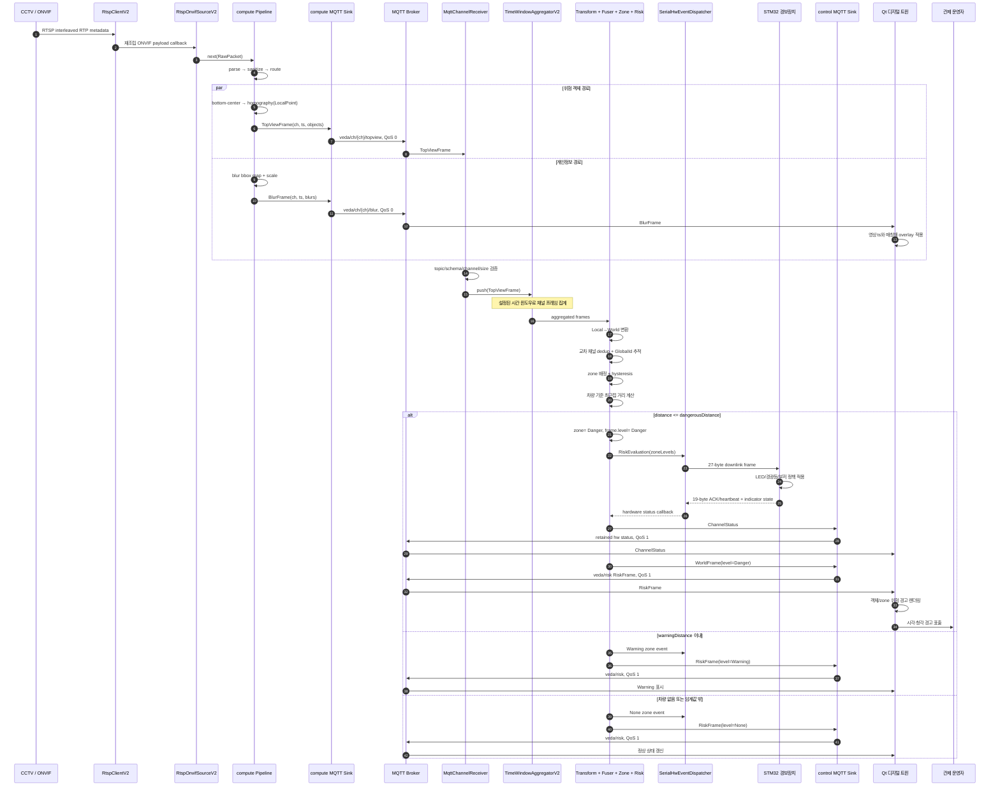
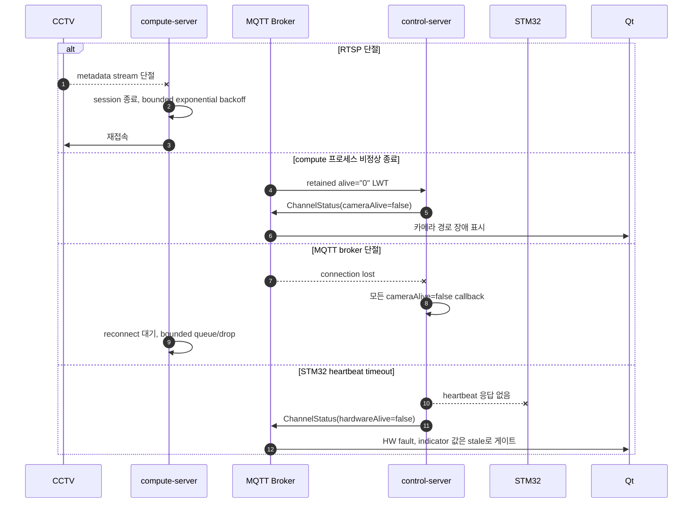

# 위험 감지 시퀀스 다이어그램

## 1. 정상 Danger 감지부터 Qt·STM32 반영까지

## 2. 오류·복구 흐름

## 3. 타이밍 기준점

| 구간 | 현재 구현 기준 | 요구사항 공백 |
| --- | --- | --- |
| CCTV→compute | 카메라 timestamp, RTSP recv timeout 기본 5초 | metadata fps, clock drift 허용값 |
| compute 내부 | packet 단위 동기 pipeline, sink는 비동기 queue | 단계별 p95/p99 예산 |
| compute→control | TopView QoS 0 | 허용 손실률, broker RTT |
| control 집계 | `windowSizeMs` 기본 220ms | 위험 경보용 승인 window |
| control→Qt | Risk QoS 1 | Qt 처리·렌더 지연과 stale 폐기 |
| control→STM32 | UART dispatch + ACK/heartbeat/retry | baudrate, 최대 반영 시간, fault escalation SLA |

종단 지연은 `CCTV ts → Qt render`와 `CCTV ts → STM32 output`을 분리 측정해야 한다. 현재 저장소만으로는 Qt render
시각과 물리 출력 확인 시각을 관측할 수 없으므로, 통합 시험 harness 또는 외부 계측점이 필요하다.
