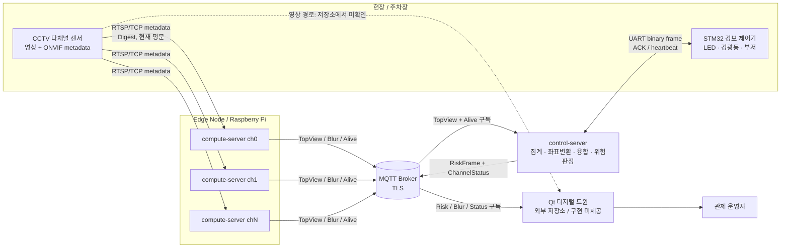
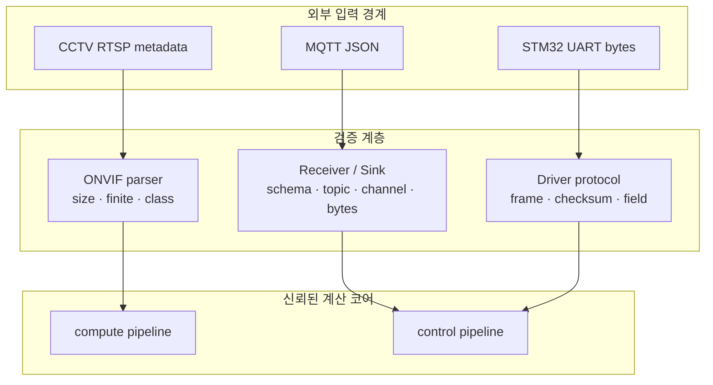

# 시스템 구성도

## 1. 논리 아키텍처

## 2. 배치 관점

| 노드 | 배치 단위 | 확인된 책임 | 미확정 사항 |
| --- | --- | --- | --- |
| CCTV | 물리 카메라 | 영상과 ONVIF 객체 metadata 생성 | 제조사 모델, fps, timestamp 동기 방식 |
| Edge | 채널당 compute-server 컨테이너 1개 | metadata 처리와 MQTT 발행 | 운영 최대 채널 수, HA, 원격 업데이트 |
| MQTT Broker | 외부 인프라 | TLS routing, QoS, retained/LWT | 제품 구성, cluster/HA, ACL, 인증 방식 |
| Control Node | 단일 control-server 프로세스 | 월드 모델과 위험 판정, UART/MQTT gateway | 배포 파일, 이중화, 장애 조치 |
| STM32 | UART 연결 장치 | 물리 경보 구동과 상태 보고 | 단일/다중 보드 topology, firmware versioning |
| Operator Node | Qt 애플리케이션 | 디지털 트윈, blur, 상태 표시 | 저장소, 영상 transport, UX/권한/ack 정책 |

## 3. 신뢰 경계

- MQTT는 인증서 검증 경로가 존재하지만 broker ACL과 client authentication 정책은 저장소에서 확정되지 않는다.
- RTSP는 현재 TLS가 없으므로 CCTV망 분리, 방화벽 또는 VPN 같은 보완 통제가 필요하다.
- UART XOR checksum은 전송 오류 검출용이며 메시지 인증이 아니다.

## 4. 데이터 흐름과 소유권

1. CCTV timestamp가 `TopViewFrame.ts`와 `BlurFrame.ts`의 기준이 된다.
2. compute-server는 도면을 모르며 카메라 로컬 좌표만 발행한다.
3. control-server가 카메라 설치 calibration을 적용해 공통 월드 좌표를 만든다.
4. Qt에는 영상 픽셀이 아닌 객체/blur/status JSON만 이 시스템에서 제공한다.
5. zone별 HW 위험도와 Qt 전체 위험도는 동일한 위험 정책 결과에서 파생되어야 한다.

## 5. 가용성 및 확장 제약

- compute-server는 RTSP/MQTT 재접속과 bounded queue를 갖고 Compose 예시는 `restart: always`를 사용한다.
- control-server는 단일 인스턴스/단일 MQTT 연결/단일 UART 경로로 보이며 명시적 HA 설계가 없다.
- `ChannelId`와 기본 control 설정은 4채널을 전제로 하지만 edge 배포 문서는 12채널까지 설명한다.
- 종단 성능은 카메라 fps, aggregation window, MQTT, Qt 렌더링을 포함해 다시 기준화해야 한다.
