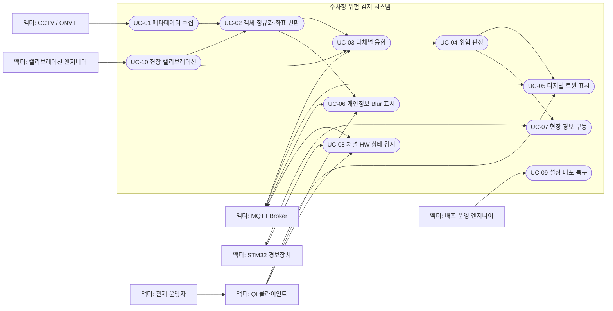

# 유스케이스 명세

## 1. 액터

| 액터 | 역할 |
| --- | --- |
| CCTV/ONVIF 장치 | 객체 metadata와 카메라 timestamp를 제공한다. |
| MQTT Broker | 서버와 Qt 사이의 TLS 메시지 라우팅 및 retained 상태를 제공한다. |
| 관제 운영자 | Qt 디지털 트윈에서 객체, 위험, blur, 장치 상태를 감시한다. |
| Qt 클라이언트 | Risk/Blur/ChannelStatus를 구독하고 화면과 경고를 렌더링한다. |
| STM32 경보장치 | zone별 위험에 따라 LED, 경광등, 부저를 제어하고 상태를 회신한다. |
| 배포·운영 엔지니어 | 설정, 인증서, 프로세스, 로그와 장애를 관리한다. |
| 캘리브레이션 엔지니어 | homography, 카메라 자세, world bounds와 zone을 측정·승인한다. |

## 2. 유스케이스 맵

## 3. 주요 유스케이스 상세

### UC-04 위험 상황 감지 및 경보

| 항목 | 내용 |
| --- | --- |
| 주 액터 | CCTV, STM32, 관제 운영자 |
| 사전조건 | 카메라/compute/control/MQTT가 동작하고 좌표·zone·거리 임계값이 승인되어 있다. |
| 트리거 | CCTV metadata에 Vehicle과 다른 객체가 관측된다. |
| 성공 후조건 | Qt와 STM32가 동일한 위험 판정 기준을 반영한다. |

기본 흐름:

1. compute-server가 metadata를 파싱하고 차량·사람을 카메라 로컬 좌표로 변환한다.
2. control-server가 시간 윈도우 내 채널 프레임을 월드 좌표로 변환하고 중복 객체를 융합한다.
3. 객체를 zone에 배정하고 각 차량에서 최근접 객체까지 거리를 계산한다.
4. 거리가 `dangerousDistance` 이하면 Danger, `warningDistance` 이하면 Warning으로 판정한다.
5. zone별 최고 위험을 UART로 STM32에 전달한다.
6. 같은 판정에서 생성된 전체 위험도와 객체 상태를 `RiskFrame`으로 Qt에 발행한다.
7. Qt는 디지털 트윈 마커와 경고 UI를 갱신하고 STM32는 표시장치를 구동한다.

대안/오류 흐름:

- 차량이 없거나 비교 대상이 없으면 위험도는 None이다.
- 좌표가 비유한이거나 zone이 미배정이면 해당 객체/zone 집계를 제외하고 로그를 남긴다.
- MQTT가 끊기면 Qt 갱신은 실패할 수 있으나 UART 경로는 control-server 내부 판정을 계속 사용할 수 있다.
- STM32 ACK/heartbeat가 끊기면 `hardwareAlive=false`를 Qt에 발행한다.

### UC-06 민감 객체 Blur 표시

| 항목 | 내용 |
| --- | --- |
| 주 액터 | CCTV, Qt 클라이언트 |
| 사전조건 | CCTV 영상과 metadata timestamp를 Qt가 같은 시간축으로 매칭할 수 있다. |
| 트리거 | Head 또는 LicensePlate 객체가 metadata에 포함된다. |
| 성공 후조건 | Qt가 해당 영상 프레임의 대상 영역을 가린다. |

기본 흐름:

1. compute-server가 parent 관계와 클래스로 blur 대상을 분리한다.
2. sanitizer가 phantom/중복 대상을 제거하고 mapper가 앱 표시 좌표와 확대 여유를 적용한다.
3. `BlurFrame`을 `veda/ch/{ch}/blur`, QoS 0으로 MQTT 발행한다.
4. Qt가 `ts`와 `ch`로 영상 프레임을 매칭해 bbox를 가린다.
5. 빈 blur frame은 직전 overlay를 제거하는 정상 상태로 처리한다.

예외 흐름:

- invalid bbox는 현재 개별 target만 drop한다. 개인정보 fail-open 여부는 제품 안전/개인정보 정책으로 재승인해야 한다.
- metadata와 영상의 시간 동기 허용오차 및 늦은 frame 처리 정책은 Qt 자료가 없어 미확정이다.

### UC-08 채널 및 하드웨어 장애 감시

| 항목 | 내용 |
| --- | --- |
| 주 액터 | MQTT Broker, STM32, Qt 클라이언트, 관제 운영자 |
| 사전조건 | alive LWT와 UART heartbeat가 설정되어 있다. |
| 트리거 | compute 연결 상태 또는 STM32 상태/indicator가 변한다. |
| 성공 후조건 | 운영자가 카메라 경로 장애와 HW 장애를 구분한다. |

기본 흐름:

1. compute-server는 연결 시 retained `"1"`, 정상 종료 시 `"0"`을 발행하고 비정상 종료용 LWT `"0"`을 등록한다.
2. control-server는 alive 토픽을 구독해 `cameraAlive`를 갱신한다.
3. UART heartbeat/ACK에서 `hardwareAlive`와 siren/buzzer/LED 상태를 갱신한다.
4. 상태가 변하면 채널별 retained `ChannelStatus`와 legacy Qt payload를 발행한다.
5. Qt는 `hardwareAlive=false`일 때 indicator 값을 stale로 간주하고 활성 상태로 표시하지 않는다.

예외 흐름:

- broker 연결 자체가 끊기면 control-server는 모든 camera channel을 dead로 callback한다.
- 상태 발행 중 broker가 끊기면 마지막 retained 값이 남을 수 있으므로 재연결 후 snapshot 재발행 정책 보완이 필요하다.
