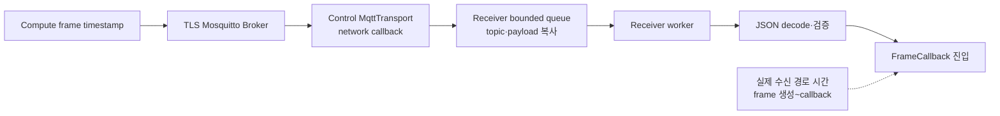
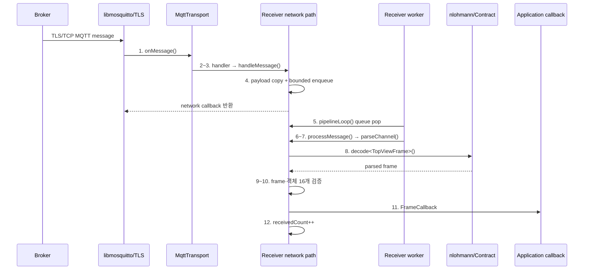
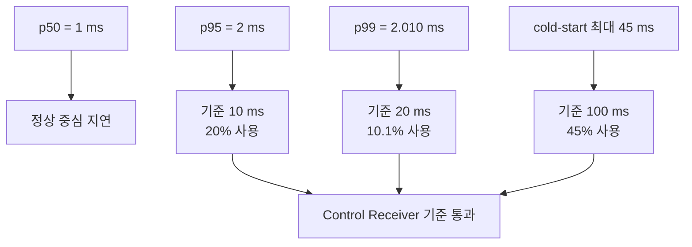

# Control Server Receiver 실행 성능 실측 보고서

> **대상 모듈**
> - `control-server/src/receive/MqttChannelReceiver.h`, `.cpp`
> - `control-server/src/sink/MqttTransport.h`, `.cpp`
> - `shared/Contract.h`

이 보고서는 실제 Control `MqttTransport`와 `MqttChannelReceiver`를 별도 process로 구동하고 실제
Mosquitto TLS Broker를 통해 TopViewFrame을 수신한 실행 성능 기준선이다. 단위 테스트·mock Broker
수치는 사용하지 않았다.

---

| Date | Version | Writer | Summary |
| :--- | :--- | :--- | :--- |
| 2026-08-05 | 1.0.0 | DevSunbi | Control Receiver 실측값과 내부·외부 함수 호출 순서·횟수 수립 |
| 2026-08-06 | 1.1.0 | DevSunbi | Git 전후 Receiver 함수별 호출 위치·횟수·실행시간 벤치마크 추가 |
| 2026-08-06 | 1.2.0 | DevSunbi | TLS 1.3 협상·인증서 검증 후 Receiver 60초×3회 재실측 |
| 2026-08-06 | 1.3.0 | DevSunbi | ELF 크기·RSS·시작 시간·주기 지터·coverage 확장 지표 추가 |

---

## 1. 측정 범위와 책임

Control Receiver의 책임은 MQTT callback을 짧게 유지하면서 payload를 유계 queue에 저장하고,
worker에서 topic parsing, JSON decode와 frame 검증 후 callback으로 넘기는 것이다.

### 1.1 실제 실행 경로

현재 production code에는 transport callback 진입 timestamp와 Receiver queue 체류 timestamp가
없다. 따라서 이번 값은 Receiver 내부만 떼어낸 CPU 시간이 아니라, 실제 발행 시각부터 Control
callback까지의 **운영 관점 수신 경로 실행 시간**이다. TLS, Broker와 localhost scheduling이
포함된다.

### 1.2 내부 함수 호출 순서

정상 TopView message 한 건이 Control application callback에 도달하는 내부 호출 순서다.

| 순번 | 실행 thread | 내부 함수 | 회당 호출 | 3회 합계 | 주요 동작·근거 |
|----:|------------|-----------|----------:|---------:|----------------|
| 1 | libmosquitto network | `MqttTransport::onMessage()` | 300 | **900** | TopView message만 집계; alive 제외 |
| 2 | libmosquitto network | 등록된 `MessageHandler` | 300 | **900** | TopView마다 Receiver handler 호출 |
| 3 | libmosquitto network | `MqttChannelReceiver::handleMessage()` | 300 | **900** | Running·payload size 검사 |
| 4 | libmosquitto network | `RawMessage` 생성·queue enqueue | 300 | **900** | Drop 0이므로 TopView 전부 enqueue |
| 5 | Receiver worker | `MqttChannelReceiver::pipelineLoop()` | 1회 시작 / 300회 처리 | **3회 시작 / 900회 처리** | 실행당 worker 1개, TopView 300건 pop |
| 6 | Receiver worker | `MqttChannelReceiver::processMessage()` | 300 | **900** | TopView topic 분기 |
| 7 | Receiver worker | `parseChannel(topic, "/topview")` | 300 | **900** | Topic channel parsing |
| 8 | Receiver worker | `veda::decode<TopViewFrame>()` | 300 | **900** | JSON domain 변환 |
| 9 | Receiver worker | `isValidTopViewFrame()` | 300 | **900** | Frame 기본·객체 검증 |
| 10 | Receiver worker | `veda::isRiskClass()` | 4,800 | **14,400** | 객체 16개 × 300 frame × 3회 |
| 11 | Receiver worker | `FrameCallback` | 300 | **900** | Application callback 진입, E2E 종료 |
| 12 | Receiver worker | `receivedCount_.fetch_add()` | 300 | **900** | Callback 정상 완료 계수와 일치 |

Alive message는 순번 6 이후 `parseChannel(topic, "/alive")` → payload `0/1` 검사 →
`AliveCallback` 순서로 분기한다. 이번 호출 횟수는 900건 TopView 표본만 집계했으며 연결·종료
과정의 alive message는 제외했다.

### 1.3 외부 함수 호출 순서

#### Receiver 초기화·구독 경로

| 순번 | 외부 함수·계층 | 회당 호출 | 3회 합계 | 목적 |
|----:|----------------|----------:|---------:|------|
| 1 | `mosquitto_lib_init()` | 1 | **3** | libmosquitto 초기화 |
| 2 | `mosquitto_new()` | 1 | **3** | Client 생성 |
| 3 | `mosquitto_connect_callback_set()` | 1 | **3** | Connect callback 등록 |
| 4 | `mosquitto_disconnect_callback_set()` | 1 | **3** | Disconnect callback 등록 |
| 5 | `mosquitto_message_callback_set()` | 1 | **3** | Message callback 등록 |
| 6 | `mosquitto_reconnect_delay_set()` | 1 | **3** | 자동 재연결 backoff |
| 7 | `mosquitto_tls_set()` | 1 | **3** | CA·선택적 client cert 구성 |
| 8 | `mosquitto_tls_insecure_set()` | 1 | **3** | Hostname/SAN 검증 정책 |
| 9 | `mosquitto_connect_async()` | 1 | **3** | 비동기 TCP/TLS 연결 시작 |
| 10 | `mosquitto_loop_start()` | 1 | **3** | Network thread 시작 |
| 11 | `mosquitto_subscribe()` | 2 | **6** | TopView·alive wildcard 각 1회; 재연결 없음 |

#### Message 수신 hot path

| 순번 | 외부 함수·계층 | 회당 호출 | 3회 합계 | 직접/간접·근거 |
|----:|----------------|----------:|---------:|----------------|
| 1 | OS socket → OpenSSL TLS → libmosquitto network loop | 측정 불가 | 측정 불가 | 간접 내부 호출, probe 없음 |
| 2 | `MqttTransport::onMessage()` C callback | 300 | **900** | TopView message 기준 libmosquitto 역호출 |
| 3 | `std::string` 생성 | 600 | **1,800** | Topic·payload 문자열 각 1개/message |
| 4 | `std::deque::push_back()` | 300 | **900** | Receiver queue enqueue |
| 5 | `condition_variable::notify_one()` | 300 | **900** | Enqueue마다 worker 통지 |
| 6 | `std::from_chars()` | 300 | **900** | Topic channel parsing |
| 7 | `nlohmann::json::parse()` | 300 | **900** | TopView JSON DOM parsing |
| 8 | `nlohmann::json::get<T>()` | 300 | **900** | JSON→TopViewFrame 변환 |
| 9 | `std::isfinite()` | 9,600 | **28,800** | 객체당 x·y 2회 × 16개 |
| 10 | MessageHandler `std::function::operator()` | 300 | **900** | Transport→Receiver 호출 |
| 11 | FrameCallback `std::function::operator()` | 300 | **900** | Receiver→Application 호출 |

수신 쪽 project code는 `read()`나 OpenSSL 함수를 message마다 직접 호출하지 않는다. libmosquitto가
network thread에서 socket·TLS를 처리한 뒤 `onMessage()`를 역호출한다. 하위 외부 함수별 시간은
현재 E2E 1.302 ms에 포함되지만 개별 분리되지 않았다. 호출 횟수는 TopView 900건만 집계했으며
alive·connection callback과 종료 정리는 제외했다.

### 1.4 호출 순서 시각화

### 1.5 포함·제외

| 포함 | 제외 |
|------|------|
| Control TLS 수신과 Mosquitto callback | Control Aggregator·Metric·Risk 계산 |
| Topic/payload 복사와 queue | STM32 UART dispatch |
| JSON decode, schema·channel·좌표 검증 | 원격 switch·WAN RTT |
| `FrameCallback` 진입 | Callback 이후 application 처리 시간 |

## 2. 실측 환경과 방법

| 항목 | 조건 |
|------|------|
| 환경 | WSL2 Ubuntu 24.04, Linux 6.6.114.1 |
| CPU·메모리 | AMD Ryzen 5 7535HS, 4 vCPU, 7.8 GiB |
| 빌드 | g++ 13.3.0, C++20, `-O2` |
| MQTT | Mosquitto/libmosquitto 2.0.18 |
| Broker | 실제 TLS 전용 listener `localhost:18884` |
| TLS | 자체 CA, SAN 검증, `insecure=false`, `Verification: OK` |
| 실제 협상 | **TLS 1.3**, `TLS_AES_256_GCM_SHA384`, X25519 |
| Client 인증 | 성능용 Broker anonymous 허용; mTLS·ACL은 미포함 |
| Receiver | Channel 1개, 실제 wildcard subscribe |
| 부하 | TopView 5 FPS, frame당 객체 16개 |
| 실행 | 60초 × 3회, 총 900건 |

Receiver를 먼저 시작하고 TLS 연결·구독 완료를 위해 2초 대기한 후 Compute process가 timestamp를
포함한 frame을 발행했다. Receiver callback 진입 시 epoch millisecond를 기록해 차이를 계산했다.

세 실행 모두 `openssl s_client`로 peer `CN=localhost`와 인증서 chain을 확인해 `Verification: OK`를
기록했다. E2E에는 TLS record 복호화가 포함되지만 최초 handshake는 2초 준비 구간에 포함돼 메시지
지연 표본에서는 제외된다.

## 3. 성능 지표

| 지표 | 정의 | 목적 |
|------|------|------|
| 수신 경로 평균/p50/p95/p99 | Frame timestamp → Receiver callback | 정상·꼬리 지연 감시 |
| Cold-start 최대 | 실행별 첫 message 포함 최대 | 초기 scheduling·준비 이상치 감시 |
| 수신 처리량 | Callback 도달 건수 / 실행 시간 | 5 FPS 지속 처리 확인 |
| 전달률 | 발행 건수 대비 callback 건수 | 정상 경로 손실 확인 |
| Receiver drop | Decode·검증·callback 실패 counter | 비정상 payload·처리 실패 감시 |

### 3.1 확장 성능·자원 지표 측정표

Receiver는 Linux 프로세스이므로 MCU의 Flash와 Deep Sleep 지표를 각각 ELF section 크기와 배포
장비 유휴 전력으로 대체한다. 측정 가능한 값은 실제 MQTT/TLS 실행으로 채웠으며 Heap/Stack 분리값과
하드웨어 전력값은 공란으로 유지한다.

| 분류 | 지표 | 측정 정의 | 단위 | 실측값 | 상태 |
|------|------|-----------|------|--------|------|
| 코드 | ELF 전체 크기 | 계측용 Receiver 실행 파일 전체 크기 | KiB | **279.477** | 실측 완료 |
| 코드 | Code Size | ELF `.text` / `.rodata` | KiB | **155.874 / 13.922** (합계 169.796) | 실측 완료 |
| 데이터 | Static Data Size | ELF `.data` / `.bss` | KiB | **0.039 / 1.539** (합계 1.578) | 실측 완료 |
| 메모리 | 정상부하 RSS | TLS 5 message/s 실행 중 `VmRSS` | MiB | **p50 9.266 / p95 9.277** | 실측 완료 |
| 메모리 | Peak RSS | 60초×3회 실행 중 `VmRSS` 최고값 | MiB | **9.277** | 실측 완료 |
| 메모리 | Heap Peak | queue·payload·decode 객체를 포함한 heap 최고 사용량 | MiB |  | 분리 계측 보류 |
| 메모리 | Stack Peak | main·libmosquitto network·Receiver worker thread stack high-water | KiB |  | 분리 계측 보류 |
| 시작 | MQTT/TLS 연결 시간 | 프로세스 `main()` 진입 → TLS 연결 관측 (`onConnect`가 이어서 구독 요청) | ms | **평균 53.304 / 최대 55.192** | 실측 완료 |
| 시작 | 첫 callback 시간 | Receiver 시작 → Compute 기동·TLS 연결 → 첫 정상 callback | ms | **평균 152.982 / 최대 168.517** | 실측 완료 |
| 실시간성 | Worker dispatch 지터 | queue enqueue → `processMessage()` 시작 지연 | µs |  | 내부 timestamp 미노출 |
| 실시간성 | Callback 주기 지터 | 200 ms 예정 callback 간격 대비 실제 간격 절대 오차 | µs | **3회 최악 p50 220.818 / p95 1,385.520 / p99 4,023.598 / 최대 42,726.802** | 실측 완료 |
| 실시간성 | Deadline miss | E2E 응답이 200 ms를 초과한 message 수와 비율 | 건, % | **0 / 900 (0.0%)** | 실측 완료 |
| 품질 | Code Coverage | Receiver 관련 소스 Line / Branch / Function coverage | % | **55.86 / 24.25 / 79.55** | TLS 통합 시나리오 |
| 전력 | Active Power | TLS 5 message/s 정상 처리 중 평균·최대 장비 전력 | W |  | 외부 전력계 필요 |
| 전력 | Idle Power | TLS 구독 유지·message 입력 없음 상태의 평균 장비 전력 | W |  | 외부 전력계 필요 |

전력값은 실제 Control Server 배포 장비에서 외부 전력계 또는 검증된 하드웨어 계측기를 사용한
경우에만 기재하며 소프트웨어 추정값은 사용하지 않는다.

확장 지표는 WSL2 x86_64, `g++ 13.3.0 -O2`, Mosquitto 2.0.18, localhost TLS,
5 message/s에서 60초×3회 계측했다. RSS 수집 간격은 20 ms다. ELF 값은 production Receiver와
계측용 `main()`을 링크한 성능 계측 실행 파일 기준이므로 최종 배포 바이너리 크기가 아니다.
Callback 지터는 첫 cold-start 간격을 제외하고 같은 `steady_clock`에서 200 ms 주기 대비 절대 오차로
측정했으며 표에는 3회 중 가장 큰 p50/p95/p99를 보수적으로 기재했다. Coverage는 별도 5초·25 message
정상 TLS 시나리오에서 `MqttChannelReceiver.cpp`와 Control `MqttTransport.cpp`를 대상으로 산출했다.
계측 worktree는 `a2cf8a4`와 Control `MqttTransport.cpp`의 로컬 수정 상태다. 원시 집계 산출물은
계측 환경에서 별도로 보관한다.

## 4. 실측 결과

### 4.1 3회 통합

| 지표 | 표본 | 평균 | p50 | p95 | p99 | 최대 |
|------|----:|-----:|----:|----:|----:|----:|
| 수신 경로 실행 시간 | 900 | **1.302 ms** | **1 ms** | **2 ms** | **2.010 ms** | 45 ms |

| 처리 지표 | 결과 |
|----------|------|
| 발행/Receiver callback | **900 / 900건** |
| 전달률 | **100.0%** |
| Receiver 검증·callback drop | **0건** |
| 평균 지속 처리량 | **5 message/s** |

### 4.2 실행별 결과

| 실행 | 평균 | p50 | p95 | p99 | 최대 | 수신 |
|------|-----:|----:|----:|----:|-----:|-----:|
| Run 1 | 1.353 ms | 1 ms | 2 ms | 2.040 ms | 44 ms | 300/300 |
| Run 2 | 1.387 ms | 1 ms | 2 ms | 5 ms | 45 ms | 300/300 |
| Run 3 | 1.167 ms | 1 ms | 1 ms | 2 ms | 41 ms | 300/300 |

Run 1·2의 첫 message는 44 ms·45 ms였고 Run 3의 첫 message는 1 ms였다. 정상 구간을 대표하는
p50은 모두 1 ms이고 전체 p99는 2.010 ms다.

### 4.3 회귀 기준 시각화

## 5. 개발 회귀 기준

| 지표 | 기준 | 실측 | 판정 |
|------|-----:|-----:|------|
| 수신 경로 p95 | ≤ 10 ms | 2 ms | 통과 |
| 수신 경로 p99 | ≤ 20 ms | 2.010 ms | 통과 |
| Cold-start 최대 | ≤ 100 ms | 45 ms | 통과 |
| 정상 연결 전달률 | ≥ 99.9% | 100.0% | 통과 |
| Receiver 검증·callback drop | 0건 | 0건 | 통과 |
| 5 FPS 지속 처리 | ≥ 5 message/s | 5 message/s | 통과 |

## 6. 구조적 성능 분석

- Mosquitto network callback은 payload 복사와 enqueue만 수행하고 decode·후속 callback을 worker로
  분리하므로 network loop 장기 점유를 줄인다.
- Queue는 4096 message와 8 MiB의 이중 상한을 사용해 OOM을 제한한다.
- Queue full 시 오래된 message를 제거해 최신 위치 정보의 가치를 우선한다.
- Topic channel과 payload channel, schema, timestamp, class와 finite 좌표를 검증한다.
- `queueDroppedCount_`가 공개 `droppedCount()`에 포함되지 않아 queue overflow 관측에는 공백이 있다.

## 7. 측정 한계

- Millisecond timestamp로 1 ms 미만 차이는 0/1 ms로 양자화된다.
- Localhost Broker이므로 현장 network RTT·jitter가 포함되지 않는다.
- Receiver 내부 enqueue→dequeue, decode, callback 각각의 시간을 분리하지 않았다.
- 1 channel·16 객체·5 FPS 결과이며 최대 4 channel과 256 객체 부하는 별도 측정이 필요하다.
- Aggregator 이후 위험 판단과 UART 출력 시간은 포함하지 않는다.

## 8. 후속 계측

1. `RawMessage`에 `steady_clock` enqueue timestamp를 추가해 queue 체류시간 측정
2. Decode 시작·종료와 callback 전후를 분리해 Receiver 자체 p95/p99 측정
3. 4 channel × 5/10 FPS, 64/256 객체 부하 측정
4. Queue message/byte depth와 high-water 공개
5. Broker 단절·재연결과 원격 Broker 환경에서 회복 시간 측정

## 9. 감사 요약

| 영역 | 판정 | 근거 |
|------|------|------|
| 실제 수신 지연 | ✅ 양호 | p95 2 ms, p99 2.010 ms |
| 정상 전달 | ✅ 충족 | 900/900, drop 0 |
| Queue/OOM | ✅ 유계 | 4096건·8 MiB 상한 |
| Cold-start | ⚠️ 감시 | 최대 45 ms |
| 내부 구간 분해 | ⚠️ 추가 필요 | Enqueue·decode 계측점 부재 |
| 현장 대표성 | ⚠️ 추가 필요 | WSL localhost 측정 |

**결론**: 실제 TLS Broker와 production Receiver 실행에서 5 FPS 수신 기준을 통과했다. 이 값은
Receiver가 포함된 실제 수신 경로 기준이며, Receiver 단독 CPU 시간과 현장 network SLO는 후속
계측으로 분리해야 한다.

## 10. Git 리팩터링 전후 함수별 벤치마크

이 절의 함수별 CPU 시간은 TLS record 복호화 이후 `MqttTransport::onMessage()`가 Receiver를 호출한
시점부터의 분해값이다. TLS 적용 상태의 전체 수신 성능은 §4의 실제 TLS 1.3 E2E 결과를 사용한다.

### 10.1 Network callback과 worker 호출 분리

`de222b5`와 `24abcb6`의 실제 `MqttChannelReceiver` 함수를 객체 16개 TopView JSON으로 실행했다.

| 함수 | 변경 전 network | 변경 후 network | 변경 후 worker | 전체 호출 변화 |
|------|----------------:|----------------:|---------------:|---------------:|
| `handleMessage()` | 1 | 1 | 0 | 1→1 |
| `parseChannel()` | 1 | 0 | 1 | 총 1→1, network에서 **100% 제거** |
| `veda::decode()` | 1 | 0 | 1 | 총 1→1, network에서 **100% 제거** |
| `isValidTopViewFrame()` | 1 | 0 | 1 | 총 1→1, network에서 **100% 제거** |
| `FrameCallback` | 1 | 0 | 1 | 총 1→1, network에서 **100% 제거** |
| `RawMessage` 생성 | 0 | 1 | 0 | 신규 1회, string 복사 2회 |
| `queue_.push_back()` | 0 | 1 | 0 | 신규 1회 |
| `queueCv_.notify_one()` | 0 | 1 | 0 | 신규 1회 |
| `processMessage()` | 0 | 0 | 1 | 신규 1회 |

| 함수 | 변경 전 | 변경 후 | 결과 |
|------|--------:|--------:|-----:|
| `handleMessage()` network 점유 | 22.696 µs | 0.153 µs | **99.33% 감소, 148.67배** |
| `processMessage()` worker | 없음 | 20.673 µs | 무거운 처리 이동 |
| `parseChannel()` | 10.280 ns | 9.218 ns | 호출 유지 |
| `veda::decode()` | 22.369 µs | 20.208 µs | 호출 유지 |
| `isValidTopViewFrame()` | 13.114 ns | 11.937 ns | 호출 유지 |
| 빈 `FrameCallback` | 1.383 ns | 1.478 ns | 호출 유지, 잡음 수준 |

99.33%는 전체 E2E가 아니라 libmosquitto network thread의 반환시간 개선이다. decode·검증·callback은
사라지지 않고 `processMessage()`에서 각 1회 실행된다.

### 10.2 과대 payload 조기 차단

`24abcb6`과 `9425f95`에서 1 MiB payload의 `handleMessage()`를 비교했다.

| 함수·동작 | 변경 전 | 변경 후 | 변화 |
|-----------|--------:|--------:|-----:|
| `handleMessage()` | 1 | 1 | 동일 |
| topic·payload string 복사 | 2 | 0 | **100% 제거** |
| `RawMessage` 생성 | 1 | 0 | **100% 제거** |
| `queue_.push_back()` | 1 | 0 | **100% 제거** |
| `queueCv_.notify_one()` | 1 | 0 | **100% 제거** |
| payload 크기 검사 | 0 | 1 | 신규 1회 |
| `recordDrop()` | 0 | 1 | 신규 1회 |

| 입력 | 변경 전 | 변경 후 | 결과 |
|------|--------:|--------:|-----:|
| 정상 16객체 payload | 0.153 µs | 0.066 µs | 모두 0.2 µs 미만, 변동이 커 % 미적용 |
| 1 MiB 과대 payload | 18.001 µs | 0.028 µs | **99.84% 단축, 642.89배** |
| queue 적재 | 1건 | 0건 | **100% 제거** |
| payload 복사량 | 1 MiB | 0 byte | **100% 제거** |

과대 payload의 0.028 µs는 rate-limit 로그가 없는 일반 drop 중앙값이다. 첫 번째와 100번째 drop은
`logError()`가 실행되므로 더 느릴 수 있다.
