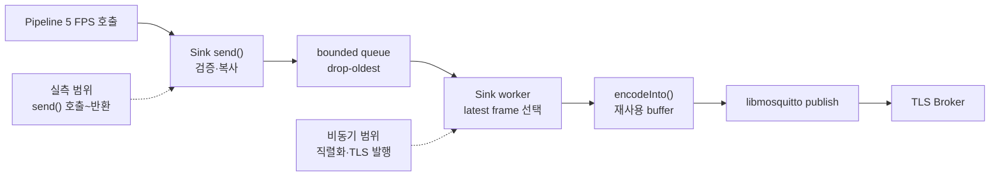
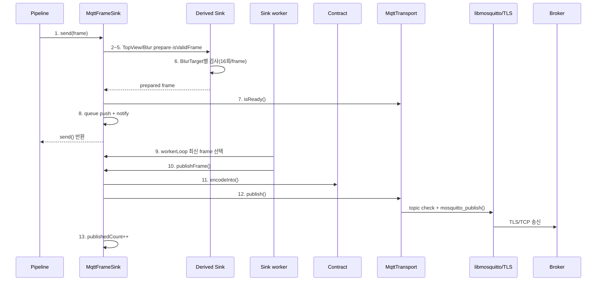
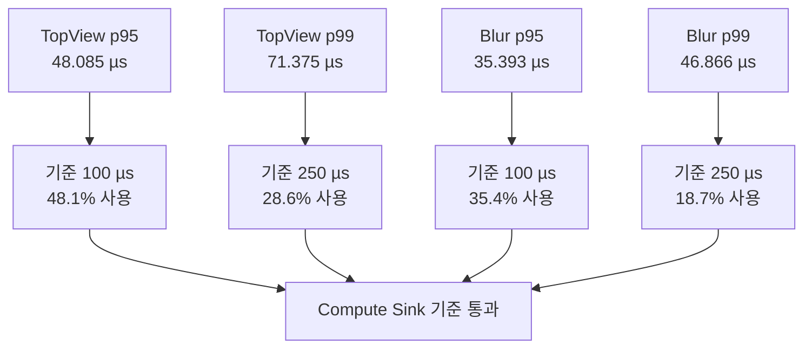

# Compute Server Sink 실행 성능 실측 보고서

> **대상 모듈**
> - `compute-server/src/sink/MqttFrameSink.h`
> - `compute-server/src/sink/MqttTopViewSink.*`
> - `compute-server/src/sink/MqttBlurSink.*`
> - `compute-server/src/mqtt/MqttTransport.*`

이 보고서는 단위 테스트나 mock transport가 아니라 프로덕션 Compute Sink와 `MqttTransport`를
실제 Mosquitto TLS Broker에 연결해 측정한 실행 성능 기준선이다. TopView와 Blur를 각각 5 FPS로
60초씩 3회 실행하여 각 경로 900건을 측정했다.

---

| Date | Version | Writer | Summary |
| :--- | :--- | :--- | :--- |
| 2026-08-05 | 1.0.0 | DevSunbi | Compute Sink 실측값과 내부·외부 함수 호출 순서·횟수 수립 |
| 2026-08-06 | 1.1.0 | DevSunbi | Git 전후 Sink 함수 호출 횟수·직렬화·backlog 벤치마크 추가 |
| 2026-08-06 | 1.2.0 | DevSunbi | TLS 1.3 협상·인증서 검증 후 Sink 60초×3회 재실측 |
| 2026-08-06 | 1.3.0 | DevSunbi | ELF 크기·RSS·시작 시간·주기 지터·coverage 확장 지표 추가 |

---

## 1. 측정 범위

Compute Server의 성능 책임은 Pipeline 호출 스레드를 오래 점유하지 않고, frame을 유계 queue로
넘겨 TLS Broker에 발행하는 것이다.

| 포함 | 제외 |
|------|------|
| frame schema·timestamp·channel·좌표 검증 | RTSP 수신과 ONVIF parsing |
| staging frame 복사와 queue enqueue | Mapper·Sanitizer·Router·Transform |
| Sink worker의 최신 frame 선택과 직렬화 | Control Receiver의 decode·callback |
| libmosquitto publish와 TLS 연결 | 원격 network RTT와 Control 후속 계산 |

### 1.1 실행 경로 시각화

`send()` 실행 시간은 Pipeline이 실제로 점유되는 구간이다. 직렬화와 socket I/O는 Sink worker와
libmosquitto network thread에서 수행되므로 `send()` 수치에는 포함되지 않는다.

### 1.2 내부 함수 호출 순서

다음 순번은 정상 frame 한 건의 production hot path를 코드에서 추적한 결과다. TopView와 Blur는
공통 template을 사용하되 `prepare()` 검증 단계가 다르다.

| 순번 | 실행 thread | 내부 함수 | 회당 호출 | 3회 합계 | 주요 동작·근거 |
|----:|------------|-----------|----------:|---------:|----------------|
| 1 | 발행/Pipeline | `MqttFrameSink<T>::send()` | 600 | **1,800** | TopView 300 + Blur 300, `send()` 실측 구간 |
| 2 | 발행/Pipeline | `MqttTopViewSink::prepare()` | 300 | **900** | TopView frame 검증·복사 |
| 3 | 발행/Pipeline | `MqttTopViewSink::isValidFrame()` | 300 | **900** | TopView 기본·객체 검사 |
| 4 | 발행/Pipeline | `MqttBlurSink::prepare()` | 300 | **900** | Blur frame 검증·복사 |
| 5 | 발행/Pipeline | `MqttBlurSink::isValidFrame()` | 300 | **900** | Blur 기본 검사 |
| 6 | 발행/Pipeline | `MqttBlurSink::isValidBlurTarget()` | 4,800 | **14,400** | 16 target × 300 frame × 3회 |
| 7 | 발행/Pipeline | `IMqttTransport::isReady()` | 600 | **1,800** | 유효 frame마다 1회 |
| 8 | 발행/Pipeline | Queue enqueue·worker notify | 600 | **1,800** | Drop 0이므로 유효 frame 전부 enqueue |
| 9 | Sink worker | `MqttFrameSink<T>::workerLoop()` | 2 | **6** | TopView·Blur worker가 실행당 각 1회 시작 |
| 10 | Sink worker | `MqttFrameSink<T>::publishFrame()` | 600 | **1,800** | Published counter 900 + 900 |
| 11 | Sink worker | `veda::encodeInto()` | 600 | **1,800** | TopView 900 + Blur 900 |
| 12 | Sink worker | `MqttTransport::publish()` | 600 | **1,800** | Frame hot path만 집계; alive 제외 |
| 13 | Sink worker | `publishedCount_.fetch_add()` | 600 | **1,800** | 발행 접수 성공 건수와 일치 |

`send()`의 48.085/35.393 µs p95는 순번 1~8 중 각 frame에 해당하는 경로를 합친 시간이다.
순번 9~13은 실제 실행되었지만 함수별 probe가 없어 개별 시간으로 분해하지 않았고 E2E에
통합되어 있다. 호출 횟수는 3회 모두 drop·coalescing이 0이고 published가 900+900인 결과를
기준으로 계산했다.

### 1.3 외부 함수 호출 순서

#### 초기 연결 경로 — 실행당 1회 또는 재연결 시

| 순번 | 외부 함수·계층 | 회당 호출 | 3회 합계 | 목적 |
|----:|----------------|----------:|---------:|------|
| 1 | `mosquitto_lib_init()` | 1 | **3** | libmosquitto 전역 초기화 |
| 2 | `mosquitto_new()` | 1 | **3** | Client handle 생성 |
| 3 | `mosquitto_connect_callback_set()` | 1 | **3** | Connect callback 등록 |
| 4 | `mosquitto_disconnect_callback_set()` | 1 | **3** | Disconnect callback 등록 |
| 5 | `mosquitto_reconnect_delay_set()` | 1 | **3** | 지수 backoff 설정 |
| 6 | `mosquitto_will_set()` | 1 | **3** | Retained alive `0` LWT 등록 |
| 7 | `mosquitto_int_option()` | 1 | **3** | MQTT 3.1.1 지정 |
| 8 | `mosquitto_tls_set()` | 1 | **3** | CA 기반 TLS 구성 |
| 9 | `mosquitto_tls_insecure_set(false)` | 1 | **3** | SAN/hostname 검증 강제 |
| 10 | `mosquitto_connect_async()` | 1 | **3** | 비동기 TCP/TLS 연결 시작 |
| 11 | `mosquitto_loop_start()` | 1 | **3** | libmosquitto network thread 시작 |

#### Frame 발행 hot path

| 순번 | 외부 함수·계층 | 회당 호출 | 3회 합계 | 직접/간접·근거 |
|----:|----------------|----------:|---------:|----------------|
| 1 | TopView `std::vector::assign()` | 300 | **900** | TopView frame당 1회 |
| 2 | Blur `std::vector::reserve()` | 300 | **900** | Blur frame당 1회 |
| 3 | Blur `std::vector::push_back()` | 4,800 | **14,400** | 유효 target 16개/frame |
| 4 | Queue `std::deque::push_back()` | 600 | **1,800** | 유효 frame enqueue |
| 5 | `condition_variable::notify_one()` | 600 | **1,800** | Enqueue마다 worker 통지 |
| 6 | `detail::appendInt()` | 11,400 | **34,200** | Frame당 3개 기본 정수 + 객체/target ID 16개 |
| 7 | `detail::appendDouble()` | 28,800 | **86,400** | TopView 32 + Blur 64 실수/frame |
| 8 | `mosquitto_pub_topic_check2()` | 600 | **1,800** | Frame publish마다 topic 검사 |
| 9 | `mosquitto_publish()` | 600 | **1,800** | Frame hot path 접수; alive 제외 |
| 10 | libmosquitto network loop → OpenSSL TLS → OS socket | 측정 불가 | 측정 불가 | 간접 내부 호출, 횟수 probe 없음 |
| 11 | Mosquitto Broker routing | 600 message | **1,800 message** | 발행 frame 수 기준 |

`mosquitto_publish()` 성공은 Broker 전달 완료가 아니라 libmosquitto 접수 성공이다. OpenSSL과
socket 하위 함수의 개별 시간과 호출 횟수는 이번 계측에서 분리하지 않았다. 초기화 표는 재연결이
없었던 정상 실행을 기준으로 하며 종료용 alive publish와 정리 함수는 frame hot path 집계에서
제외했다.

### 1.4 호출 순서 시각화

## 2. 실측 환경과 방법

| 항목 | 조건 |
|------|------|
| 환경 | WSL2 Ubuntu 24.04, Linux 6.6.114.1 |
| CPU·메모리 | AMD Ryzen 5 7535HS, 4 vCPU, 7.8 GiB |
| 빌드 | g++ 13.3.0, C++20, `-O2` |
| Broker | Mosquitto 2.0.18, TLS 전용 listener `localhost:18884` |
| 보안 | 자체 CA, SAN 검증, `insecure=false`, `Verification: OK` |
| 실제 협상 | **TLS 1.3**, `TLS_AES_256_GCM_SHA384`, X25519 |
| Client 인증 | 성능용 Broker anonymous 허용; mTLS·ACL은 미포함 |
| 부하 | TopView 5 FPS + Blur 5 FPS, frame당 16개 객체/target |
| Queue | Sink별 8 frame |
| 반복 | 60초 × 3회 |
| 표본 | TopView 900건, Blur 900건 |

별도 프로세스의 Control Receiver가 wildcard topic을 실제 구독한 상태에서 Compute 발행 프로세스를
실행했다. TLS handshake와 구독 완료를 위해 2초 준비 후 계측을 시작했다. 각 호출 직전·직후를
`steady_clock`으로 측정했으며 GoogleTest 실행 시간은 사용하지 않았다.

따라서 `send()` 시간은 Pipeline의 검증·복사·queue 삽입까지이며 비동기 TLS 암호화는 포함하지 않는다.
실제 TLS 적용 여부는 세 실행 모두 별도 `openssl s_client` 검증으로 확인했다.

## 3. 성능 지표

| 지표 | 측정 구간 | 의미 |
|------|----------|------|
| TopView `send()` 시간 | 호출 직전 → 반환 직후 | TopView Pipeline 점유 시간 |
| Blur `send()` 시간 | 호출 직전 → 반환 직후 | Blur Pipeline 점유 시간 |
| publish 수 | Sink worker의 `mosquitto_publish()` 접수 성공 | Broker client queue 접수량 |
| Sink drop 수 | 검증·queue·직렬화·publish 실패 누적 | 손실과 과부하 징후 |
| 정상 전달률 | TopView 발행 대비 실제 Receiver callback | 통합 경로 정상성의 보조 지표 |

### 3.1 확장 성능·자원 지표 측정표

Sink는 Linux 프로세스이므로 MCU의 Flash와 Deep Sleep 지표를 각각 ELF section 크기와 배포 장비
유휴 전력으로 대체한다. 측정 가능한 값은 실제 MQTT/TLS 실행으로 채웠으며 Heap/Stack 분리값과
하드웨어 전력값은 공란으로 유지한다.

| 분류 | 지표 | 측정 정의 | 단위 | 실측값 | 상태 |
|------|------|-----------|------|--------|------|
| 코드 | ELF 전체 크기 | 계측용 Sink 실행 파일 전체 크기 | KiB | **169.109** | 실측 완료 |
| 코드 | Code Size | ELF `.text` / `.rodata` | KiB | **98.245 / 4.210** (합계 102.455) | 실측 완료 |
| 데이터 | Static Data Size | ELF `.data` / `.bss` | KiB | **0.039 / 1.539** (합계 1.578) | 실측 완료 |
| 메모리 | 정상부하 RSS | TLS 5 FPS·16 objects 실행 중 `VmRSS` | MiB | **p50 9.398 / p95 9.414** | 실측 완료 |
| 메모리 | Peak RSS | 60초×3회 실행 중 `VmRSS` 최고값 | MiB | **9.414** | 실측 완료 |
| 메모리 | Heap Peak | queue·payload buffer를 포함한 heap 최고 사용량 | MiB |  | 분리 계측 보류 |
| 메모리 | Stack Peak | main·Pipeline·Sink worker·MQTT thread stack high-water | KiB |  | 분리 계측 보류 |
| 시작 | MQTT/TLS 연결 시간 | 프로세스 `main()` 진입 → TLS 연결 완료 | ms | **평균 72.967 / 최대 80.601** | 실측 완료 |
| 시작 | 첫 publish 시간 | 프로세스 `main()` 진입 → 첫 `send()` 완료 | ms | **평균 74.735 / 최대 82.207** | 실측 완료 |
| 실시간성 | Publish 주기 지터 | 200 ms 예정 `send()` 시각 대비 실제 시작 시각 절대 오차 | µs | **p50 85.415 / p95 116.434 / p99 170.392 / 최대 2,782.969** | 실측 완료 |
| 실시간성 | Deadline miss | 200 ms 처리 기한을 초과한 frame 수와 비율 | 건, % | **0 / 900 (0.0%)** | 실측 완료 |
| 품질 | Code Coverage | Sink 관련 소스 Line / Branch / Function coverage | % | **65.69 / 37.29 / 84.91** | TLS 통합 시나리오 |
| 전력 | Active Power | TLS 5 FPS·16 objects 정상 처리 중 평균·최대 장비 전력 | W |  | 외부 전력계 필요 |
| 전력 | Idle Power | TLS 연결 유지·frame 입력 없음 상태의 평균 장비 전력 | W |  | 외부 전력계 필요 |

전력값은 Raspberry Pi 등 실제 배포 장비에서 외부 전력계 또는 검증된 하드웨어 계측기를 사용한
경우에만 기재하며 소프트웨어 추정값은 사용하지 않는다.

확장 지표는 WSL2 x86_64, `g++ 13.3.0 -O2`, Mosquitto 2.0.18, localhost TLS,
5 FPS·16 objects에서 60초×3회 계측했다. RSS 수집 간격은 20 ms다. ELF 값은 production Sink와
계측용 `main()`을 링크한 성능 계측 실행 파일 기준이므로 최종 배포 바이너리 크기가 아니다.
Coverage는 별도 5초·25 frame 정상 TLS 시나리오에서 `MqttTransport.cpp`, Sink 구현 `.cpp`와
`MqttFrameSink.h`를 대상으로 산출했으며 오류·reconnect 경로 coverage는 낮게 남는다. 계측 worktree는
`a2cf8a4`와 Control `MqttTransport.cpp`의 로컬 수정 상태다. 원시 집계 산출물은 계측 환경에서
별도로 보관한다.

## 4. 실측 결과

### 4.1 통합 결과

| 지표 | 표본 | 평균 | p50 | p95 | p99 | 최대 |
| :--- | ---: | ---: | ---: | ---: | ---: | ---: |
| TopView `send()` | 900 | 33.787 µs | 31.777 µs | **48.085 µs** | 71.375 µs | 192.352 µs |
| Blur `send()` | 900 | 25.652 µs | 24.283 µs | **35.393 µs** | 46.866 µs | 76.706 µs |

| 계수 지표 | 결과 |
|----------|------|
| TopView publish/drop | **900 / 0건** |
| Blur publish/drop | **900 / 0건** |
| TopView Receiver 확인 | **900 / 900건(100.0%)** |

### 4.2 실행별 편차

| 실행 | TopView 평균 / p95 | Blur 평균 / p95 |
|------|-------------------|-----------------|
| Run 1 | 37.863 / 52.988 µs | 28.833 / 39.040 µs |
| Run 2 | 31.632 / 43.309 µs | 24.311 / 33.441 µs |
| Run 3 | 31.865 / 42.484 µs | 23.812 / 32.733 µs |

세 실행 모두 p95가 70 µs 미만이었다. 최대값은 짧은 scheduler 지연과 cold cache를 포함하므로
p95·p99를 주 회귀 지표로 사용하고 최대값은 이상치 감시에 사용한다.

### 4.3 회귀 기준 시각화

## 5. 개발 회귀 기준

| 지표 | 기준 | 실측 | 판정 |
|------|-----:|-----:|------|
| TopView `send()` p95 | ≤ 100 µs | 48.085 µs | 통과 |
| TopView `send()` p99 | ≤ 250 µs | 71.375 µs | 통과 |
| Blur `send()` p95 | ≤ 100 µs | 35.393 µs | 통과 |
| Blur `send()` p99 | ≤ 250 µs | 46.866 µs | 통과 |
| 정상 연결 Sink drop | 0건 | 0건 | 통과 |
| 5 FPS 지속 발행 | 경로별 300건/분 | 300건/분 | 통과 |

이 기준은 현재 x86_64 로컬 TLS 환경의 개발 회귀선이다. Raspberry Pi ARM과 원격 Broker에서
재측정한 값으로 운영 SLO를 별도 승인해야 한다.

## 6. 성능·자원 분석

- `send()`는 socket I/O를 수행하지 않아 Pipeline 지연이 broker RTT에 직접 결합되지 않는다.
- frame 수, 객체 수, serialized payload와 queue 크기에 상한이 있어 backlog 메모리는 유계다.
- worker는 backlog 중 최신 frame만 선택하므로 실시간 snapshot의 고정 지연을 억제한다.
- `staging_`이 queue로 move되어 frame 복사 시 vector 재할당이 반복될 수 있다. 현재 p95에는 문제가
  없지만 64/256 객체와 메모리 압박 조건에서 다시 측정해야 한다.
- `publishedCount()`는 Broker 전달 완료나 QoS PUBACK가 아니라 libmosquitto 접수 성공 수다.

## 7. 한계와 후속 실측

1. Raspberry Pi에서 30분 이상 5/10 FPS 측정
2. 64개·256개 객체 경계에서 p95/p99와 RSS high-water 측정
3. Broker 단절·복구 시 queue 포화, drop과 회복 시간 측정
4. Sink enqueue→publish 및 QoS 1 PUBACK 시간을 별도 계측
5. staging 반복 할당 최적화 전후 비교

## 8. 감사 요약

| 영역 | 판정 | 근거 |
|------|------|------|
| Pipeline 점유 | ✅ 양호 | 두 Sink `send()` p95 48.085 µs 이하 |
| 정상 처리량 | ✅ 충족 | 각 5 FPS, 60초×3회 발행 완료 |
| 정상 손실 | ✅ 없음 | Sink drop 0건 |
| 메모리 상한 | ✅ 유계 | 객체·payload·queue 상한 |
| 현장 대표성 | ⚠️ 추가 필요 | WSL localhost 결과, ARM·원격망 미포함 |

**결론**: 실제 TLS Broker 연결 상태에서 Compute Sink의 생산자 점유 시간과 처리량은 개발 회귀
기준을 통과했다. 운영 승인 전 Raspberry Pi와 현장 network 조건의 재실측이 필요하다.

## 9. Git 리팩터링 전후 함수별 벤치마크

이 절은 Sink 내부 CPU·queue 함수의 전후 차이를 분리한 값으로 TLS 암호화 비용을 포함하지 않는다.
TLS 암호화는 libmosquitto network thread가 비동기로 수행하므로 §4의 실제 TLS 1.3 통합 결과와 함께 판단한다.

### 9.1 `publishFrame()` 직렬화 호출 변화

`de222b5`의 실제 TopViewFrame과 직렬화 API를 g++ 13.3.0, C++20 `-O2`로 실행했다.

| 함수·동작 | 변경 전 호출/프레임 | 변경 후 호출/프레임 | 16객체 실행시간 |
|-----------|-------------------:|-------------------:|-----------------:|
| `MqttFrameSink::publishFrame()` | 1 | 1 | 호출 수 동일 |
| `veda::encode()` | 1 | 0 | **22.871 µs** |
| `nlohmann::json` DOM 생성 | 1 | 0 | `encode()`에 포함 |
| JSON `.dump()` | 1 | 0 | `encode()`에 포함 |
| `veda::encodeInto()` | 0 | 1 | **1.940 µs** |
| 직렬화 `operator new` | 564 | 0 | **100% 제거** |
| `IMqttTransport::publish()` | 1 | 1 | 호출 수 동일 |

| 객체 수 | 변경 전 | 변경 후 | 성능 향상 |
|--------:|--------:|--------:|----------:|
| 16 | 22.871 µs | 1.940 µs | **91.52% 단축, 11.79배** |
| 64 | 94.088 µs | 7.770 µs | **91.74% 단축, 12.11배** |
| 256 | 367.585 µs | 29.270 µs | **92.04% 단축, 12.56배** |

직렬화 함수 호출은 1→1로 동일하지만 DOM 생성과 dump 하위 호출·할당이 제거됐다. parse 후 JSON
의미 동등성은 통과했으며 key 순서 때문에 byte 배열은 동일하지 않았다.

### 9.2 `workerLoop()` backlog 8건 호출 변화

`8e4f3dc`와 `5f1064f`의 실제 Sink worker를 queue 8건으로 실행했다. 전송 계층만 publish 호출 수를
측정하는 mock으로 교체했으며, Sink worker·queue·직렬화는 production 코드다.

| 함수 | 변경 전 | 변경 후 | 변화 |
|------|--------:|--------:|-----:|
| `workerLoop()` 기상 | 1 | 1 | 동일 |
| `queue_.pop_front()` | 8 | 0 | **100% 제거** |
| `queue_.back()` / `queue_.clear()` | 0 / 0 | 1 / 1 | 최신 frame 선택 추가 |
| `publishFrame()` | 8 | 1 | **87.5% 감소** |
| `encodeInto()` | 8 | 1 | **87.5% 감소** |
| `transport.publish()` | 8 | 1 | **87.5% 감소** |
| `recordDrop()` | 0 | 7 | superseded 계상 추가 |
| rate-limit `logError()` | 0 | 1 | 첫 drop 로그 추가 |

| 지표 | 변경 전 | 변경 후 | 개선 |
|------|--------:|--------:|-----:|
| backlog drain 중앙값 | 69.011 µs | 47.560 µs | **31.08% 단축** |
| 실제 publish | 8회 | 1회 | **87.5% 감소** |
| queue 깊이 유발 노후화 | 최대 1.6초 | 선택 시 0초 | **100% 제거** |

### 9.3 공통 템플릿화의 호출 횟수

`b7c4994`는 관련 LOC를 884→448줄로 **49.32%** 줄였지만 런타임 호출 수를 줄인 변경은 아니다.

| 함수 | 변경 전 | 변경 후 |
|------|--------|--------|
| TopView·Blur `send()` | 각 구현에서 frame당 1회 | 공통 템플릿에서 frame당 1회 |
| `workerLoop()` | 구현 2개, worker 2개 | 구현 1개, worker 2개 |
| `publishFrame()` | 구현 2개, frame당 1회 | 구현 1개, frame당 1회 |
