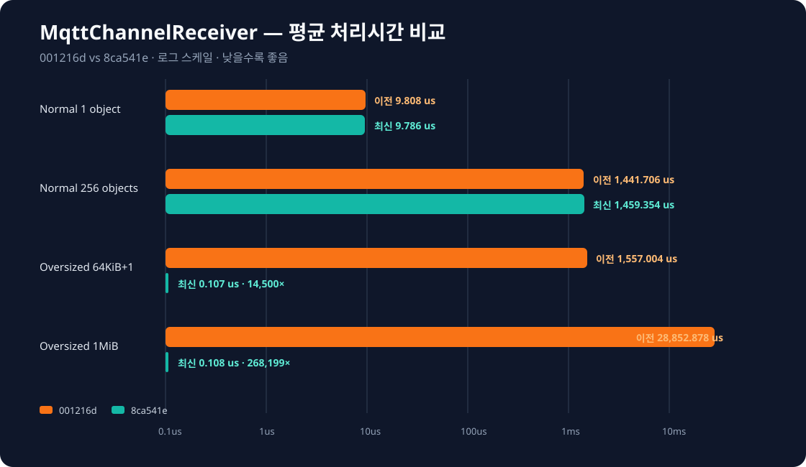
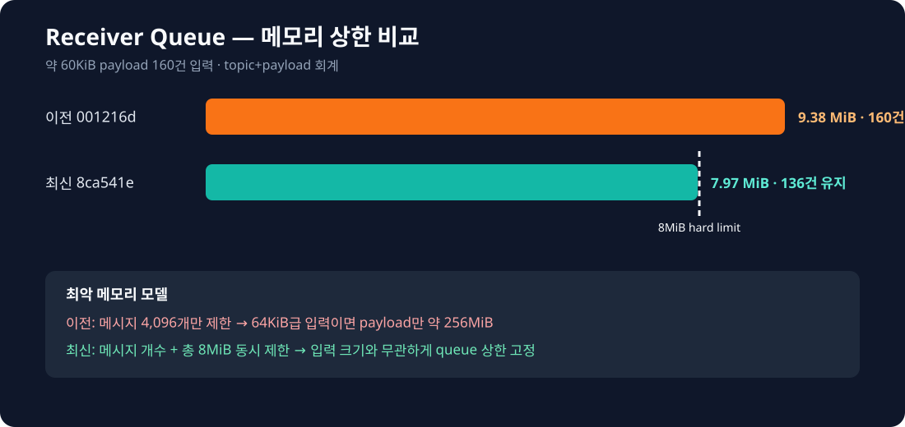

# Control-Server
> 관제 서버 MQTT Receiver 최적화 과정 및 지표를 정리한 마크다운입니다.

---

# IChannelReceiver

### 이전: 제한 없는 MqttChannelReceiver (`001216d`)

#### 성능 지표

| 측정 경로 | Payload | 평균 | p50 | p95 | p99 |
| :--- | ---: | ---: | ---: | ---: | ---: |
| 정상 1 object E2E | 106 B | 9.808 us | 9.792 us | 9.992 us | 9.992 us |
| 정상 256 objects E2E | 15,661 B | 1,441.706 us | 1,440.031 us | 1,457.410 us | 1,457.410 us |
| 64KiB+1 payload | 65,537 B | 1,557.004 us | 1,555.526 us | 1,560.014 us | 1,560.014 us |
| 1MiB payload | 1,048,576 B | 28,852.878 us | 28,841.087 us | 28,885.147 us | 28,885.147 us |

#### 기존 동작

1. MQTT callback에서 payload 크기 검사 없이 `std::string`으로 전체 복사
2. queue는 메시지 4,096개만 제한하고 총 바이트 상한은 없음
3. PipelineWorker가 크기 제한 없이 nlohmann JSON DOM을 생성
4. TopView 객체 수 상한이 없어 257개 이상도 callback으로 전달
5. 64KiB급 메시지 4,096건 적체 시 payload만 이론상 약 256MiB

---

### 이후: 크기 제한 MqttChannelReceiver (`8ca541e`)

#### 성능 지표

| 측정 경로 | Payload | 평균 | p50 | p95 | p99 |
| :--- | ---: | ---: | ---: | ---: | ---: |
| 정상 1 object E2E | 106 B | 9.786 us | 9.683 us | 10.021 us | 10.021 us |
| 정상 256 objects E2E | 15,661 B | 1,459.354 us | 1,458.568 us | 1,468.465 us | 1,468.465 us |
| 64KiB+1 payload 거부 | 65,537 B | 0.107 us | 0.107 us | 0.109 us | 0.109 us |
| 1MiB payload 거부 | 1,048,576 B | 0.108 us | 0.101 us | 0.129 us | 0.129 us |

#### 개선 사항

1. TopView payload를 복사·enqueue하기 전에 64KiB로 제한
2. Alive payload를 wire contract에 맞춰 callback에서 최대 1byte로 제한
3. queue 메시지 4,096개 상한과 총 8MiB 상한을 동시에 적용
4. enqueue/dequeue/종료 시 queue byte counter를 갱신
5. TopView 객체를 최대 256개로 제한
6. 종료 시 남은 queue를 즉시 비우고 byte counter를 0으로 초기화

#### 이전 버전과의 비교

| 지표 | 이전 `001216d` | 이후 `8ca541e` | 변화량 |
| :--- | ---: | ---: | ---: |
| 정상 1 object | 9.808 us | 9.786 us | **0.2% 감소** |
| 정상 256 objects | 1,441.706 us | 1,459.354 us | 1.2% 증가 |
| 64KiB+1 payload | 1,557.004 us | 0.107 us | **약 14,500배 단축** |
| 1MiB payload | 28,852.878 us | 0.108 us | **약 268,199배 단축** |
| 60KiB×160 queue | 약 9.38MiB, 160건 | 약 7.97MiB, 136건 | **8MiB 상한 적용** |
| 이론상 queue payload | 약 256MiB | 최대 8MiB | **약 96.9% 감소** |

#### 기능 테스트

| 테스트 | 이전 `001216d` | 이후 `8ca541e` |
| :--- | :--- | :--- |
| 정상 payload | queue 적재 | queue 적재 |
| 64KiB+1 | queue 적재 | callback에서 drop |
| Alive `"10"` | queue 적재 | callback에서 drop |
| 객체 257개 | callback 전달 | decode 후 drop |
| 객체 256개 | callback 전달 | callback 전달 |
| 60KiB×160 queue | 약 9.38MiB 유지 | 8MiB 이하 유지 |
| **GTest 결과** | **6/6 통과** | **6/6 통과** |

> 이전 버전 테스트는 제한 부재라는 기존 동작을 확인하고, 이후 버전 테스트는 제한 적용을
> 확인하는 비교 계약입니다.

#### 측정 환경

| 항목 | 값 |
| :--- | :--- |
| 장비 | Raspberry Pi, aarch64 |
| 컴파일러 | GCC 14.2.0 |
| 옵션 | `-std=c++20 -O2 -DNDEBUG -pthread` |
| Clock | `std::chrono::steady_clock` |
| Logger | Off |
| Broker/TLS | 사용하지 않음 |
| 측정 일자 | 2026-07-30 |

#### 주의

- 실제 Mosquitto callback, TLS, broker 전송 및 thread wake-up 비용은 포함하지 않습니다.
- 테스트 translation unit에서 private 접근 제한만 해제했으며 프로덕션 로직은 복제하지 않았습니다.
- sample 수가 10~20개라 p99는 정밀한 운영 p99가 아니라 sample 상단값에 가깝습니다.
- 실제 서비스 p99와 RSS는 broker 입력 10,000건 이상으로 별도 측정해야 합니다.
