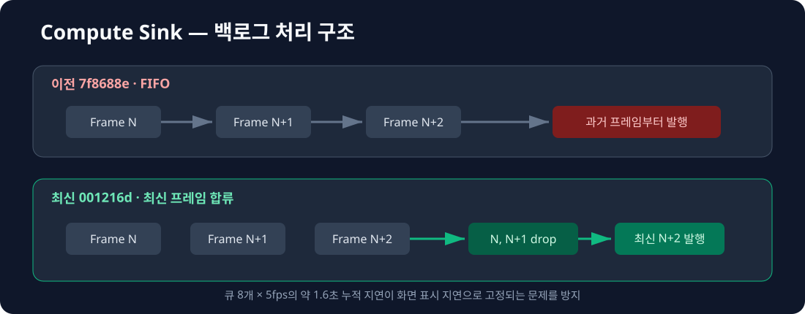

# Compute-Server
> 연산 서버 Sink 최적화 과정 및 지표를 정리한 마크다운입니다.

---

# ISink

### 이전: FIFO MqttTopViewSink / MqttBlurSink (`7f8688e`)

#### 성능 지표

| 측정 경로 | 평균 |
| :--- | ---: |
| `encodeInto(TopViewFrame, 1 object)` | 0.360 us |
| `encodeInto(TopViewFrame, 256 objects)` | 57.573 us |
| `encodeInto(BlurFrame, 1 target)` | 1.099 us |
| `encodeInto(BlurFrame, 256 targets)` | 252.357 us |
| `TopView send(valid, enqueue)` | 0.654 us |
| `Blur send(valid, enqueue)` | 0.729 us |
| `TopView send(valid, worker 완료)` | 19.385 us |
| `Blur send(valid, worker 완료)` | 20.089 us |
| `TopView start + destruct` | 62.471 us |
| `Blur start + destruct` | 65.678 us |

#### 기존 동작

1. queue가 가득 차면 가장 오래된 프레임을 제거하는 `drop-oldest` 정책을 사용
2. worker는 queue 앞에서부터 FIFO 순서로 프레임을 발행
3. 입력 속도가 발행 속도보다 빠르면 queue 깊이만큼 과거 프레임을 계속 발행
4. 5fps, queue 8개 기준 최대 약 1.6초 과거의 TopView/Blur 상태가 전달될 수 있음

---

### 이후: 최신 프레임 합류 MqttTopViewSink / MqttBlurSink (`8ca541e`)

#### 성능 지표

| 측정 경로 | 평균 | 중앙값 | p95 | 최소 | 최대 | 반복 |
| :--- | ---: | ---: | ---: | ---: | ---: | :--- |
| `encodeInto(TopViewFrame, 0 objects)` | 0.128 us | 0.127 us | 0.132 us | 0.127 us | 0.133 us | 30×10,000 |
| `encodeInto(TopViewFrame, 1 object)` | 0.361 us | 0.362 us | 0.370 us | 0.348 us | 0.376 us | 30×10,000 |
| `encodeInto(TopViewFrame, 256 objects)` | 56.591 us | 56.572 us | 56.766 us | 56.483 us | 56.790 us | 30×1,000 |
| `encodeInto(BlurFrame, 0 targets)` | 0.128 us | 0.127 us | 0.129 us | 0.127 us | 0.141 us | 30×10,000 |
| `encodeInto(BlurFrame, 1 target)` | 1.134 us | 1.133 us | 1.144 us | 1.132 us | 1.149 us | 30×10,000 |
| `encodeInto(BlurFrame, 256 targets)` | 257.661 us | 258.598 us | 259.545 us | 249.185 us | 260.161 us | 30×1,000 |
| `TopView send(valid, enqueue)` | 0.735 us | 0.746 us | 0.790 us | 0.665 us | 0.790 us | 20×1,000 |
| `TopView send(invalid, reject)` | 0.099 us | 0.098 us | 0.118 us | 0.095 us | 0.118 us | 20×1,000 |
| `TopView send(valid, worker 완료)` | 20.095 us | 19.355 us | 31.120 us | 18.047 us | 31.120 us | 20×100 |
| `Blur send(valid, enqueue)` | 0.829 us | 0.821 us | 0.947 us | 0.785 us | 0.947 us | 20×1,000 |
| `Blur send(invalid, reject)` | 0.107 us | 0.104 us | 0.129 us | 0.099 us | 0.129 us | 20×1,000 |
| `Blur send(valid, worker 완료)` | 19.983 us | 19.951 us | 20.738 us | 19.758 us | 20.738 us | 20×100 |
| `TopView start + destruct` | 63.174 us | 61.619 us | 69.581 us | 58.383 us | 79.474 us | 30×20 |
| `Blur start + destruct` | 63.680 us | 62.184 us | 75.357 us | 59.739 us | 77.003 us | 30×20 |

#### 개선 사항

1. worker가 backlog를 발견하면 과거 프레임을 버리고 가장 최신 스냅샷 하나만 발행
2. queue 개수 상한의 `drop-oldest`와 발행 직전 최신 프레임 합류를 함께 적용
3. 오래된 Blur 좌표가 현재 영상의 다른 위치를 가리는 개인정보 노출 위험 완화
4. 정상 5fps 경로의 enqueue와 직렬화 비용은 기존과 유사한 수준으로 유지
5. TopView/Blur의 schema, channel, timestamp, class, 좌표 및 256개 상한 검증

#### 이전 버전과의 비교

| 지표 | 이전 `7f8688e` | 이후 `8ca541e` | 변화량 |
| :--- | ---: | ---: | ---: |
| TopView 1개 직렬화 | 0.360 us | 0.361 us | 거의 동일 |
| TopView 256개 직렬화 | 57.573 us | 56.591 us | **1.7% 감소** |
| Blur 1개 직렬화 | 1.099 us | 1.134 us | 3.2% 증가 |
| Blur 256개 직렬화 | 252.357 us | 257.661 us | 2.1% 증가 |
| TopView enqueue | 0.654 us | 0.735 us | 12.4% 증가 |
| Blur enqueue | 0.729 us | 0.829 us | 13.7% 증가 |
| TopView worker 완료 | 19.385 us | 20.095 us | 3.7% 증가 |
| Blur worker 완료 | 20.089 us | 19.983 us | **0.5% 감소** |
| TopView lifecycle | 62.471 us | 63.174 us | 1.1% 증가 |
| Blur lifecycle | 65.678 us | 63.680 us | **3.0% 감소** |

> 이전과 이후 수치는 같은 장비·컴파일 옵션의 별도 실행 결과입니다. 1us 이하 경로는
> CPU 상태와 thread scheduling 영향을 크게 받으므로 작은 차이를 코드 효과로 단정하지 않습니다.

#### 백로그 처리 구조 비교



```text
이전: Frame N → N+1 → N+2 → 과거 프레임부터 FIFO 발행
이후: Frame N, N+1, N+2 적체 → N/N+1 drop → 최신 N+2 발행
```

#### 기능 테스트

| Test suite | 결과 | 검증 범위 |
| :--- | ---: | :--- |
| `MqttSinkLifecycleTest` | 2/2 | 중복 start, listener 해제 |
| `MqttSinkQueueTest` | 4/4 | 최신 프레임 합류, queue full, 미준비, publish 실패 |
| `MqttTopViewSinkTest` | 5/5 | topic/QoS/payload, 입력 방어, 256/257 경계 |
| `MqttBlurSinkTest` | 6/6 | target 필터, bbox 방어, 빈 상태, 256/257 경계 |
| **합계** | **17/17** | **실패 0** |

#### 측정 환경

| 항목 | 값 |
| :--- | :--- |
| 장비 | Raspberry Pi, aarch64 |
| 컴파일러 | GCC 14.2.0 |
| 옵션 | `-std=c++20 -O2 -DNDEBUG -pthread` |
| Clock | `std::chrono::steady_clock` |
| 로깅 | `LogLevel::Off` |
| Broker/TLS | 사용하지 않음, Fake transport |
| 측정 일자 | 2026-07-30 |

#### 주의

- 실제 libmosquitto, socket, TLS, broker ACK 및 QoS 전달 시간은 포함하지 않습니다.
- worker 완료 측정에는 condition variable을 사용하는 benchmark 동기화 비용이 포함됩니다.
- CPU governor와 core affinity를 고정하지 않아 하드 실시간 최악 지연으로 해석할 수 없습니다.
